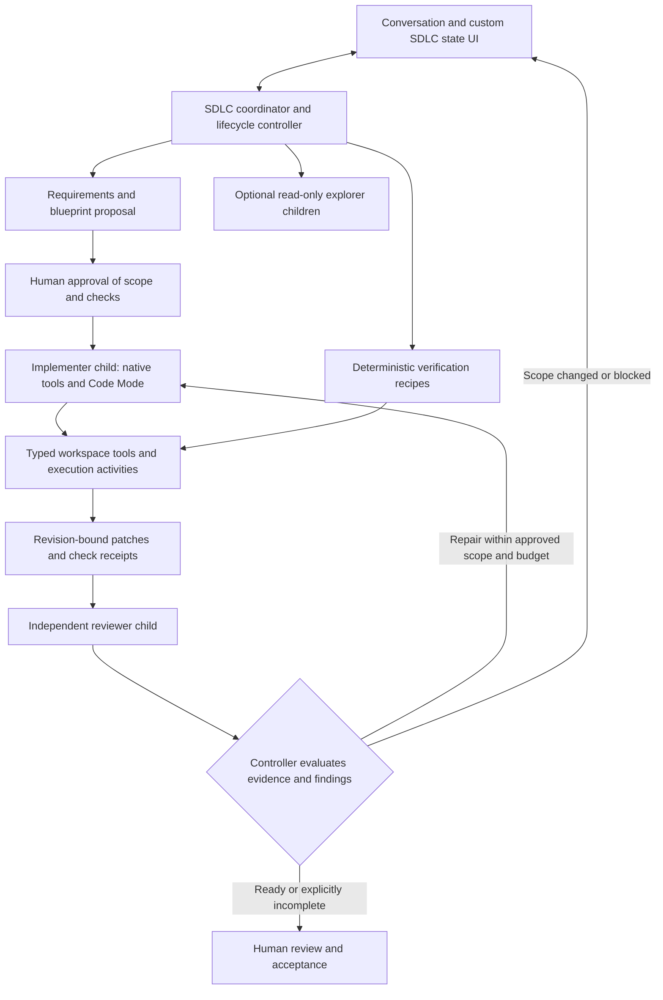

# SDLC agent review and next implementation milestone

**Implementation follow-up:** the Coding agent V2 slice is now implemented for new tasks. See [CODING_V2.md](CODING_V2.md) for setup, verified behavior and remaining limits. The assessment below records the pre-V2 design review.

Reviewed September 16, 2026 against the current boltzmann source, the harness checkout, and boltzmann's installed harness 0.4.0. This is a review and proposed implementation plan, not a claim that the design below is already implemented. Runtime behavior is unchanged by this review.

## Assessment

boltzmann currently has a durable, constrained action loop. It uses real harness agent turns, internal state, SDK model activities, workspace tools, and tracing. Its conversational and execution plumbing is useful. However, the model chooses each individual read, write, check, plan update, and finish action. The application has not yet implemented the stronger lifecycle architecture described in [STATE_UI.md](STATE_UI.md) and section 6 of [PLAN.md](PLAN.md).

The next improvement should combine native SDK tool calling, typed coding tools, Code Mode, a small number of focused subagents, and a deterministic controller that tracks evidence. Merely splitting the existing prompt among several agents would preserve its weaknesses and add cost.

The model will still interpret requirements, design changes, write novel code, and diagnose failures. Code Mode lets it express an operation once as a program. Tools then perform exact edits, iterate over results, run authorized checks, and record outcomes without another model decision for each mechanical step. Deterministic execution does not prove that generated software meets its requirements; tests and independent review supply additional evidence.

`StateRef.mutate()` is the correct harness mechanism for progress. The important change is what justifies each mutation: validated operation results and lifecycle rules, with model suggestions clearly distinguished from verified facts.

## Findings in the current implementation

| Priority | Finding | Evidence and consequence |
| --- | --- | --- |
| High | Completion remains largely a model assertion. | `task_progress()` accepts model-supplied `completed_tasks`; any successful read can accompany those claims. The `finish` branch goes to review without checking required verification, and local acceptance has no separate verification assessment. See [workflow.py](src/sdlc_builder/workflow.py). Keep review available for unfinished work, but distinguish implemented, verified, reviewed, waived, and accepted outcomes. |
| High | The SDK is used as a one-action generator. | [openai.py](src/sdlc_builder/integrations/openai.py) builds an agent with `output_type=Action`, no model-facing tools, and `max_turns=1`. The outer workflow invokes it again for every action. Repository inspection and routine build/check sequences consume many model round trips. |
| High | Existing guards cannot be bypassed by introducing a second execution path. | Ask restrictions, plan approval, command approval, and pause checks live in the outer action loop. [workspace_action](src/sdlc_builder/activities.py) and [perform](src/sdlc_builder/workspaces.py) enforce filesystem constraints and journaling, but not those lifecycle permissions. Direct script/child calls would need the same guards. This is a migration requirement, not an assertion that today's model can bypass the current loop. |
| Medium | The tool contract is too coarse for Code Mode and precise edits. | One `Action` carries fields for unrelated operations, the workspace tool returns bare `dict`, and edits rewrite entire files. A construction probe against harness 0.4.0 fails with `CodeModeStubError: workspace_action return: bare dict without an element type`. Typed operations and results are required. |
| Medium | Context and verification are underpowered for daily work. | [conversations.py](src/sdlc_builder/conversations.py) keeps the original request and recent records, dropping older records at a character limit. There is no durable requirements/decision memory independent of that context, no independent reviewer, and checks are not bound to a complete workspace revision. Checks are invalidated by known app edits, but external edits and check commands that alter files need reconciliation. |
| Medium | A model-call cap will not contain Code Mode or a subagent tree. | A single script can issue many host calls; several children can each consume a budget. The new design needs aggregate model-call allocation, host-operation limits, script limits, and bounded repair attempts, in addition to per-command limits. |

Preserve the existing isolated workspace, credential references, immutable message settings, command receipts, durable message outbox, stale-hash protection, conversation IDs, and explicit user gates. These solve real problems and should become shared infrastructure for the new agents.

## What to take from the harness examples

| Reference | Adopt | Adapt for boltzmann |
| --- | --- | --- |
| [Monty conversational agent](../../examples/monty/conversational_workflow.py) | `agent.code_mode_tool()` exposes typed host functions; a script can gather independent reads, process results, and return a compact answer. | Use scoped repository tools. Preserve approvals on each actual side effect, and enforce operation/concurrency limits. Keep direct tools for simple calls where a script adds no value. |
| [Monty dynamic agent](../../examples/monty/workflow.py) | Execution of a supplied script requires no model in the executor. | This is the useful separation between deciding what to do and performing it. Ordinary execution activities are sufficient initially; a separate script-runner child is optional, not a required extra agent. |
| [Monty subagent example](../../examples/monty/conversational_subagent_workflow.py) | Real child workflows, typed messages/replies, persistent child handles, and repeat conversations with a child. | Do not copy its approval stance: the example gates the parent tools while its simulated child skips host approvals. A coding child must enforce its own assigned permissions. |
| [Monty trip board](../../examples/monty/trip_board.py) | Scoped inline tools mutate an injected observable state document. | Record validated operation/evidence receipts automatically. Do not require the model to remember a second “mark done” call, or accept a model-invented successful-check receipt. |
| [OpenAI ReAct example](../../examples/react_agent/workflow.py) | `as_openai_agent_tools()` and `Runner.run_streamed(..., context=runner)` let the SDK run its tool loop while the harness owns durable execution, approvals, and tracing. | Keep the app's OpenAI profile/credential integration and disable separate tracing export as today. Replace the one-Action contract with role/tool execution, retaining structured outputs at meaningful boundaries. |
| [Callback coding example](../../examples/callback_tools/coding_agent/tools.py) | Purpose-built read, search, glob, write, exact edit, and task tools. | Start with worker-side activity tools in the local app. A future shared service can use a local execution companion and callback tools; do not make the browser execute shell commands. |

The harness's `subagent_toolset()` also composes with Code Mode. Use this for bounded parallel investigations when helpful, rather than exposing unlimited child creation to the model. The parent can drive mandatory implementation/review steps directly through the runner's public subagent methods; the model need not repeatedly decide to start and stop those workers.

## Recommended architecture

Use three core responsibilities, with one optional specialist:

- **Coordinator:** owns the ongoing conversation, requirements, assumptions, blueprint revisions, permissions, task dependencies, budgets, questions, and acceptance. It uses a model for discussion/planning but workflow code determines allowed transitions and dispatches mandatory stages. An Ask message can finish here using read tools; it does not need the full build pipeline.
- **Implementer child:** receives a bounded assignment plus approved scope and trusted execution references. It reads, edits, and verifies through native harness tools and Code Mode. One active writer per workspace initially. Reuse this child for in-scope repairs; a separate “repair agent” is unnecessary initially.
- **Reviewer child:** receives the requirements, exact source revision/diff, and recorded checks in a fresh context. It reads the actual code and produces typed findings with locations, severity, rationale, and missing evidence. It has no write/approve/deploy capability. Passing tests and an empty review are evidence, not a guarantee of correctness.
- **Optional explorers:** investigate separate areas of a larger repository concurrently with read-only capabilities. Return sourced findings and uncertainties. Skip delegation for small tasks where the extra model calls would outweigh its benefit.

Builds, test runners, Git operations, and deployment adapters are deterministic tools/activities or supervised jobs. They do not need their own LLM just to execute an approved operation. Deployment remains a separate, later milestone with its own authorization and receipts.

### Typed tools and Code Mode

Replace the catch-all model-facing Action with narrow contracts, for example:

- `list_files`, `search_code`, `read_file`, `read_files`, `get_diff`, `get_workspace_revision`.
- `apply_patch` and `edit_file`, with expected hashes, exact-match validation, explicit failure/conflict results, and a receipt identifying changed files and revisions.
- `discover_checks`, `run_check`, and `read_check_output`, returning command, execution identity, exit status, bounded output/artifact references, and the source revision checked.
- `propose_blueprint`, `report_blocker`, and `read_task_state` as scoped workflow tools. Approval and acceptance remain operator commands.

All returns must use explicit Pydantic models or supported typed structures so Code Mode can generate faithful stubs. Inject workspace, role, assignment, permission scope, and operation identity from trusted context. The model may select a file within scope; it must not select another workspace or broaden its own permissions.

Expose `inspect_code` over read tools and `change_code` over the tools available to the implementer. The wrappers are not the authority boundary: every host call must re-check its scope, lease, budget, and pause/cancel state. Use the existing native OpenAI adapter for both direct tools and the Code Mode tools.

For example, one script can read several related files concurrently, select relevant sections, check exact edit preconditions, apply a patch, and inspect the resulting diff. A fixed verification recipe can run the already-approved commands and aggregate their results without asking the model what to execute between commands. Return concise evidence to the model while retaining full receipts and bounded logs as artifacts.

Do not put unrestricted application-generated Python into the credential-bearing control process. Monty runs orchestration scripts against explicitly exposed host functions; it is not an OS sandbox for repository tests. Repository commands retain their own execution boundary and authorization.

### Evidence, permissions, and state

Implement a small application-owned transition layer rather than scattered ad hoc phase writes. It owns stable task IDs, blueprint revision, workspace revision, active assignments, pending approvals, and evidence references. A model can report “implementation ready”; the controller evaluates the applicable criteria before recording “verified.”

Bind check and review evidence to the exact workspace snapshot, including relevant untracked changes. A later patch or external edit makes old evidence stale. Checks that mutate source/configuration must be detected; don't attach a green result to a different revision. A failing, missing, or waived check stays visibly distinct from a passing check. The user can still review incomplete work and explicitly accept a documented limitation.

An approved verification recipe binds the actual commands, arguments, working directory, and relevant script/configuration revision. Discovering `npm test` in a manifest does not make its contents trusted; changing that script requires reassessing the authorization. Run checks sequentially by default unless their independence or separate execution workspaces is established.

The custom UI should render `SdlcStateV2`, showing the active agent/assignment, current operation, pending gate, remaining tasks, per-role and total usage, verification freshness, and review findings. The controller updates authoritative facts from typed durable results. Models provide public explanations and proposals, not arbitrary state edits or acceptance flags.

Children can publish their own observable state for detailed progress. The root records child identities and validated summaries; the UI/debugger follows the actual child streams. The harness does not copy all child events onto the root stream. App-owned approval endpoints must route to the correct child/call and preserve authorization—the current blanket restriction on debugger mutations means child approvals will not become usable automatically.

Allocate the message's model budget across coordinator and children so a cap of 200 means 200 across the whole tree. Reserve child allowances before dispatch and reclaim unused allowance afterward. Also bound host calls, active execution time, concurrent reads/children, patch size, output, and repair attempts. Pause/stop must apply at host-call boundaries and settle or reconcile already-running commands; cancelling a parent wait does not prove a subprocess stopped.

## Package support and engineering gaps to prove

The installed harness 0.4.0 exposes `agent.code_mode_tool`, `agent.subagent_toolset`, and `as_openai_agent_tools`. A schema-construction probe with a typed stand-in read tool successfully composed Code Mode with the native OpenAI adapter. This was a construction check, not an end-to-end execution or model-quality evaluation.

boltzmann currently requests `[ui,openai-agents]`; Monty is not installed in its virtual environment. Add the harness's `code-mode` extra and lock it. The checkout pins `pydantic-monty==0.0.18` because a later compiler API requires a port; use the version required by the tested harness release. Continue supporting published-package and `--local-harness` modes without importing `examples.*` or private harness helpers.

Before enabling the new agent by default, prove these integration details:

1. **Safe host dispatch:** guards must work identically through direct tools, Code Mode, and children. Preserve journal semantics for uncertain command outcomes. Never reuse one injected operation ID for every host call in a script; each needs a stable distinct identity.
2. **Resource control:** Code Mode's existing `step_timeout` bounds one Temporal activity wait, not total script work or host-call count. The inspected stepper does not configure runtime CPU/memory limits. Validate enforceable sandbox limits or process isolation/termination, plus bounded batch concurrency, before treating this as a dependable daily execution path.
3. **Subagent ownership:** configure each child explicitly. Generated `start_<role>` tools do not automatically inherit parent approval settings. Use trusted wrappers/public runner configuration and scoped assignments. A child must not receive model-supplied permission escalation.
4. **Restart/cancellation correctness:** reuse durable operation receipts and test lost replies, simultaneous approvals, stop during a child/script, and child cleanup. The harness documents a subagent-send/heartbeat crash window; business operations still need idempotency. Review how parent termination affects subprocesses and children.
5. **Context and history:** retain accepted requirements, decisions, current blueprint, file/evidence references, and unresolved findings separately from raw chat. Keep native SDK history within its adapter and use portable handoff artifacts between roles/providers. Test history rotation at settled boundaries; do not assume the current indefinitely-running agent loop can transparently continue-as-new.
6. **SDK boundary:** add a role-execution contract alongside the existing `decide` contract. Use native tools for work and typed plan/review outputs at boundaries. Keep the existing credential resolver, SDK plugin, serialization compatibility, and provider test, but extend the test to validate an actual harmless tool-call round trip. Future Pydantic AI support should adapt the same app-owned tools and role contracts.

This recommendation retains OpenAI as the first supported SDK. Earlier Pydantic-first suggestions in PLAN.md are historical and do not supersede the current implementation or the user's OpenAI direction.

## Next usable milestone

Implement a narrow vertical slice called **Coding agent V2**, and hand it back for testing before expanding the lifecycle:

1. Add typed read/search/patch/check contracts and shared scope, journal, and permission guards. Preserve existing behavior behind the V1 path.
2. Add native OpenAI tool execution and bounded Code Mode using the packaged harness. Supply deterministic verification recipes and revision-bound receipts.
3. Add one implementer child and one independent reviewer. The coordinator enforces blueprint approval and a bounded repair loop; optional explorers can follow after this path works.
4. Render child progress, remaining work, verification status, and review findings in the existing task UI. Preserve same-task conversation and draft behavior.
5. Gate default adoption on the tests and real-repository pilot below. Keep deployment, concurrent writers, arbitrary generated agents/tools, and a general agent marketplace outside this milestone.

For the substantial workflow change, register a separate `SdlcAgentV2` workflow and retain V1 workers/handlers for existing histories. Select V2 for new tasks with an explicit engine version in task metadata. Existing tasks continue on V1 until a separately tested migration/handoff is available; keep their task/workspace/history intact. If an existing task is upgraded later, use a settled checkpoint and an explicit predecessor link rather than rewriting its recorded command sequence.

## Acceptance and evaluation

Use the harness's model-free [Code Mode tests](../../tests/examples/monty/test_code_mode_e2e.py) and [subagent tests](../../tests/examples/monty/test_subagent_e2e.py) as patterns for exercising the app through the real Temporal and SDK paths. Add app-level acceptance checks for:

- A multi-file change with a regression test, a failed check followed by a scoped repair, and a follow-up on the same task.
- A false `finish`/completion claim, fabricated receipt, missing check, changed source revision, and reviewer disagreement: none becomes verified success automatically.
- Ask mode and reviewer roles refusing writes/commands through both direct and scripted paths; no child/parent model approving its own work.
- Restart between script batches and during a child approval, rejected stale approvals, lost child replies, and no duplicated side effects.
- Conflicting edits, an external/manual change, command output limits, script limits, aggregate budgets, and stopping active work.
- Accurate root/child progress in the custom UI and harness debugger, including late join and reconnect.
- Both a clean published-package install and local harness development mode.

Then compare V1 and V2 on a fixed set of representative repositories/tasks: multi-file features, debugging, refactoring, test failures, and follow-ups. Record acceptance-criterion success, regression failures, edit conflicts, user corrections/approvals, model calls/tokens, tool calls, and wall time. Evaluate by task outcome and evidence, not by the agent claiming success. Code Mode can reduce model round trips but adds sandbox/activity overhead; subagents can improve focus but add model cost. Enable each where the measured result justifies it.

Review validation performed: source inspection of boltzmann and the referenced examples/harness features; inspection of the installed 0.4.0 API surface; reproduction of the current tool's Code Mode schema failure; successful typed-tool/Code Mode/OpenAI-adapter construction. No runtime files were changed, no dependencies were installed, and no paid model calls were made for this review.
