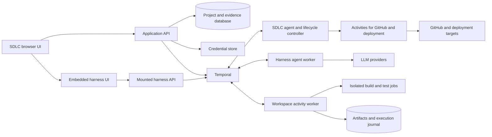
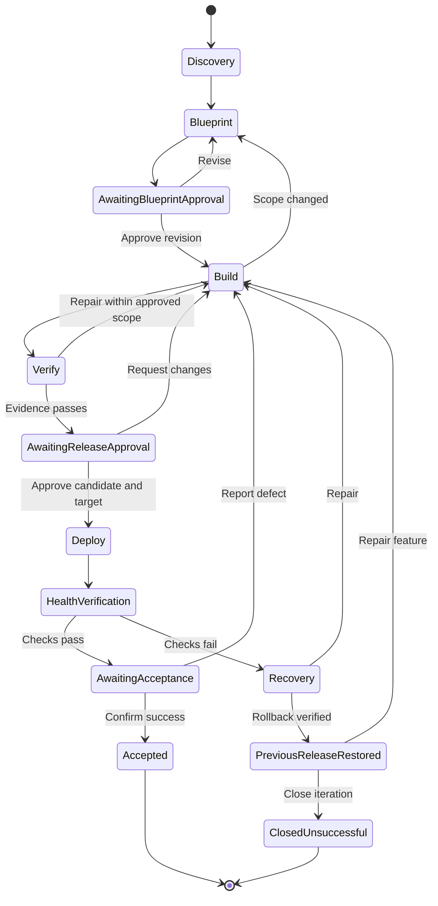

# SDLC application builder

Status: broader implementation plan, based on repository revision `e4bde4b` and source inspection on September 15, 2026. The first usable local milestone is now implemented; see [README.md](README.md) for its tested scope and launch instructions. Further lifecycle work is paused for user testing. The initial app uses authoritative full-state snapshots and individually approved host commands; the SSE projector, container execution, GitHub publishing, and deployment adapters below remain planned.

Build an independently packaged daily development application in `apps/sdlc/`. It should support asking about code, quick fixes, debugging, manual editing, reviewing existing work, and the full path from a feature request through an approved blueprint, implementation, verification, deployment, and acceptance. Consume `temporal-agent-harness` as a dependency and embed its existing debugger. Keep lifecycle rules, project configuration, credentials, agents, and development tools in this application.

Confirmed product choices: local application for one developer, a migration path to a shared service, GitHub repositories, and a configurable deployment adapter.

The expanded [daily product specification](PRODUCT.md) defines the reasons to adopt it, necessary editing/review/context capabilities, conveniences, and measurable daily-use criteria. [STATE_UI.md](STATE_UI.md) specifies the required SDLC agent internal state and the custom UI that renders its progress. This document supplies the architecture and delivery plan. Daily usability and state-driven progress are part of the initial scope, with an intermediate pilot before the complete lifecycle release.

## 1. What the repository already provides

| Existing capability | Evidence | Application implication |
| --- | --- | --- |
| Python distribution with optional UI and AI SDK dependencies | [pyproject.toml](../../pyproject.toml) | Depend on a released package; do not import repository examples. The checkout declares harness version `0.4.0`. |
| Packaged Svelte 5 UI and reusable FastAPI factory | [web/app.py](../../temporal_agent_harness/web/app.py), [UI package](../../ui/package.json) | Mount the packaged app at `/harness/` and embed it in an iframe. The frontend is private, not a published component library. |
| Relative UI assets and relative API requests | [vite.config.ts](../../ui/vite.config.ts), [httpClient.ts](../../ui/src/lib/api/httpClient.ts), [packaging tests](../../tests/web/test_packaged_ui.py) | Prefix mounting is intentional and has static-asset coverage. Full mounted startup and SSE still need integration validation. |
| Session links through `?s=<workflow_id>` | [agentRunStorage.ts](../../ui/src/lib/state/agentRunStorage.ts), [agentRun.svelte.ts](../../ui/src/lib/state/agentRun.svelte.ts) | A phase can open its exact agent in the embedded debugger, provided the session is present in the returned catalogue. |
| Typed agent messages and universal agent startup contract | [agent_interface.py](../../temporal_agent_harness/harness/agent_protocol/agent_interface.py) | Keep `AgentConfig` unchanged. Send feature, workspace, model-profile, and artifact references through app-defined `@agent.accepts` messages. |
| Observable internal state with snapshots and JSON patches | [state package](../../temporal_agent_harness/harness/state/__init__.py), [runner](../../temporal_agent_harness/harness/agent_workflow.py), [trip board example](../../examples/monty/trip_board.py) | Register `SdlcState` through `runner.state("sdlc", ...)`; the custom product UI renders this actual execution state. Generic display annotations are still a design, not a shipped requirement. |
| Durable agent turns, tool approvals, activity tools, callback tools, operator commands | [agent.py](../../temporal_agent_harness/harness/agent.py), [agent_workflow.py](../../temporal_agent_harness/harness/agent_workflow.py), [agent_client.py](../../temporal_agent_harness/harness/agent_client.py) | Reuse execution and inspection plumbing; add application decisions above it. |
| Subagents with typed handlers and merged streams | [subagent_toolset.py](../../temporal_agent_harness/harness/subagent_toolset.py), [stream merge](../../temporal_agent_harness/harness/stream_merge/README.md) | Specialists can appear in an existing agent's graph. A separate lifecycle workflow will not automatically appear as one unified harness graph. |
| Pydantic AI and OpenAI Agents adapters, plus a Gemini SDK integration | [AI SDK integrations](../../temporal_agent_harness/ai_sdks), [Pydantic example](../../examples/pydantic_ai_hello/workflow.py) | Prefer the existing Pydantic AI integration for initial provider selection, with a small app-owned runtime boundary. |
| Coding example with file and shell callback tools | [coding example](../../examples/callback_tools/coding_agent/README.md), [local executors](../../examples/callback_tools/coding_agent/opencode_shim/local_tools.py) | Useful design reference. It is not shipped, is Gemini-specific, and its host shell execution is not an isolated execution environment. |
| Shared data converter and payload offload | [plugin.py](../../temporal_agent_harness/plugin.py), [large_payload.py](../../temporal_agent_harness/utils/large_payload.py) | Every client and worker must use compatible converters and the same offload backend. Use persistent app storage, not the default `/tmp` directory. |
| Session-manager worker and registry | [session_manager.py](../../temporal_agent_harness/web/session_manager.py) | Keep it for the packaged debugger. It does not own project or feature lifecycle state. Its registry is seeded once and is not dynamically refreshed. |

The repository does not currently provide a project database, credential manager, provider-settings UI, isolated build runner, GitHub lifecycle integration, deployment abstraction, or feature-level acceptance gates. These are the application's work.

## 2. Product flow

The primary object is a **project**, containing **work items**: questions, fixes, investigations, features, reviews, maintenance, and incidents. Each item records context, attempts, evidence, decisions, and its intended outcome. Guided features also have immutable blueprint revisions and releases. A successful release remains part of the project's history; subsequent work starts another linked item or iteration. References to a feature below describe that guided subtype, not a requirement that every task use every stage.

Support direct entry from a prompt, selected code, terminal failure, screenshot, GitHub issue/PR, or an existing branch. Ask is read-only. A quick change uses a compact scope brief, edits, checks, and review; it can finish at an accepted local patch. Debug starts with reproduction. Review imports existing work. Ship starts from an existing candidate. Tasks can promote into the guided feature path when scope warrants it, preserving their history. Approval of a small task's visible scope can be part of its initial submit action under an established project policy; do not ask again for already-authorized work.

| Screen / phase | Developer experience | Durable output and exit condition |
| --- | --- | --- |
| Setup | Connect GitHub; add or select an existing repository, or create a repository from a template; configure credentials, model profiles, Temporal, and deployment targets. | Validated project configuration and connection checks. Creating a remote repository is an explicit action. |
| Intake | Describe the feature; attach an issue, documents, or screenshots; select the base branch. | Feature brief and a recorded base commit. |
| Discovery | Agent inspects the repository and asks focused questions. Show requirements, assumptions, missing information, scope exclusions, dependencies, and risks as editable records. | Requirements with stable IDs, resolved blocking questions, and explicit acceptance of consequential assumptions. |
| Blueprint | Review architecture, UI changes, data/API changes, migration needs, implementation tasks, test plan, deployment plan, and rollback limitations. | An immutable blueprint revision with requirements-to-tests traceability and human approval. |
| Build | Watch task progress, changes, tool requests, costs/usage, and blockers; inspect diffs and the embedded harness debugger. | Implementation in an isolated workspace, commits, and a draft PR. Changes in scope return to blueprint review. |
| Verify | Review actual lint, typecheck, tests, build, and acceptance checks; inspect screenshots and logs where applicable. | Evidence tied to a commit and artifact digest. Failed checks enter a bounded repair loop or request a decision. |
| Release | Review the diff, PR checks, deployment target, exact artifact, configuration revision, and any migration/rollback steps. | Approval for that release candidate and target; merge and deployment permissions are recorded separately. |
| Deploy | Follow the adapter's progress, URL, provider operation ID, and health checks. | A deployment receipt and verification evidence, or a failure requiring repair/rollback/reconciliation. |
| Accept | Open the application and confirm acceptance criteria, or report a defect. | Human acceptance closes the iteration. Defects create a linked repair attempt; further enhancements create a linked feature. |

Keep a conversation alongside structured documents. Conversation helps collect information; structured, versioned records determine what is approved. Show concrete blockers and completed tasks instead of invented percentage estimates. Closing a browser must not stop the work.

Recommended navigation: Today, Projects, Work, Changes, Releases, and Settings. The project workbench combines conversation/planning, files and diffs, preview, terminal/checks, and an expandable harness debugger. A custom state view always makes the current phase, active work, blockers, completed work, remaining tasks, and next action understandable. Render it from the SDLC agent's observable state, not by interpreting chat. Restore layouts and drafts per project. Today shows meaningful blockers, results ready to review, and a summary since the last visit. Put important approvals in the main application, not only in the debugger. [PRODUCT.md](PRODUCT.md) specifies daily interactions and [STATE_UI.md](STATE_UI.md) specifies the progress renderer and state transport.

## 3. Architecture and directory boundary

Use Python/FastAPI for the application API and workers, Svelte 5/TypeScript for the product UI, SQLite with migrations for local metadata, and filesystem artifact storage. Keep the app's frontend separate from `ui/` and package its production build with the app. The harness dependency supplies its own UI assets.



The arrows from lifecycle to integrations represent scheduled activities; workflow code does no direct external I/O.

Proposed layout, to be created during implementation:

```text
apps/sdlc/
  PLAN.md
  PRODUCT.md                    # Daily workflows, priorities, adoption criteria
  STATE_UI.md                   # Observable agent state and custom progress UI
  README.md
  pyproject.toml                 # Independent distribution and lockfile
  uv.lock
  justfile
  src/sdlc_builder/
    cli.py                      # dev, serve, worker, doctor, harness-source
    api/                        # Product routes, authentication, SSE
    domain/                     # Projects, work items, blueprints, decisions
    persistence/                # Repositories, migrations, projection/outbox
    workflows/                  # SdlcAgentWorkflow with deterministic lifecycle policies
    agents/                     # Discovery, blueprint, build, review, repair
    tools/                      # Harness tool definitions owned by this app
    activities/                 # Durable side effects and agent dispatch
    integrations/
      harness.py                # Public package API integration and mounting
      providers/                # Runtime profiles and SDK wiring
      github.py
      deployments/              # Adapter protocol and command adapter
    execution/                  # Workspace leases, job journal, isolation
    workbench/                  # File access, PTY broker, services, manual takeover
    context/                    # Repository map, retrieval, rules, approved memory
    state/                      # SdlcState schemas, reducers, snapshot/patch projection
    review/                     # Review sessions, comments, checkpoint comparisons
    notifications/              # Persistent inbox and local notification delivery
    secrets/                    # SecretStore and OS credential backend
    artifacts/                  # ArtifactStore and event archive
    ui/dist/                    # Built application UI, not a copy of harness UI
  ui/                           # Independent Svelte application and lockfile
  tests/                        # Unit, Temporal integration, browser, packaging
```

Runtime data belongs in an OS-appropriate application-data directory outside target repositories: `app.db`, persistent Temporal database, payload offload files, artifact blobs, workspace leases, execution journal, and sanitized logs. Support an explicit data-directory option and backup/export. Generated software lives in managed workspaces and its GitHub repository, not under the SDLC application's source directory.

The local launcher supervises a persistent Temporal development server when needed, the API, the session-manager worker, the lifecycle worker, and agent/execution workers. Use loopback listeners and allow an existing Temporal connection. Detect healthy existing processes; track only processes the launcher owns. Expose readiness and actionable failures in the app. The development server is a local-development choice; a shared deployment uses Temporal Cloud or a production Temporal installation.

The workbench adds an authenticated PTY/service broker, workspace watchers, an incremental local context index, and an isolated browser/preview runner. Serve generated application previews on a separate origin from the control application. Persistent terminals/dev servers belong to managed jobs with leases and reconnect behavior, not long-lived browser requests. Route finite checks through durable execution. Queue interactive questions alongside background jobs with explicit resource/concurrency limits. Local work resumes after laptop sleep; it cannot execute while the machine is off. Remote workers are a later option for that need.

## 4. Dependency modes: package and local development

The app must work when copied out of this repository. Use normal absolute imports from `temporal_agent_harness`; never use `sys.path` modifications or import `examples.*`, `ui/src`, or underscored harness helpers.

Start with an exact harness dependency, provisionally `temporal-agent-harness[ui,pydantic-ai]==0.4.0`, and pin a tested transitive dependency set in the app lockfile. Confirm the published wheel against the checkout before finalizing this version. Add provider SDK extras explicitly: the harness's `pydantic-ai` extra only requests Pydantic AI's Temporal integration, not every provider SDK. Do not use the unpublished `nexus-mcp` extra for the first version.

Support these two deliberate modes:

| Mode | Dependency source | UI behavior |
| --- | --- | --- |
| Release / default | Exact published version, app-owned lockfile | Serve the harness assets shipped in its wheel. No harness checkout or Node is needed at runtime. |
| Harness development | Editable local harness path, same distribution/import name | Python source edits require appropriate process reload; harness UI edits require rebuilding its `ui/dist` or using its Vite server. |

Implement a `harness-source local <path>` / `harness-source release` helper to make the switch explicit, show the effective source/version, and maintain separate reproducible lock inputs. uv supports editable path sources via `tool.uv.sources`; release CI must resolve without that source and in a directory outside the harness checkout. Avoid a committed local source silently overriding release-mode tests. [uv dependency documentation](https://docs.astral.sh/uv/concepts/projects/dependencies/)

CI must cover a published-wheel installation, a wheel built from the current checkout, and an editable development installation. Assert import provenance and packaged assets. The app distribution must not enlarge the harness distribution or change its release process.

## 5. Lifecycle orchestration and ownership

Implement `SdlcAgentWorkflow` per work item iteration: a harness agent containing the deterministic lifecycle controller. This replaces the earlier plain `FeatureLifecycleWorkflow` / `WorkItemLifecycleWorkflow` proposal. It owns the mode, intended outcome, phase, selected artifact revisions, pending gates, repair budget, and permitted next transitions as a canonical `SdlcState(HarnessState)` registered using `AgentWorkflowRunner.state("sdlc", ...)`. It reads `StateRef.current` and commits transitions through synchronous `mutate()` blocks; the harness emits the snapshots/patches the custom UI consumes. AI specialists propose plans and produce work; this root workflow enforces progression. The diagram below shows the guided feature/release path. Other modes use the same control and evidence records with only applicable stages: Ask → Answer; Quick change → Scoped work → Checks → Review; Review → Findings or repair. Local-patch and PR outcomes need not deploy.

The root retains the standard `AgentConfig` startup contract and receives the work item through a typed `@agent.accepts` message. Its lifecycle handler may run across phases and durable human waits; separate app-owned Update handlers validate/enqueue user decisions so they can be received during that turn. A single controller applies state transitions. Stage agents expose optional detailed state linked by workflow/run/agent identity. Do not add a separate mirror-only progress agent or a second authoritative progress table. [STATE_UI.md](STATE_UI.md) defines the schema, ownership, and required implementation spike.



Rollback verification means the prior release was restored; it does not satisfy the failed feature's acceptance criteria. From that state the user can close the iteration as unsuccessful or start a repair. A successful feature requires verification of its own intended release. A deployment failure before health verification also enters Recovery. Track paused, blocked, canceled, and failed conditions in addition to the phase.

Use Temporal Updates for commands such as `answer_questions`, `approve_blueprint`, `request_changes`, `approve_release`, `confirm_acceptance`, `pause`, `resume`, and `cancel`. Each includes an idempotency ID and expected feature/decision revision. Validate state and referenced revisions; enqueue work for the main workflow loop. Queries return snapshots without side effects. [Temporal message passing](https://docs.temporal.io/develop/python/workflows/message-passing)

All product-chat messages use this same lifecycle-aware command path. Track queued, delivered, and incorporated states. The harness's existing turn queue is sequential, so it does not by itself supply mid-turn steering. Add app-owned controls and explicit safe-boundary checks in the app's agent implementation; validate SDK support before offering steering during a model/tool loop. A manual-takeover command settles active writes, checkpoints, and transfers the workspace lease. Resuming detects human/external edits and invalidates affected context, tests, and review decisions.

Important rules:

- A blueprint edit creates a new revision and invalidates approval of the older revision for future work. Existing evidence remains readable.
- A compact quick-change brief receives the same version/scope treatment without requiring a full blueprint. Ask mode never silently gains write authority.
- Release approval binds blueprint revision, source SHA, artifact digest, test evidence, deployment plan, target, and configuration revision. Any relevant change requires a new decision.
- Human gates are lifecycle commands, not model-callable tools. A permissive harness tool policy cannot approve a feature or release.
- Pause means stop scheduling new work and settle at a checkpoint. Stop/cancel has separate semantics: cancel active work, terminate/reconcile sandbox jobs, preserve artifacts, and record unresolved external operations. The existing harness `close` ends the agent session; it is not a resumable per-turn pause.
- Retries of infrastructure errors and deliberate repair iterations are different. Cap model calls, tool calls, elapsed execution, repair attempts, and concurrency; human waiting time should not consume the active-work budget. Report estimated cost as an estimate, with token/attempt caps as enforceable limits.
- Snapshot non-secret configuration at each attempt. Changes to settings affect subsequent attempts, not silently the current run. Persist recorded checkpoints before restarting with another provider.
- Rotate agent sessions at bounded phase/task boundaries. Checkpoint the root lifecycle before its history grows too large and validate a successor-session protocol that retains the standard `AgentConfig` startup contract, then initializes from a typed checkpoint reference. If using Continue-as-New, prove handler completion and checkpoint restoration first; do not assume the current runner supports it automatically. Keep immutable artifacts and accepted command IDs across the transition, and give each state generation a distinct identity.

**State authority:** the root SDLC agent's committed observable state is authoritative for active execution and decisions. SQLite owns project/settings records, searchable evidence/catalogues, and a rebuildable projection of that state. A collector archives harness `state_snapshot` / `state_patch` events and transactionally records the folded document, its version, and an application event watermark. Bootstrap and live updates use that same watermark to avoid a reconnect race. App command delivery uses a durable request/outbox record and deterministic workflow/update IDs. If the API crashes between delivery and acknowledgement, reconcile instead of starting another item. Show projection lag, missing snapshots, or version gaps explicitly and resync from a known state. Never substitute an unversioned query result or guessed chat-derived progress. See [STATE_UI.md](STATE_UI.md).

## 6. App-owned agents and tools

Define a small fixed set of agents before adding general agent generation. Each uses `@agent.defn`, `AgentWorkflowRunner`, typed `@agent.accepts` handlers, and the harness's stream/approval behavior.

| Agent | Input / output | Initial capability scope |
| --- | --- | --- |
| SDLC root | Typed work item + decisions/results → canonical `SdlcState`, progress events and outcome | Deterministic lifecycle control; delegate model work; validate gates and evidence before advancing. |
| Discovery / Ask | Brief or question + repository snapshot → sourced answer, requirements, questions, assumptions, risks | Repository/document reads; no repository mutation. |
| Blueprint | Confirmed requirements → structured blueprint revision | Read context; propose architecture, tasks, tests, release plan. |
| Builder | Approved task + workspace + profile → patch, commit, explanation | Read/search/edit, bounded commands and local checks inside the workspace. |
| Reviewer | Blueprint + exact diff + test evidence → findings and acceptance mapping | Independent review with read-only source access; cannot mark failed checks as passed. |
| Repair | Failure evidence + approved scope → bounded corrective patch | Same workspace controls as Builder; changes to requirements trigger replanning. |
| Debug | Reproduction + logs + source → hypotheses, evidence, regression test, proposed repair | Scoped reproductions and diagnostics; apply repair only within the item's granted scope. |

Tests/builds/deployments are activities or external jobs with observable results. An agent may select checks, explain failures, or draft release notes; a successful narrative cannot replace an exit code, check result, or deployment receipt.

Tools should include scoped `read_file`, `search_code`, `list_files`, `apply_patch`, `run_command`, `run_checks`, `get_diff`, `save_artifact`, and `report_blocker`. GitHub operations and deployment execution belong to dedicated integration activities, invoked only after the applicable lifecycle gate. Inject project/workspace/attempt scope using `Injected` or trusted per-turn dependencies; the model must not choose a different workspace or credential reference.

Use `@agent.activity_tool_defn` for workspace operations in the local execution worker. Keep the executor behind a protocol so a future remote service can use a local companion with callback tools. The existing callback-tools example informs that later transport; the browser itself must not execute shell callbacks.

Initially run one writer per feature workspace. Permit parallel read-only analysis and independent tests when useful. Add harness subagents for bounded tasks after the sequential path works. Give concurrent writers separate workspaces and an explicit integration step.

**Driving a phase agent:** the lifecycle starts a harness child workflow with only `AgentConfig`, then an app activity sends a typed phase message and consumes its reply/events. Use the public `SEND_AGENT_MESSAGE_UPDATE` protocol and a stable Temporal update ID keyed by feature/phase/attempt/command. Persist/heartbeat accepted turn ID and stream resume cursor, then reattach after a retry. Standard `AgentClient.submit_message` currently has no `update_id` argument; do not pretend it does. `start_and_submit_message` has one, but is not needed to start an already-owned child. Do not use the underscored client helper.

The harness subagent activity explicitly documents a crash window between submission and durable heartbeat. Business side effects therefore require their own idempotency regardless of dispatch deduplication. Child completion/close, parent cancellation, and lost-worker behavior need explicit tests.

If later features generate new tools or agents, generate them as versioned project artifacts, test them in isolation, and install them into a versioned worker build only after review. Do not dynamically import generated Python into the application's credential-bearing control processes. Authoring the initial SDLC tools and agents is part of this app; unrestricted self-extension is outside the first release.

## 7. Provider profiles, secrets, and configuration

A model profile contains provider kind, model ID, optional endpoint, credential reference, model parameters, capability requirements, context/output limits, timeout/retry policy, and budgets. Let projects choose defaults and override by phase. Start by validating two real providers—OpenAI and Anthropic—through the same Pydantic AI-based agent implementation. Add Google and compatible/local endpoints after the capability checks pass; an OpenAI-compatible endpoint is not automatically equivalent for tools or structured output.

Store model IDs as configurable values, not a permanently hardcoded list. A provider adapter offers connection validation and optional model discovery plus manual entry. Check tool calling and structured output before selecting a profile for an agent that requires them. Provider changes occur at a fresh attempt/checkpoint with a portable artifact summary; do not blindly send provider-specific history to another provider.

The checked-in lockfile uses Pydantic AI `2.14.1`, and the local installation exposes `TemporalAgent(provider_factory=...)` and per-run model selection. Current upstream documentation describes a newer capability-based integration. Pin and test the API used by this checkout rather than assuming current documentation matches it; SDK migration is a separate change. [Current Pydantic AI Temporal documentation](https://pydantic.dev/docs/ai/capabilities/durable_execution/temporal/)

`SecretStore` should support storing, replacing, deleting, testing, and resolving opaque references. Use an OS credential backend locally (macOS Keychain, Windows Credential Locker, or a supported Linux secret service), with a clear setup error if no secure backend is available; no silent plaintext fallback. SQLite stores only metadata: label, purpose, provider, scope, version, and last validation result. [Python keyring documentation](https://keyring.readthedocs.io/en/latest/)

Distinguish harness/model credentials, GitHub credentials, deployment credentials, and target-application runtime secrets. Projects declare environment-variable bindings by secret reference. Generated `.env.example` files contain names/placeholders only; deploy adapters resolve target bindings when needed. The model can know a required variable's name and purpose without receiving its value.

Resolve secrets inside the activity/process making the external call. Provider factories receive non-secret profile references; never serialize keys into `AgentConfig`, agent message/deps payloads, workflow history, SSE frames, artifacts, or log arguments. Verify where the pinned SDK invokes its factory before allowing secret access; if resolution also occurs in workflow code, use a worker-initialized provider registry or a dedicated model activity that keeps credentials out of replay state. Avoid changing global environment variables per request. Rotation creates a new secret version for future attempts; revocation blocks dependent operations and is visible to the user.

Local credentials should be write-only in normal UI use. After saving, display connection status and metadata, with replace/delete actions. Bind the API to loopback and use a local authenticated session, origin/host checks, and CSRF protection for mutations—including the mounted harness API. Unrelated websites must not be able to command the local runner. Sanitize errors and streamed tool output before they are persisted; redaction is defense in depth, not permission to expose secrets to an LLM.

Expose advanced harness settings separately: Temporal connection/profile, namespace, queues, concurrency, tool policy, model/tool timeouts, payload storage, and trace retention. Validate worker readiness. Connection/topology changes require a coordinated restart; do not mutate a live shared process's environment.

## 8. Workspaces, GitHub, and execution

Manage a dedicated clone/cache and a per-feature branch/workspace based on a recorded SHA. Preserve the user's existing checkout and dirty changes. Track a workspace lease and operation journal so a retried job reattaches to the existing workspace/job instead of creating another or overwriting later edits.

Import an existing branch or a user-selected patch of dirty changes with a recorded checkpoint and provenance, retaining the original checkout. Permit in-app editing and external-editor handoff. Human and agent writers share a lease protocol; check expected file content before writes and detect out-of-band changes. Review comments and checkpoints reference exact revisions; selective restore or partial staging invalidates evidence for the resulting tree. A checkpoint restores local source, while remote commits/deployments have separate recovery operations.

Store a versioned project environment profile with language/toolchain versions, package roots, install/test/dev commands, service dependencies, ports, health checks, and secret references. Detect monorepos, hooks, submodules, and large/binary assets; handle supported cases explicitly and expose limitations before mutation. Keep interactive terminals and dev servers reconnectable through the workbench broker. The preview, diagnostics, and test evidence must identify their actual workspace/source revision.

Use a container-backed local executor for generated-code commands, with explicit workspace mounts, resource/time limits, a minimal environment, and configurable network access. Keep model/GitHub/deploy credentials in separate host services. A working directory or Git worktree is not an isolation boundary. A host-process executor can be an explicit trusted-project option, with its weaker isolation reflected in configuration; do not inherit the app's credentials into it.

Each command produces its argv, working directory, source SHA, start/end times, exit code, log artifact references, and job ID. Stream bounded log chunks. File tools enforce canonical path/symlink containment and prevent reads of credential/config directories. Patch operations use expected file hashes; a replay detects an already-applied patch or a conflict. For ambiguous external effects, reconcile using the job/provider ID; never promise exactly-once execution of arbitrary shell commands.

For local GitHub authentication, support a scoped token stored in `SecretStore` and an optional existing `gh` credential source. Keep GitHub behind an adapter so a shared installation can use a GitHub App. Implement clone/fetch, branch/commit/push, draft PR creation/update, status/check polling, and review/merge metadata. Tie PRs to feature IDs and head SHAs, and reconcile creation on retry. Never force-push over changes the app does not own.

Remote actions follow explicit project policy: approve the initial push/PR action once or grant it for the feature; approve merge separately. Merge is not implied by a successful build. If merging/rebasing changes the candidate SHA, rebuild/retest that exact source before deployment. Repository bootstrap/template creation uses the same tracked operations and approvals.

## 9. Test evidence and deployment adapter

The blueprint defines a `CheckPlan` with command IDs, acceptance criteria, expected evidence, required/optional checks, and environment needs. Existing project commands should be discovered and confirmed. Agents may add meaningful tests, but cannot quietly remove or weaken required checks to pass a feature. Track any approved waiver explicitly.

A verification result includes source SHA, dependency/configuration digest, executor image/environment, command, exit status, timestamps, test report, logs, and artifacts. A changed source tree invalidates relevant evidence. Acceptance tests map back to requirement IDs. External GitHub checks are read for the exact head SHA. Missing or unavailable evidence is pending/unknown, never success.

Define an application-level deployment protocol, initially implemented by a configurable command adapter:

```text
validate(target_config) -> capabilities and configuration errors
plan(candidate_ref, target_revision) -> immutable DeploymentPlan
deploy(approved_plan_ref, operation_id) -> DeploymentReceipt
status(receipt_ref) -> pending | running | succeeded | failed | unknown
verify(receipt_ref, check_plan_ref) -> VerificationReport
rollback(receipt_ref, approved_rollback_plan, operation_id) -> DeploymentReceipt
```

The adapter declares whether it supports previews, immutable artifact promotion, cancellation, rollback, and application-secret injection. Its configuration supplies reviewed executables/argument arrays, target-scoped secret bindings, timeouts, and JSON input/output schemas. Generated code does not supply an unrestricted deployment command at execution time. Use argv execution rather than concatenating user/model text into a shell string. Ship a fake adapter for tests and an executable example using a local preview target; validate at least one real user-configured remote target before calling deployment support complete.

Build once and deploy the approved artifact digest where supported. For source-build platforms, require a pinned source SHA, record the produced artifact, and verify its identity. Record target, URL, release/provider ID, source/artifact digest, config revision, approval ID, migration steps, and previous release. Health checks are distinct from human acceptance.

Use a stable deployment operation ID and a journal written before dispatch. On retry, query the existing operation. If the adapter cannot determine whether a timed-out deployment happened, enter `unknown` and require reconciliation; blindly retrying is unsafe. Rollback is available only when supported and reviewed, and schema/data migrations may need a forward repair. A repair always produces a new candidate and fresh checks.

## 10. Harness UI embedding and event retention

Mount the unmodified `create_agent_harness_app(...)` under `/harness/`, with its packaged assets. Keep the trailing slash so relative assets/API paths resolve correctly. The product UI embeds `/harness/?s=<encoded_workflow_id>` and also offers an open-in-new-tab link. Changing the selected phase attempt changes the iframe URL; use existing URLs rather than DOM access or invented `postMessage` APIs.

Explicitly manage the mounted app's lifespan from the host: mounting alone does not run its startup logic, which creates its Temporal client and manager handle. A lifecycle supervisor should retain Settings/diagnostics availability while Temporal is unavailable and return an actionable unavailable state for harness routes until initialized. Use a dedicated manager workflow ID/task queue and version its static registry when agent definitions change. [FastAPI lifespan documentation](https://fastapi.tiangolo.com/advanced/events/)

The application starts the root SDLC agent and its phase agents outside the session manager. The packaged API discovers running agents by workflow type, with visibility delay and a bounded result set. Therefore add an app-owned route at `/harness/api/sessions` before the mount, returning the existing session wire shape from the application's authoritative agent-run catalogue. Register the root and phase workflow types. The catalogue must include the selected agent immediately, use real execution status, and be covered by compatibility tests. Wait for the initial typed turn/session record before rendering a new attempt's debugger. Do not depend on global workflow discovery as the project's index.

Default the embedded debugger to observation and tool approvals. An app-owned middleware/gateway limits chat, session creation, callback results, and operator commands to application policy. Disable policy-changing slash commands on these agents unless deliberately exposed. Agent handlers also validate phase/attempt ownership. This prevents debugger interaction from racing the lifecycle driver or changing immutable run settings. Harness `remember` approvals and custom auto-approval fallbacks are conveniences, not authorization boundaries; workspace/deployment services enforce scope independently.

The root SDLC agent exposes its actual lifecycle state in the harness state pane as well as the custom product UI. Starting a plain Temporal child does not automatically produce harness subagent graph events: the product timeline/state links phase sessions, and each debugger shows its own tools and any children driven through the harness's subagent protocol. Keep the public, idempotent phase-dispatch bridge described above until its replacement is proven. Do not fabricate a unified graph by copying internal stream-merge code.

Archive normalized agent events and logs server-side, with workflow/run/agent/turn identity and reconnect cursors, independently of any browser. The collector must start with the agent, catch up from persisted offsets after a restart, and confirm its terminal records are durable before the lifecycle closes a session. Archive per-stream identities/offsets for deduplication; the merged root resume cursor alone is not a unique event key. Separate the lifecycle SSE feed (phase changes, decisions, artifacts) from the token/tool debug stream. Preserve the harness merge's opaque resume semantics; an event's display position is not its resume cursor. Route subagent approvals to their actual workflow, not automatically to the phase root.

**Current limitation:** the existing UI skips a fresh attach for closed workflows and relies on browser frame caches; externally started closed sessions also disappear from discovery. An iframe plus a session link does not by itself solve historical replay. The first release provides a durable transcript/evidence view in the SDLC app and uses the harness for live debugging. Full archived replay in the harness UI needs a generic replay-source feature in a separately released harness version; it must not become a hidden prerequisite for installing the app against the current package.

## 11. Minimal persistent model and API

| Record | Essential fields |
| --- | --- |
| Project | ID, repository binding, default branch, workspace/execution policy, profile IDs, check/deploy configurations |
| WorkItem / Iteration | ID, project ID, kind/mode, intended outcome, brief, imported-work provenance, parent iteration, base SHA, workflow ID, phase, revision |
| Requirement / Question / Risk | Stable ID, revision, status, source, answer/acceptance, linked criteria |
| BlueprintRevision | Immutable content reference/digest, requirements, tasks, tests, deployment/recovery plans |
| PhaseAttempt / AgentRun | Phase, attempt, workflow and run IDs, profile/config snapshots, budget, outcome |
| Decision | Kind, exact subject revision/digest, actor, reason, timestamp, command ID |
| Workspace / Operation | Lease, branch/base SHA, execution job ID, idempotency key, outcome/reconciliation state |
| Artifact / Verification | Content digest, storage reference, source SHA, type, evidence links, retention |
| Release / Deployment | Candidate, approval, target/config revision, provider operation ID, health result, acceptance |
| CredentialMetadata / ModelProfile | References and non-secret configuration only |
| ContextManifest / ProjectDecision | Source references/revisions, scope, provenance, approval, freshness, exclusions; context snapshot per attempt |
| ReviewSession / Comment / Checkpoint | Reviewed base/head, hunk or artifact anchor, state, named snapshot, subsequent delta |
| EnvironmentProfile / Service / Terminal | Workspace, process/job identity, working package, readiness/ports, lease, reconnect cursor |
| WorkQueue / Notification / Usage | Priority/dependencies, delivery/acknowledgement, budget and usage attribution |
| boltzmannPreference / Draft | Layout, open files, scroll positions, input/attachment recovery and local accessibility preferences |
| StateProjection / StateCheckpoint | Workflow/run/agent/state identity, schema and harness versions, folded document, transactional event watermark, freshness and archival checkpoint |

Product routes live under `/api/v1`, including projects, work items, blueprint revisions, questions/answers, decisions, attempts, artifacts, credentials, model profiles, deployment targets, and health. Use command endpoints such as `POST /work-items/{id}/approve-blueprint` with `expected_revision` and `command_id`, rather than arbitrary status updates. `GET /work-items/{id}/events` is resumable application SSE. Add workspace files/search, review/checkpoints, context/memory, service/preview, notifications, and draft/preferences APIs. PTY traffic uses a separate authenticated streaming channel. Authorize workflow, workspace, terminal, and artifact IDs through project ownership even in the single-user implementation.

## 12. Implementation sequence and completion checks

Each milestone should be reviewable and usable before the next. Avoid building all screens over fake lifecycle state and postponing the durable integration.

| Milestone | Deliverable | Completion check |
| --- | --- | --- |
| 0. Prove the boundaries | Independent app package; exact dependency set; mounted debugger; root SDLC agent with real observable state and a custom progress view; one typed phase agent; two provider profiles; release/local dependency switch. | From outside the repo, serve mounted assets/API/SSE; open the intended session; render task start/completion/blocker from actual state patches; receive a decision during a root turn; restart during approval; verify secret isolation and closed-session behavior. |
| 1. Local foundation | Launcher, persistent Temporal, migrations, local/GitHub repository setup, OS secret store, model settings, health and backup. Deferred GitHub write/deploy setup. | Restart everything and recover settings; begin an Ask without deployment configuration; diagnose bad credentials, missing executor, or unavailable Temporal; inspect effective dependency source. |
| 2. Daily workbench vertical slice | Ask and quick-change modes; root state-driven phase/current-work/tasks/needs-you panels with reconnect; real builder/tools, isolated workspace/journal, files/manual editing, terminal, checks, diff review, archive, task queue/drafts/shortcuts, and debugger. | Make and verify a small fix without a full feature wizard; understand current/remaining work without reading chat; restore the exact state after late join/reload; take over and resume without losing edits; recover mid-tool. |
| 3. Planning and continuity | Guided discovery → blueprint → version-bound approval; Debug reproductions; context inspector, rules/approved memory, named checkpoints, scoped autonomy, honest queue/pause controls. | Build from a plan; reject stale decisions; reproduce/repair a failure; resume the next day without repeating context; catch a source change that makes memory/evidence stale. |
| 4. Review, environments, and GitHub | Environment/service profiles, preview/browser evidence, source-bound verification, improved diff/comment review, reviewer/repair cycle, draft PR/check integration. | Complete the daily pilot requirements D01–D16 in PRODUCT.md; review only subsequent changes, diagnose a failing check, capture a preview defect, and handle a conflicting branch. PR retries do not duplicate publication. |
| 5. Deploy and accept | Reviewed deployment plan, command adapter, receipts, health checks, rollback/reconciliation, human acceptance, and follow-up work. | Deploy an approved artifact to a real configured target, verify it, accept it, and complete a defect loop; test timeout-after-success and supported rollback. |
| 6. Daily-use acceptance and release | Clean-machine install, three dependency-mode CI jobs, crash/replay tests, retention/export, accessibility/performance checks, and a two-week real-use pilot. | Meet PRODUCT.md's L01–L09 and adoption criteria; finish the lifecycle using the published package and editable checkout; resolve critical lost-work, recovery, and editing defects before release. |

The first useful vertical slice is milestone 2: open a repository, ask, edit, run checks, review, and resume tomorrow. Milestones 3–4 complete the broader daily pilot and guided planning. The complete application is milestone 6: test, deploy, verify, accept, and repair remain in the first-release scope. Product conveniences and priorities in [PRODUCT.md](PRODUCT.md) are part of each relevant surface, not a separate cosmetic phase after the architecture is finished.

Prioritize tests at the boundaries that can lose work or grant the wrong authority:

- Temporal replay/time-skipping tests for lifecycle transitions, stale decisions, pause/cancel, and repair limits.
- Crash windows around agent update submission, patch/job launch, PR creation, deployment dispatch, projection writes, and command acknowledgement.
- Credential canaries proving keys do not enter history, tool arguments, stream frames, artifacts, logs, or generated repositories.
- Browser tests for mounted startup, exact-session links, approvals, SSE reconnect, refresh during work, and a durable closed-run transcript in a new browser session.
- Adapter contract tests for success, failure, unknown outcome, idempotent reconciliation, and unsupported rollback.
- Packaging tests outside the source tree with no example imports and no local dependency source available.
- Human takeover/external edits, selective checkpoint restore, stale review anchors, and evidence invalidation without data loss.
- Terminal/dev-server reconnect without duplicate processes; preview-origin isolation and exact workspace association.
- Source-linked context retrieval, outdated memory, exclusion rules, and context handoff between attempts/providers.
- Keyboard/accessibility flows, draft/layout recovery, large-diff/log responsiveness, and the daily adoption scenarios in PRODUCT.md.
- Observable state correctness: renderer/projection equals committed agent state; snapshot bootstrap, version gaps/duplicates, atomic evidence/task updates, replay, same state IDs across agents, and workflow generation changes. See STATE_UI.md.

Use deterministic fake models/targets for ordinary CI, with opt-in live provider/GitHub/deployment smoke tests. The plan itself was checked against source and documentation; these integration tests have not yet been implemented or run.

## 13. Path to a shared service

Keep identity/workspace scope in data and APIs now, with one local identity. Later replace SQLite with PostgreSQL, filesystem artifacts/offload with shared object storage, OS credentials with a managed secret service, and the local supervisor with deployed workers. Add authenticated users, project roles, per-project authorization on both APIs, and GitHub App installation credentials before exposing the service beyond loopback.

Retain `SecretStore`, `ArtifactStore`, `WorkspaceExecutor`, `GitHubGateway`, and `DeploymentAdapter` interfaces. A local companion can execute callback tools for private local repositories, while hosted workers use remote sandboxes. Use tenant task-queue fairness and quotas when multiple users share worker capacity. Ensure every process reads the same offload backend, with retention at least as long as histories that reference it. Add worker versioning/replay gates before upgrading long-running shared workflows.

Deferred from the initial product: multiplayer editing, organization billing, an agent/tool marketplace, arbitrary hot-loaded generated tools, many deployment vendors, and a published harness component library. These do not block the requested local lifecycle.

## 14. Decisions and risks to resolve through the first spike

| Risk / unknown | Resolution |
| --- | --- |
| Published `0.4.0` may differ from the inspected checkout; upstream APIs are experimental. | Test the actual wheel, record a supported version matrix, and pin deliberate upgrades. |
| Provider factory timing and SDK serialization could expose credentials or read mutable config during replay. | Inspect/test the pinned integration with canary credentials; only worker-side resolution is acceptable. |
| Mounted app initialization can serve static HTML while its API is uninitialized. | Explicit lifespan supervision and a mounted API/SSE test, not only an asset test. |
| Debugger discovery/replay does not cover the full feature history. | App-owned session catalogue and archived evidence view; treat full harness archive replay as an optional upstream enhancement. |
| Custom progress diverges from the actual agent or loses a patch on reconnect. | Make `SdlcState` authoritative, materialize snapshot/patch events with a transactional watermark, and test exact state equality and gap recovery. |
| Activity retries can repeat an external side effect. | Stable operation IDs, execution journals, reconciliation, and an explicit unknown state. |
| Generated code or repository instructions can misuse ambient authority. | Isolated runner, scoped tools, credential separation, and lifecycle-controlled release operations. |
| Long coding sessions can grow history/context without bound. | Bounded task/phase attempts, explicit checkpoints, offloaded artifacts, and tested lifecycle rotation. |
| Deployment success may not mean feature success. | Exact-artifact checks, health verification, and a separate human acceptance record. |

No harness source changes are required for the initial proposal. Candidate upstream improvements—an explicit archived replay source, a narrower embeddable UI mode, and uniform update-ID support—should remain independent enhancements with their own releases and compatibility tests.
