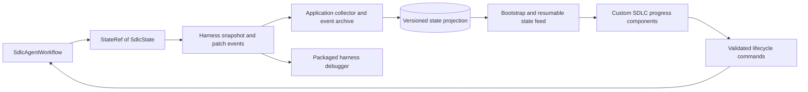

# SDLC agent state and its custom progress UI

Status: target application design. The first usable milestone implements a real harness state document and a custom progress UI; see [README.md](README.md). It retrieves and archives full authoritative snapshots every one to two seconds rather than implementing the future SSE/patch projection architecture below. The native harness UI still receives the emitted snapshots and patches. This refines [PLAN.md](PLAN.md) and [PRODUCT.md].

## 1. Use the feature that exists in this repository

The inspected implementation provides:

- `HarnessState` and `StateRef` in [harness/state](../../temporal_agent_harness/harness/state/__init__.py).
- `AgentWorkflowRunner.state(state_id, initial)` to register a state document, publish its initial snapshot, and publish patches after mutations. See [agent_workflow.py](../../temporal_agent_harness/harness/agent_workflow.py).
- `AgentStateSnapshot` and `AgentStatePatch` on the existing `turn_events` stream. Patches contain the version they produce and RFC 6902 operations. See [events.py](../../temporal_agent_harness/harness/agent_protocol/events.py).
- A working domain-state example in [trip_board.py](../../examples/monty/trip_board.py), and workflow/stream tests in [test_observable_state.py](../../tests/harness/test_observable_state.py).
- A generic JSON state renderer and replay fold in the existing UI. See [agentState.ts](../../ui/src/lib/state/agentState.ts).

The separate [rendering-agent-state design](../../docs/design/rendering-agent-state.md) is marked **not built**. Its proposed display annotations are not a dependency of this app. Build an app-owned, typed SDLC renderer against the existing snapshot/patch contract. Do not import the private frontend source from `ui/src` or pretend it is a published component package. Verify that the chosen published harness version includes the observed state API; use the matching released version or explicit local development mode if it does not.

## 2. Make the root SDLC agent own the lifecycle state

Refine the earlier plain `WorkItemLifecycleWorkflow` proposal into a harness agent, named `SdlcAgentWorkflow`, for each work item iteration. It contains the deterministic lifecycle controller and registers a canonical `SdlcState` document under `state_id="sdlc"`. The lifecycle controller reads that state to choose permitted work and commits the changes that the UI observes.

Keep the standard `AgentConfig` constructor/run input. Initialize the work item through an app-defined typed `@agent.accepts` message. The handler can drive the lifecycle across child-agent turns, activities, and human waits. Human decisions and control requests use separate app-owned Temporal Update handlers, so approval/resume/cancel is not queued behind a long-running harness message handler. One controller applies domain transitions; handlers validate/enqueue commands rather than concurrently editing competing copies of state. The initial spike must prove these interactions through the real runner.

The root agent need not call an LLM for every transition. It uses the harness for its typed interface, observable state, events, and debugging, while workflow code enforces scope and evidence gates. Discovery, builder, reviewer, and repair agents do the model-driven work. Their own observable documents can expose detailed phase/task state, linked from the root by workflow/run/agent IDs. They cannot independently declare the overall work item accepted or deployed.

There must not be a separate progress agent mirroring another workflow's independently maintained status. The root state is the actual execution state. Database projections and UI stores are reconstructable views of it, with explicit freshness. Project/settings/artifact records retain their existing ownership outside this document.

Example of the actual harness authoring pattern, reduced to the relevant part:

```python
from temporal_agent_harness.harness.state import HarnessState, StateRef

class TaskState(HarnessState):
    task_id: str
    title: str
    status: str = "todo"  # Full schema uses a closed Literal/Enum.
    evidence_refs: list[str] = []

class SdlcState(HarnessState):
    schema_version: int = 1
    work_item_id: str = ""
    phase: str = "intake"
    active_task_ids: list[str] = []
    tasks: dict[str, TaskState] = {}

# In @workflow.init, after constructing AgentWorkflowRunner:
# self._sdlc: StateRef[SdlcState] = self._runner.state("sdlc", SdlcState())

# In workflow code, after validating a completed check's durable result:
# with self._sdlc.mutate() as state:
#     state.tasks[task_id].status = "done"
#     state.tasks[task_id].evidence_refs.append(report_ref)
#     state.active_task_ids.remove(task_id)
```

The production schema is richer and validates domain transitions. All nested state models subclass `HarnessState`; plain nested `BaseModel` values and sets are not accepted by the inspected state implementation. Use lists and string-keyed dictionaries with stable IDs. A `mutate()` block is synchronous and never spans an `await`. Activities do not receive a `StateRef`; they return validated results or submit scoped progress reports, which the workflow reduces into state.

## 3. State contract

The document describes observable work and decisions. It does not contain secrets, private chain-of-thought, full file contents, raw logs, or every historical token. Store large evidence as artifact references. User-facing intent summaries are brief statements of the current action and its purpose.

| Field group | Contents | Used for |
| --- | --- | --- |
| Identity | Schema version, work item ID, iteration/generation, mode, intended outcome | Select the correct renderer and distinguish successive workflow runs. |
| Objective and scope | Goal, compact brief/blueprint reference and revision, acceptance-criteria IDs | Explain what the agent is trying to achieve and which scope is in force. |
| Lifecycle | Current phase, execution condition, phase statuses and phase dependencies | Render where the work is now and which stages apply. |
| Current focus | Active task IDs, short action/purpose, responsible agent IDs, operation references | Explain what is happening now and link to the actual tool/job. Multiple active tasks are supported. |
| Work plan | Tasks keyed by stable ID plus explicit display order; phase, dependencies, status, attempt, owner, completion criteria, evidence references | Render completed, active, blocked, and remaining work. A plan revision explains newly added/removed tasks. |
| Questions and blockers | Kind, cause, affected task IDs, possible responses, decision/command references | Make a wait actionable: answer, grant scope, fix environment, increase budget, or retry. |
| Decisions | Pending and resolved gate references, exact subject revision/digest, decision result | Show blueprint/release acceptance without allowing a model to manufacture it. |
| Agent and attempt links | Workflow/run/agent IDs, role, task assignment, state document identity | Open phase detail or the harness debugger at the relevant execution. |
| Verification | Required check IDs, queued/running/passed/failed/stale/waived status, source/artifact identity, evidence references | Distinguish implemented work from verified work. |
| Delivery | PR reference and head, release candidate, target/config revision, deployment operation and receipt, health and acceptance status | Show the difference between ready, deployed, healthy, and accepted. |
| Constraints | Active permission-profile reference, budgets/usage summary, unresolved risk IDs, pause/cancel/control state | Explain why the agent may stop and what it is allowed to do. |
| Handoff | Last completed checkpoint, next eligible task/action references, recovery reason | Resume after interruption and explain the next useful action. |

Keep three versions separate: the document's `schema_version`, the harness's mutation `version`, and the domain's blueprint/plan/decision revisions. A patch version orders state updates; it is not an approval revision or a stream cursor.

Derive task counts and the remaining-work list from task state. Do not independently maintain a UI-only checklist or an agent-written percentage. Show, for example, “6 of 9 planned tasks complete; 1 blocked; 2 ready.” That is a task count, not an estimate that 67% of effort or time is finished. Scope additions can change the denominator and should be visible as a plan revision.

Use precise statuses: a task can be planned, ready, running, waiting for input, blocked, completed, failed, skipped, or canceled. Checks have their own evidence status. A coding task can finish implementation while the enclosing phase still requires verification. Skip/waiver requires a reason and applicable authority; neither is silently counted as passed.

## 4. What writes the state

| Transition | Authoritative input | State change |
| --- | --- | --- |
| Requirements/plan proposed | Schema-validated agent output | Store proposal/task references and unresolved assumptions; do not approve it. |
| Blueprint or release approved | Validated human command for the current subject revision | Resolve that gate, select the approved revision, and expose eligible next work atomically. |
| Task starts | Controller dispatches an owned attempt/operation | Mark running and record active agent/operation identity before waiting on its result. |
| Tool or test result arrives | Durable, scoped activity/agent result | Link evidence; change task/check status according to completion criteria. |
| Progress during a long operation | Validated, sequence-numbered progress report from its execution service | Update a bounded operation summary; coalesce reports instead of writing every output line into workflow state. |
| A dependency fails | Recorded failure classified by the controller | Block dependent work, record the cause and available recovery actions. |
| User takes over / steers / cancels | Lifecycle-aware command and reconciled execution state | Record requested versus achieved control state; invalidate stale context/evidence as necessary. |
| Repair or new scope | Approved plan revision or bounded repair decision | Create an attempt/task and preserve the original result/evidence. |
| Deployment verified and accepted | Adapter receipt/check results, then a human acceptance command | Advance deployment, health, and acceptance fields separately. |

Use one mutation for related facts so the UI never sees “task completed” without its evidence reference or “phase advanced” with an unresolved gate. The actual I/O finishes before that mutation; do not hold a draft open while awaiting it. Models may propose tasks, report a blocker, or explain intent through app tools, but cannot use a generic arbitrary-state-write tool to bypass evidence or authority.

For child agents, aggregate completion/failure through typed durable results. If detailed ongoing child state is needed, observe its own document directly and label its owner. Promote a child fact into root state only through a scoped, versioned report that the root validates; avoid a second heuristic event parser guessing the root phase.

## 5. The custom UI

The primary progress surface lives alongside conversation and code. It is rendered by app-owned Svelte components selected by document identity/schema, with generated TypeScript types or schema contract checks to prevent drift.

```text
Add organization invitations                     BUILD · working
Approved blueprint v3                            6 / 9 tasks completed

Plan ✓ ── Build ● ── Verify ○ ── Review ○ ── Deploy ○ ── Accept ○

NOW                              LEFT TO DO
Builder: implement expiry check   ● Complete token expiry handling
Task T7 · Attempt 2               ○ Add expiry regression test
[View diff] [Open agent]          ○ Verify invitation acceptance flow

NEEDS YOU                        COMPLETED
Confirm invitation lifetime      ✓ Model and migration
[24 hours] [7 days] [Specify]     ✓ Invitation endpoint
                                 ✓ Email delivery adapter

EVIDENCE                         NEXT
API checks: passed at <SHA>       Run regression tests after T7 completes
Browser check: not run            Deployment waits for release approval

[Tasks] [Decisions] [Checks] [History] [Harness debugger]
```

This is illustrative. The current action, tasks, question, and next step must come from state, not hardcoded stage text. Adapt the phase rail to Ask, quick changes, and tasks with no deployment. Optional dependency/agent views can expand the same plan; a large graph is not required to understand a simple task.

Implement these components:

- **Phase rail:** completed/current/upcoming/blocked/not-applicable states, with the current condition and a drilldown to evidence or a gate.
- **Current work:** action, responsible agent, source task, attempt, job/tool links, and requested control actions. Worker connection/heartbeat freshness is a separate liveness overlay, since a stopped workflow cannot publish its own offline status.
- **Task board:** stable task IDs, dependencies, completion criteria, status, and evidence. Filter to remaining work or show the full plan and changes since the last visit.
- **Needs you:** questions and approvals with scope/revision visible. Submit typed commands to the agent; never mutate the projected JSON in the browser to simulate progress.
- **Verification/release panel:** source-bound check results, PR/candidate, deployment and health status, and the separate acceptance gate.
- **Recent changes:** highlight the affected task/field briefly without moving focus or rewriting an open diff. Explain plan changes and invalidated evidence.
- **History:** reconstruct the state at a selected event/checkpoint; clearly label historical mode and disable action buttons against past state. Return to live without losing review position.

Use the embedded harness UI for raw state, tools, model events, approvals, and detailed execution inspection. The custom view and debugger consume the same underlying state events and can link to the same agent/turn. A useful custom view must be available without opening the debugger or reading JSON.

## 6. Transport, materialization, and reconnect correctness



The initial harness snapshot is published once at state registration, often before the first turn. A client attaching from a later offset may receive only patches. `agent_status` is not a generic endpoint for these custom documents. Do not assume opening an SSE connection automatically provides a fresh snapshot.

Maintain a server-side collector that reads the root and selected child streams from a valid initial point, archives events, and folds state by `(workflow_id, run_id, agent_id, state_id)`. Store a state document, its harness version, and the corresponding collector/event watermark transactionally. Store harness resume cursors separately from application event IDs.

Proposed application routes:

- `GET /api/v1/work-items/{id}/state` returns the materialized document, identity, schema version, state version, and application watermark/freshness.
- `GET /api/v1/work-items/{id}/state-events?after=<watermark>` replays changes after that same point and then follows live updates. Use a database-backed ordered log so an update between the two requests cannot be lost.
- Existing work-item command routes carry `command_id` and the applicable expected domain revision. The UI shows pending acknowledgement until the resulting authoritative state arrives.

These are app APIs, not new claims about the harness HTTP API. If the projection is behind, label it catching up and recover from stored events; never fill missing state with invented defaults. An optional app-defined workflow query can aid diagnosis, but combining a query snapshot with an unrelated stream offset is not a correct bootstrap protocol.

Validate snapshot identity/schema and require each patch to produce `current_version + 1`. Deduplicate already-applied events by identity/version with conflict detection. A gap or invalid operation marks the view out of sync and triggers resync from a known snapshot/log checkpoint. Apply a patch atomically to a candidate copy; do not present partially applied invalid data as authoritative. Do not optimistically mark a task done before its agent state confirms it.

Keep transport ordering, schema validation and JSON Pointer escaping in a tested app adapter using the public wire format. The current harness frontend is a useful reference, not an import dependency, and does not remove the need for gap/duplicate tests in this product.

Cache periodic projection snapshots for efficient historical replay. The snapshot and its watermark must describe the same folded state. Large logs, documents and old task detail live in archived artifacts, with bounded summaries in the active state. New workflow generations have new state identity/version sequences and an explicit predecessor/checkpoint link; never apply old-run patches to a new-run document. Test checkpoint-based successor sessions before advertising long-running history rotation with the fixed `AgentConfig` startup shape.

## 7. Delivery and validation

This is a required part of the early vertical slice, not a later visualization enhancement:

1. In the initial integration spike, build a real `SdlcAgentWorkflow` with a small `SdlcState`, publish a task start/completion/blocker, and render it outside the generic debugger.
2. In the daily workbench milestone, ship the phase/current-work/task/needs-you components and a collector-backed bootstrap/reconnect path. The same data should appear in the harness's state pane.
3. Add questions, blueprint/review/check/deployment state as those capabilities arrive. Every new stage must supply its state contract and evidence links before it can be marked complete in the UI.
4. Add timeline replay and checkpoint comparisons using the archived state events. Test a new browser session after the original workflow is closed.

Required checks include: late join after many patches; reload during an approval; worker/API restart; duplicate/delayed/missing patch; invalid patch/schema; two agents using the same state ID; two runs with reset versions; task insertion/reordering; atomic task/evidence updates; scope changes affecting counts; failed/canceled/blocked operations; and historical mode receiving live events without moving its playhead. At selected checkpoints, assert the renderer's document equals the workflow's committed `StateRef.current` serialization.

The product acceptance test is simple: without reading chat or opening the debugger, Alex can identify **the current phase, what the agent is doing, why it is waiting, what has completed, what remains, and the next action**. Every displayed fact must be traceable to the agent's committed state or an explicitly labeled liveness/evidence source.
