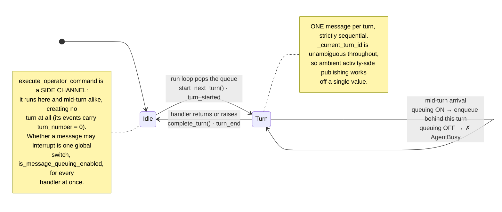
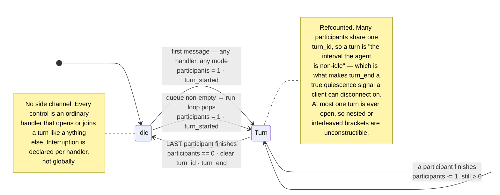
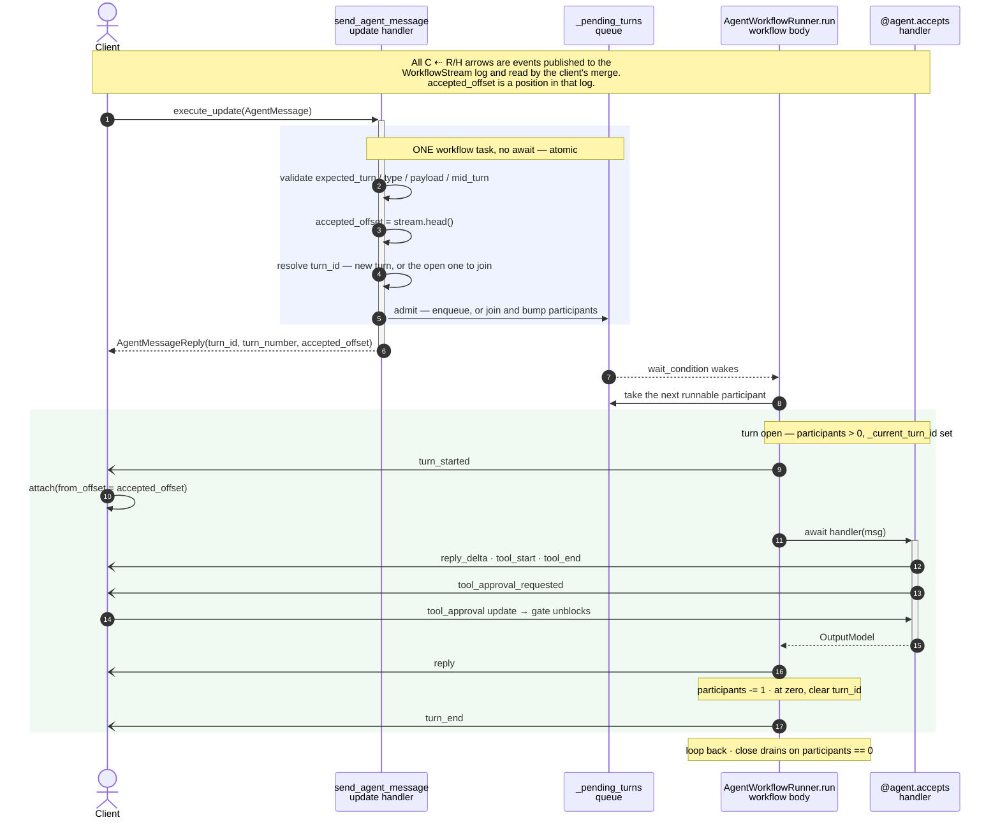

# Slash commands are not a harness concept

> Status: accepted, and implemented across the harness, the Python client, the FastAPI layer
> and the packaged Svelte UI. The Nexus surface (IDL, generated stubs, Go connector) follows
> in a separate change; until it lands, its two operator operations stay declared but answer
> `NOT_IMPLEMENTED`.
>
> This note records the reasoning as well as the result, because several of the questions it
> raised have non-obvious answers that would otherwise be silently re-opened — see
> **Decisions**, and the two-halves discussion under **Consequences that need care**.
> **Arguments against** is kept deliberately: the trades were made knowingly, not because
> they went unnoticed.
>
> **Follow-on:** making a turn hold several messages left the event vocabulary behind — the
> stream still encodes a message as `turn_started.user_message`, so a mid-turn message is
> invisible and replies cannot be paired with the message that produced them. See
> [`per-message-events.md`](per-message-events.md).

The harness currently knows what a slash command is. `slash_commands.py`, the
`operator_interface` query, the `execute_operator_command` update, and the
`OperatorCommand*` protocol types all encode one specific interaction shape: a human typing
`/foo bar` into a terminal-ish chat box.

That shape comes from coding agents, which is where slash commands live today. It is not a
generic property of agents. A product with a settings toggle that reconfigures the agent
mid-session is sending the same *kind* of message — "change what you are, don't do work" —
but it is a button, not a slash command, and nothing about it should route through a
concept named `slash`.

This note argues the harness should carry **one inbound door** (`send_agent_message` →
`@agent.accepts`), and that the properties currently bundled into "slash" should become
declared, orthogonal configuration on the handler.

## The concrete problem: the guardrail is a string compare

This isn't only an aesthetic complaint. The harness's security boundary between "a human
may do this" and "a parent agent's model may do this" is currently implemented as a
comparison against a magic name, in the two places that matter:

```python
# agent_workflow.py:1868 — what a caller can discover
for h in self._handlers.values() if h.name != _SLASH_MESSAGE_TYPE

# subagent_toolset.py:186-188 — what a parent model can actually call
if name != _SLASH_MESSAGE_TYPE
```

So an author who names a config-mutating handler `set_config` instead of `slash` silently
hands a parent agent the ability to relax its child's approval policy — defeating the
human-in-the-loop guardrail that `subagent_toolset.py:18-21` documents as load-bearing. And
an author who wants a legitimately model-callable handler named `slash` cannot have one.

The protection is a naming convention borrowed from terminal UIs. It should be a declared
property.

## What "slash" actually bundles

Three independent things, fused into one name:

| Property | Today | Should be |
| --- | --- | --- |
| **Model-callability** — may a parent agent's model call this? | implied by the name `slash` | a hint on the handler, decided by the parent |
| **Mid-turn behavior** — what happens if the agent is busy? | one global switch for all messages (`is_message_queuing_enabled`, `agent_workflow.py:1397`) | declared per handler |
| **Presentation** — how does a client render it? | `OperatorCommand.label` = `"/approvals"`, `payload_name`, `aliases` | client's business, not the harness's |

Every combination of the first two is meaningful, and today only two of four are
expressible. "Operator-only but queued" (a human injecting a note as a real turn) and
"agent-callable but immediate" (a cheap read a parent may issue without queuing) are both
reasonable and both currently impossible to write.

## The core reframe: a turn is a busy bracket, not a message bracket

The thing that makes this tractable is getting `turn` right. It is tempting to read a turn
as "one message's unit of work," which leads to wanting a second, non-turn bracket kind for
immediate messages. That's wrong, and it breaks on the idle case: an immediate message that
arrives while the agent is idle *is* the agent starting to do something, and must be visible
as such.

**A turn is the interval during which the agent is non-idle.** Idle → doing anything at all
opens a turn; back to idle closes it. That makes `turn_end` the quiescence signal, which is
what lets a client safely disconnect from the event stream instead of holding it open
forever.

With that definition there is exactly one bracket kind, and the only question a message
answers is whether it **joins** the open turn or **opens** a new one:

1. At most one turn bracket is open at a time. (Preserved — nothing else opens one.)
2. A message arriving while idle always opens a turn.
3. A message arriving mid-turn either joins the open turn, queues for a later one, or is
   rejected — per that handler's configuration.

Nested or interleaved `TurnStarted`/`TurnEnded` pairs are unconstructible, because no
message ever opens a second turn.

This also *removes* a client-side exception rather than adding one. `agent_client.py:620`
currently special-cases stream termination:

```python
terminal_operator_event = ev.event.type in {...}
if ev.event.type != AgentEventType.TURN_END and not terminal_operator_event:
```

That branch exists only because operator commands aren't turns. Under this model every
terminal is `TURN_END` and it deletes itself, along with the `OperatorCommandStarted` /
`Completed` / `Failed` event types (`events.py:341-370`).

### The turn model, before and after

The reframe is easier to see than to describe, and it is the one place in this note worth
comparing old against new directly. Before, the bracket is scoped to one message — so
anything that must *not* get its own turn needs a second, turn-less channel to live in,
which is exactly what `execute_operator_command` is and why its events carry
`turn_number = 0`. After, the bracket is scoped to busyness, and there is nothing left for a
side channel to do.

**Before — a turn is a message bracket:**



**After — a turn is a busy bracket:**



## Proposed surface

Mid-turn behavior, declared per handler. All three modes are identical when the agent is
idle (open a turn, run) — the setting governs only mid-turn arrival, so there is no
idle-case ambiguity to specify.

```python
@agent.accepts(mid_turn=MidTurn.ENQUEUE)
async def ask(self, msg: Ask) -> TextReply: ...

@agent.accepts                                 # mid_turn=REJECT, model_callable=True
async def start_batch(self, msg: Batch) -> BatchStarted: ...

@agent.accepts(mid_turn=MidTurn.ACCEPT, model_callable=False)
async def set_approvals(self, msg: SetApprovals) -> TextReply: ...
```

- `MidTurn.ENQUEUE` — queue behind the open turn.
- `MidTurn.REJECT` — fail the update with a typed error.
- `MidTurn.ACCEPT` — join the open turn and run now.

`mid_turn` is an enum, not a string: these are three fixed behaviors the harness dispatches
on, and a typo'd string should not be a runtime discovery. It defaults to `MidTurn.REJECT`,
and `model_callable` defaults to `True`, so the bare `@agent.accepts` form stays valid.

`REJECT` is the right default because it is the only one of the three that cannot surprise
an author: a handler that silently queues (`ENQUEUE`) delays work the caller thought it had
dispatched, and one that silently joins (`ACCEPT`) opts the author into concurrency with the
open turn — see *Concurrent state mutation is the author's problem*. Failing loudly on a
busy agent is the mode whose consequence is visible immediately, at the call site, in
development.

`model_callable` is only a hint, and the parent's `SubagentToolPolicy` is authoritative
either way (see below) — so a permissive default costs nothing that the policy can't
recover, while a restrictive one makes the common case (an agent whose whole surface is
meant to be drivable) the one that needs annotating. The real control is at toolset
construction, not here.

`is_message_queuing_enabled` and the global `AgentBusy` check (`agent_workflow.py:1397`)
are deleted in favor of this. Centralizing that decision was the original mistake: "a stop
command must work on a busy agent" and "a user message should queue" are the same decision
made oppositely, and the runner currently has to pick one for everything.

### Model-callability is a hint, and the parent decides

The magic-string filters are replaced by the same two-layer shape the harness already uses
for tool approvals, rather than by a second hardcoded rule.

A tool declares `inherently_safe: bool = False` (`agent_workflow.py:2495`) — a static claim
about its nature, explicitly *not* a decision. `ToolApprovalPolicy` is authoritative and
may honor that claim (`allow_inherently_safe()`), ignore it
(`always_require_approvals()`), or override everything (`dangerously_skip_all()`).

Handlers get the same treatment. The child declares a hint; the **parent** building the
toolset makes the call:

```python
# Child's declaration — a hint about intent, not an access decision.
@agent.accepts(mid_turn=MidTurn.ENQUEUE, model_callable=True)
async def ask(self, msg: Ask) -> TextReply: ...

# Parent's decision — authoritative, overrides the hints either way.
agent.subagent_toolset(
    ChildAgent, key="researcher", task_queue=...,
    tools=SubagentToolPolicy.allow_model_callable(),        # default: honor the hints
    # tools=SubagentToolPolicy.allow_only("ask"),           # narrower than the hints
    # tools=SubagentToolPolicy.dangerously_allow_all(),     # ignore the hints entirely
)
```

This two-layer split is what makes `model_callable`'s permissive default safe. Unlike
`inherently_safe` — whose conservative default matters because a tool's own claim can be the
*last* word when a policy honors it — a handler hint is never the last word: the parent
builds the toolset, and `allow_only` / `dangerously_allow_all` override the hints in both
directions. So the hint's job is to express intent, not to enforce, and defaulting it to
`True` keeps the common case (an agent whose whole surface is meant to be drivable)
annotation-free while leaving the actual control exactly where it belongs.

**Consequence: `agent_interface` now returns every handler**, each carrying its `mid_turn`
and `model_callable` values. It has to, since `operator_interface` is gone and a debugging
UI must be able to discover *all* of an agent's messages. That is not a regression: hiding
a handler from a discovery query was never the real boundary, because a parent model can
only act through the tools it was given. Filtering at toolset construction is the actual
control, and making it the *only* control removes a layer of security-by-obscurity that
implied more than it delivered.

### Telling the handler which case it's in

A handler often wants to behave differently depending on whether it opened the turn or
joined one. The motivating example is a coding-agent text box: sending while idle should
start a new prompt, sending mid-turn should *steer* — ride alongside the next tool result
presented to the model.

The handler contract is strictly one argument besides `self` (`agent_workflow.py:543`), and
that argument's model generates the `parameters` schema every caller introspects, so a
second positional parameter would either pollute that schema or need bespoke exclusion.

`Injected[T]` already means exactly "the workflow supplies this, hide it from the model's
schema" (`agent.py:38-43`). Extending it from tool parameters to `@agent.accepts` handlers
costs one concept instead of two:

```python
@agent.accepts(mid_turn="accept")
async def user_text(self, msg: UserText, ctx: Injected[MessageContext]) -> Reply:
    if ctx.joined_turn:
        self._steering.append(msg.text)      # drained by the running model loop
    else:
        return await self._prompt(msg.text)
```

Note that steering needs no new harness primitive: an `accept` handler appends to a buffer
and the running turn's model loop drains it when composing its next model input. That's the
same shape as the approval-policy case — a state mutation the open turn observes. Any
richer steering API is a convenience over this mechanism, not a missing part of it.

### Packaged controls go away entirely

`slash_commands.default_commands()` can't survive, since handlers become agent methods. The
harness ships **no replacement**: `approvals`, `allow-tools`, `status` and `stop` are simply
gone, and an agent that wants any of them as a message writes its own handler.

This costs nothing, because every one of them already has a first-class, non-command surface
that a client should have been using anyway:

| Packaged command | First-class surface it duplicated |
| --- | --- |
| `approvals` / `allow-tools` | the `tool_approval` update — `remember=True` relaxes the live policy and cascades to already-parked gates |
| `status` | the `agent_status` query |
| `stop` | the `close` signal |

It also removes a real problem rather than relocating it: those commands are currently **on
by default** (`agent_workflow.py:1265`), so `set_approvals` can disable human-in-the-loop
for a whole session through an unauthenticated `POST /api/operator-commands`
(`web/app.py:270`). Deleting the channel is a stronger fix than making it opt-in.

A packaged mixin — `class MyAgent(HarnessControls)`, found automatically because
`_discover_handlers` walks the MRO via `inspect.getmembers` (`agent_workflow.py:538`) —
remains available as a later convenience if a real need for these as *messages* shows up. It
is deliberately not part of this change: the mechanism it would need already exists, so
nothing is foreclosed by waiting.

## What this deletes

- `slash_commands.py` (378 lines) — handlers become ordinary methods.
- `OperatorCommand`, `OperatorCommandArgument`, `OperatorCommandRequest`,
  `OperatorCommandResult` (`agent_interface.py:274-322`).
- `OperatorCommandStarted` / `Completed` / `Failed` (`events.py:341-370`).
- The `operator_interface` query and `execute_operator_command` update.
- `/api/operator-interface` and `/api/operator-commands` (`web/app.py:231,270`).
- The client's terminal-operator-event branch (`agent_client.py:620`).
- The Slack connector's slash-prefix stripping (#78) — which is itself evidence for this
  design. That code exists because Slack's `/` collides with the harness's. Under one door
  the connector just maps a platform command to a message type. (Deferred to a follow-up
  along with the rest of the Nexus surface, which is still experimental; the harness-side
  operations it calls remain declared but answer `NOT_IMPLEMENTED` in the meantime.)

Two bugs go away as a side effect:

**Missing validation.** `_validate_send_agent_message` already validates payloads against
`handler.input_type` (`agent_workflow.py:1434-1443`). The slash path bypasses it with a
weaker check (`:1409-1420`), and `execute_operator_command` has no validator at all
(`:1347-1350`) while all three of its siblings do (`:1307`, `:1330`, `:1345`) — so an
unknown command is admitted into history and returns a *successful* response whose body is
an error string.

**Unenforced argument metadata.** `OperatorCommandArgument.kind`/`choices`
(`agent_interface.py:274-292`) is a hand-rolled mini-schema that is never checked
workflow-side, despite its docstring claiming otherwise. A pydantic input model with
`mode: Literal["strict","safe","skip"]` produces the same enum in the JSON schema
`AcceptedFunction.parameters` already carries — and that one is actually enforced.

Nothing replaces it. There is no presentation metadata in the harness — no labels, no
aliases, no argument-kind enum, no pass-through hints dict. A client that wants to render a
handler has the handler's name, its docstring, and its input model's JSON schema, which is
what `AcceptedFunction` already carries. If that turns out to be insufficient, the case
gets made from a real client that needs something specific.

## Consequences that need care

### Admission and execution are two halves

Admission and execution are separate halves joined by one queue, and most of what follows
turns on that seam. The update handler contains no `await`, so it completes inside a single
workflow task — which is what guarantees `accepted_offset <= turn_started`, and is the same
property the participant refcount relies on: increment during admission, never when a
handler body starts.



The update's *return value* is on the critical path for streaming, which is why a handler
body must not run inside the update handler. `accepted_offset` is the client's read-start
hint: `send_message` awaits the update to completion and only then builds the merge
(`agent_client.py:459`), as does the `run_subagent_turn` activity. Deferring the response
until the work finished would stop anything streaming live, and would deadlock a gated tool
on those submit-then-stream callers — the client that would send `tool_approval` is still
awaiting the update response, so it never sees `tool_approval_requested`. An `accept`
handler therefore runs as a spawned in-workflow task and replies on the stream, exactly as a
queued one does.

**`TurnEnded` becomes refcounted, with an admission race.** Today it's one message in, one
turn out (`agent_workflow.py:943-954`). With join-semantics a turn ends when the *last*
participant finishes. The race — participant A finishes, count hits zero, `TurnEnded`
publishes, while an `accept` message admitted moments earlier is about to start — is
avoidable because update handlers run synchronously until their first `await`. Increment
the refcount in the synchronous admission prologue, not when the handler body starts. This
is the same guarantee `accepted_offset` already relies on (`:1361-1368`).

**...and `complete_turn()` currently nulls the turn id, which crashes rather than
mis-stamps.** This is the most likely first failure. `complete_turn` clears
`_current_turn_id` (`:951-954`), so the moment the first participant finishes,
`current_stream_context` returns `None` (`:912-919`) and any still-running `accept`
handler's next tool call hits a hard raise — either `_apply_approval_policy:331-336`
("gated tool has no active turn to publish its approval against") or
`AgentToolContext.for_current_tool_id:659-663` ("no active agent turn"). Same fix: clear
the turn id at refcount zero, not on first completion. Loud rather than silent, so it's
cheap to get wrong on the first pass.

**`expected_turn` silently changes meaning, and it breaks naive clients.** It was a slot
reservation — `current_turn + len(pending) + 1`, "I claim to be turn N." Under
join-semantics a message may not get its own turn at all, so it becomes a staleness token:
"the next number the agent should hand out." Same type, different meaning — the kind of
change that would normally demand a version bump, since every client computing
`last_seen + 1` keeps working until it doesn't.

**It does not stay theoretical.** A client that increments once per message *sent* is
correct until the first `accept` message joins an open turn: that join advances no counter,
so the client is permanently one ahead and every later send fails `StaleTurn`. The stream
cannot repair it either — a join publishes under the joined turn's *lower* number, so a
`turn_number >= expected` reconciliation never fires. The bug is invisible until someone
uses `accept` on a busy agent, which is exactly when they will.

So the contract must be stated positively, not left implicit: **a client sets its next
`expected_turn` from `AgentMessageReply.turn_number + 1`** — the joined turn for a join, the
reserved slot otherwise — and never from a local send count. `agent_status` re-derives it for
a client that has lost track. This is documented on both `AgentMessage.expected_turn` and
`AgentMessageReply.turn_number`, and pinned by a test asserting that a join leaves the next
expected turn unchanged.

No versioning here. The repository is early-stage with test users only, so the semantics
change outright and the packaged Svelte UI is updated in the same change to keep the stack
working end to end. The documentation obligation is to describe the *resulting* behavior
accurately — the docs should read as though this was always the design, not narrate a
migration from something else.

**Stream attribution needs no work** — worth recording so it isn't re-derived. An `accept`
handler runs *inside* the turn it joined, so the single `_current_turn_id` gives every
participant the right answer, and per-call identity is already task-scoped:
`_CURRENT_RUNNER` and `_CURRENT_TOOL_ID` are `ContextVar`s (`agent_workflow.py:231-239`).
The entry-carried publishing in `_publish_approval_resolved:1660` and
`_publish_callback_resolved:1752` ("an update handler driving a policy cascade isn't bound
to any one turn") already handles the one case that isn't ambient.

**Close must drain.** `_closed` is only observed between turns (`:1934`), so in-flight
`accept` handlers must be waited on before the workflow completes or their results are lost.
The wait is on the participant refcount reaching zero, not
`workflow.all_handlers_finished` — an `accept` handler's body runs as a spawned task rather
than inside its update handler (see *Admission and execution are two halves*), so the
handler-level signal wouldn't see it. The refcount is the right instrument anyway: it is the
same counter that closes the turn bracket, so "the turn has ended" and "it is safe to
complete" cannot disagree.

**Status must stop lying.** `turn_active` / `has_pending_work` (`:927-932`) need a
companion notion of in-flight participants, or `/status` misreports and any remaining
busy-check reasons about the wrong thing.

## Decisions

Three questions this design raised, and how they were settled. Recorded with reasoning
because these are the kind that get re-opened otherwise.

### 1. Concurrent state mutation is the author's problem

`accept` is the first mechanism that lets *author-written* code mutate shared runner state
concurrently with itself. The concrete shape is a read-modify-write split across an
`await`: read `current_approval_policy`, derive a new one with `with_tool_allowed`, write
it back — safe today only because the packaged handler is synchronous
(`slash_commands.py:330-333`), and a lost update once it isn't.

**The decision is to document this, not to prevent it.** Three reasons:

- The harness is *already* concurrent inside a turn. A turn's tool calls are dispatched
  under `asyncio.gather` and each gated call parks in its own task
  (`agent_workflow.py:317-321`), and `_apply_policy_update` already runs from an update
  handler alongside those parked gates. `accept` widens who participates, not whether
  concurrency exists.
- Harness-internal state is already safe by construction, and stays that way: registries
  are partitioned by unique id (`_approvals`, `_callbacks`, `_subagents`), and every
  `_WorkflowStatus` mutator is non-yielding, so on a single-threaded event loop each is
  atomic. `_approval_policy` is the only unpartitioned mutable field, and it is swapped by
  reference.
- **Hardening only harness state would be an inconsistent guarantee.** Authors own agent
  state the harness cannot see or protect; they will need their own discipline regardless.
  A partial guarantee on one field invites the assumption of a general one. Temporal is an
  inherently concurrent paradigm and workflow authors should be treated as capable of it.

What this costs: the `accept` docs must say plainly that these handlers run concurrently
with the open turn and with each other, and that runner state they mutate is shared. That's
a documentation obligation, not a mechanism.

Separately, and *not* as a safety measure: exposing atomic deltas (`runner.allow_tool(name)`)
instead of a policy read + `set_approval_policy` write is probably better ergonomics on its
own merits. Worth considering when that API is next touched; not a prerequisite.

### 2. Policy relaxation keeps releasing already-parked gates

`_apply_policy_update` (`agent_workflow.py:1617`) re-evaluates every pending approval
against a new policy and auto-resolves those it now allows. **This behavior stays.**

A human who says "stop asking me about tool calls" almost always means the calls already
sitting in front of them, not merely future ones. Making relaxation apply only going
forward would leave parked gates stranded and require a second, separate action to clear
them — worse ergonomics for the common case, in service of a threat model that assumes the
human is being impersonated or is badly out of date. The human-in-the-loop gate is a
guardrail on the *model*, not on the human; the human is the escalation target.

The residual risk is real and accepted: a sufficiently stale client can relax the policy
and thereby release a dangerous call it never saw, and (per decision 3) the staleness check
won't always catch that. The tightening move, if this ever bites, is to scope the cascade —
keep it for `ToolApprovalDecision.remember`, which is an explicit human decision about one
named tool, and require an explicit release for blanket policy swaps. Deliberately not
doing that now.

### 3. `expected_turn` stays; no `expected_offset`

`expected_turn` is turn-granular, so it does not catch a stale client acting during a turn
it hasn't finished observing — agent mid-turn 5 with a dangerous call parked, queue empty,
`next_turn_number` is 6, and a client that saw only turn 5 *start* passes the check.

The precise alternative — asserting a stream offset — **is rejected**, because it's a race
you lose almost every time. The offset advances on every event, including each streamed
model delta, so by the time a client composes and sends a message its offset is already
behind and the update fails. A CAS that spuriously rejects on nearly every busy-agent
interaction would push clients straight into retry loops, and a check people learn to retry
past protects nothing.

So `expected_turn` remains the only staleness token, with the semantics change noted under
*Consequences*: it stops meaning "the queue position I claim" and starts meaning "the turn
I have observed through." Coarse, but stable enough to be worth sending honestly.

## The client's generic message surface

`agent_interface` returning every handler is enough for a client to render an arbitrary
agent, with no per-agent knowledge and no hardcoded handler names. The packaged Svelte UI
demonstrates the shape:

- The composer always has **one selected handler**. Sending builds
  `{type: <handler>, payload: {...}}` for it.
- A handler whose input schema is **single-string-shaped** — exactly one property, `type:
  "string"`, no `enum` — renders as an ordinary chat text box, with the property name read
  from the schema. This is what keeps a plain chat agent feeling like a chat agent without
  the client assuming the field is called `text`.
- Every other handler renders as a **form generated from its input JSON schema**. `enum`
  (and `anyOf` of `const`s, which is how pydantic emits a `Literal`) becomes a dropdown, so a
  constrained field is impossible to get wrong. This is the enforced replacement for
  `OperatorCommandArgument.kind`/`choices`, which was never checked workflow-side.
- Typing `/` in the text box opens a **picker over every handler** — name, docstring, and a
  `mid_turn` badge telling the user whether sending will queue, join, or be rejected —
  filtered by prefix and navigable by arrow keys. The `/` is purely a client-side
  convention for a familiar affordance; nothing about it reaches the harness, which is the
  whole point of this note.

## Still open (implementation, not design)

- **Whether `AcceptedFunction` carries anything beyond** `mid_turn` + `model_callable`.
  Deliberately nothing else for v1 — no presentation metadata. The input model's JSON
  schema already describes the payload, and a client that needs more should prove the need
  first.

## Arguments against

- **It's a real breaking change** across the Python client, the FastAPI layer, the Svelte
  UI, and the Go connector. Contained today because there's essentially one consumer; much
  worse in six months. That's an argument for doing it now, but not an argument that it's
  cheap.
- **Per-handler dispatch config is more rope.** A global queuing switch is easy to reason
  about; per-handler `accept` invites authors into concurrency they may not realize they've
  opted into. The position above accepts that trade knowingly, but it *is* a trade, and
  "the docs said so" is the only thing standing behind it. The `REJECT` default narrows the
  exposure — concurrency is now something an author types — but does not remove it.
- **`mid_turn` may not be the last axis.** Adding `model_callable` and `mid_turn` today invites
  a third and fourth later, and decorator config that grows without bound is its own smell.
  Worth being explicit that these two are justified by existing, demonstrated needs and
  that further axes need the same bar.
- **Slash commands do work today.** Nobody is blocked. This is a bet that the harness's
  generality matters more than the cost of churn, and that bet is only worth making while
  the consumer count is low.
