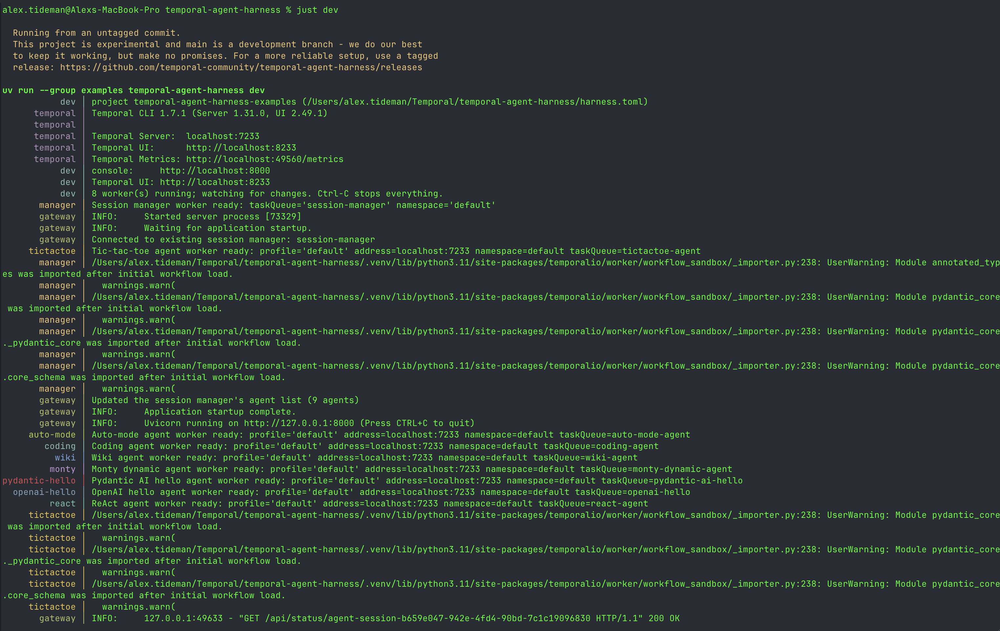

# Development

Contributor-facing notes for working in this repository from a checkout: the layout,
the root `justfile`, UI development, and building/packaging. (End-user installation and
usage lives in the top-level [`README.md`](../../README.md).)

## Repository layout

```
temporal_agent_harness/
├── harness/      # the core harness: agent contract, turn runner, tools, Code Mode,
│                 #   the agent/subagent protocol, human-in-the-loop approvals
├── ai_sdks/      # AI SDK integrations (Gemini today) — durable activity wrappers
├── web/          # packaged session-manager workflow + FastAPI app factory
└── utils/        # general Temporal utilities (e.g. large-payload offload)

examples/
├── monty/          # a travel-booking agent example with packaged web/UI wiring
└── callback_tools/
    └── wiki_agent/ # a wiki-organizing agent built on callback tools, with a thin terminal client

ui/               # shared Svelte frontend for the Monty example

tests/            # mirrors the package layout
```

## Root Justfile

The repo root has a `justfile` for the common development workflow. Run
`just --list` from the repo root to see the available recipes.

Build and package recipes run directly from the root:

```bash
just app-install   # install Svelte dependencies
just app-build     # build ui/ into temporal_agent_harness/ui/dist
just app-check     # Svelte checks
just package       # UI build + UI checks + pytest + uv build
```

Run the local stack in one terminal:

```bash
just dev                         # Temporal, session manager, web server, and available workers
just dev --only monty,tictactoe    # select workers by their names in harness.toml
just dev --fresh                  # discard the saved local Temporal database
just dev --no-watch               # run without restarting workers on file changes
```

Example startup with all eight example workers:



`harness.toml` lists the example registries and worker commands. The runner loads `.env.local`
without overriding exported variables and skips workers whose required keys are missing.
Editing a watched path restarts only the workers watching it; editing an agent registry reloads
the web server and updates the session manager's agent list without terminating sessions.
Changes to worker definitions in `harness.toml` require restarting `just dev`.

The runner reuses a reachable Temporal server and leaves it running on exit. Otherwise, it starts
a local server and stores its database in `.harness/`, so sessions survive restarts. `--fresh`
discards that database only when starting its own server. Ctrl-C stops all processes it started.

The same runner works in other projects with `temporal-agent-harness[ui]` installed:

```toml
[project]
name = "my-agents"
env_file = ".env.local"
registries = ["agents.toml"]

[[workers]]
name = "my-agent"
command = ["python", "-m", "my_app.worker"]
requires = ["OPENAI_API_KEY"]
watch = ["my_app"]
```

Save this as `harness.toml` and run `uv run temporal-agent-harness dev`, or pass
`--manifest path/to/harness.toml`. Paths resolve relative to the manifest. A leading `python`
or `python3` in a worker command uses the runner's interpreter and installed dependencies.

Individual processes can also run in separate terminals:

```bash
just temporal          # local Temporal dev server
just session-manager   # packaged session-manager worker
just server            # serves the COMMITTED UI build + FastAPI API on http://localhost:8000
just dev-server        # rebuild the UI first, then serve (use after editing ui/)
just worker-monty      # Monty agent worker
just ui-dev            # Vite hot reload on http://127.0.0.1:5173
```

`just server` deliberately does **not** rebuild the UI: it serves the committed
`temporal_agent_harness/ui/dist`, so a downloaded release archive runs with no Node/pnpm
installed. That makes the committed build load-bearing — after changing anything under `ui/`,
run `just app-build` (or `just dev-server`) and commit the result.

All example recipes read one shared env file, `.env.local` at the repo root: the root
justfile loads it directly, and `examples/*/justfile` read the same root file (via
`dotenv-path`). Keep your Temporal profile + `GEMINI_API_KEY` there.

## UI Development

The source Svelte app lives in [`ui/`](../../ui). The package ships the compiled
output in [`temporal_agent_harness/ui/dist`](../../temporal_agent_harness/ui/dist), so
any UI change needs a rebuild before packaging or before `just server` serves it:

```bash
just app-install   # one-time install of Svelte dependencies
just app-build     # build ui/ into temporal_agent_harness/ui/dist
just app-check     # svelte-check + local Svelte 5 syntax guard
```

For hot reload, keep the FastAPI API server running on port 8000 and start Vite
in another terminal:

```bash
# terminal 1
just server

# terminal 2
just ui-dev
```

The production build uses relative asset and API URLs, so the UI can be served
from `/` or under a path prefix as long as the UI and API are mounted together.

## Build And Package

Use the package recipe from the repo root:

```bash
just app-install   # one-time setup if ui/node_modules is absent
just package
```

The resulting artifacts are written to `dist/`:

```text
dist/temporal_agent_harness-0.3.0.tar.gz
dist/temporal_agent_harness-0.3.0-py3-none-any.whl
```

The wheel and sdist include:

- the core harness package
- `temporal_agent_harness.web` with the FastAPI app factory and session-manager worker helper
- `temporal_agent_harness.ui/dist` with the built Svelte UI assets
- the `ui` extra, which pulls in `fastapi[standard]`

Before publishing or handing off artifacts, run:

```bash
just package
```

`just package` runs the Svelte production build, Svelte checks, the local
Svelte 5 syntax guard, the Python test suite, and `uv build`. The primary
recipe lives in the repo-root `justfile`; the same recipe is also available
from `examples/monty/justfile` for convenience.
