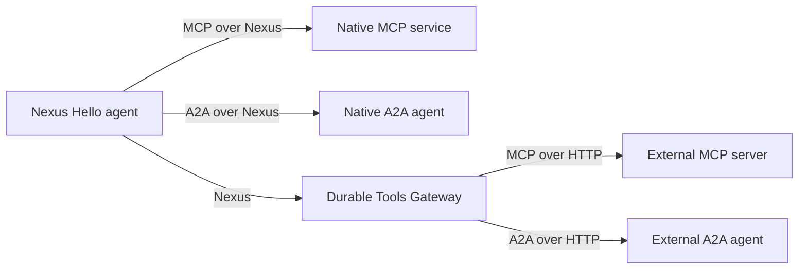
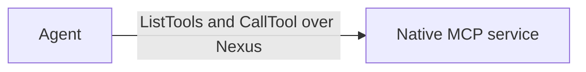
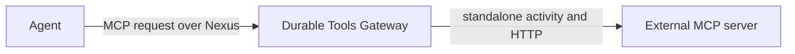
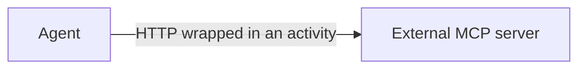
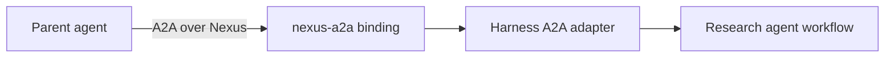
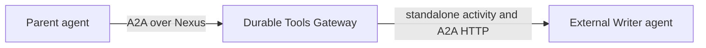
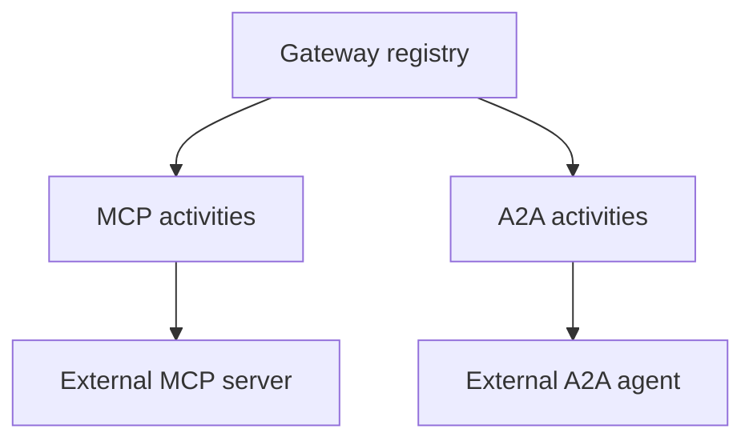
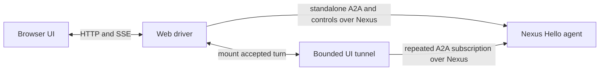

# Nexus-hello agent

This example shows two things reached over Nexus: a tool, and a subagent. Both use the
same two paths. A **native** path calls the resource directly. A **gateway** path calls a
3rd-party resource through the Durable Tools Gateway. The same gateway brokers both kinds.

The model decides when to use each resource. It never gets called directly by the
workflow. The two MCP tools are plain `Agent(mcp_servers=[...])` entries. The two
subagents are bridged into plain `Agent(tools=[...])` function tools, via
`harness_tool_as_openai_tool`.

- `nexus_native_mcp_server(name, endpoint)` / `agent.nexus_native_subagent(cls, endpoint, key=...)`
  -- one hard-coded native Nexus service, called directly. No registry. No registration.
- `nexus_gateway(account_id).mcp_servers(...)` /
  `agent.nexus_subagent_gateway(account_id).subagent([...], alias, key=...)`
  -- a resource registered ahead of time with the Durable Tools Gateway, called through it.
  The explicit `account_id` selects the account-owned registry.

Native and 3rd-party resources never mix inside the gateway's routing. MCP tools and
subagents share one gateway and one registry workflow. Each HTTP operation uses a
standalone activity.
Tool lists are never cached. They are fetched live from the real MCP server on every
`list_tools()` call. The subagents run no real model. Both give a canned reply. Calling
them proves the transport works, not that they can hold a conversation. But the model
decides whether to call them at all, the same way it decides for the MCP tools.

Resources (registered under account_id `"NexusHelloAccount"`):
- `demo_get_fun_fact` - a 3rd-party (non-Nexus) MCP server, reached through the
  **Durable Tools Gateway** ("demo" -> `http://127.0.0.1:8765/mcp`).
- `demo-nexus_get_lucky_number` - a **native** MCP server, called directly. No gateway.
  No registration.
- `research` - a **native** SUBAGENT (a real harness agent), called directly. No
  gateway. No registration.
- `writer` - a **3rd-party** A2A agent (HTTP+JSON, no Nexus and no Temporal client),
  reached through the same **Durable Tools Gateway** as `demo_get_fun_fact`.

## Architecture



## How it works

```python
account_gateway = nexus_gateway("NexusHelloAccount")
mcp_servers=[
    account_gateway.mcp_servers("demo"),
    nexus_native_mcp_server("demo-nexus", "nexus-hello-demo-endpoint"),
]

research = agent.nexus_native_subagent(
    NativeResearchSubagentWorkflow, "nexus-hello-subagent-endpoint", key="research"
)
subagent_gateway = agent.nexus_subagent_gateway("NexusHelloAccount")
writer = subagent_gateway.subagent(
    [agent.declared_handler("ask", "...", TextMessage, TextReply, param_name="message")],
    "writer",
    key="writer",
)

sdk_agent = OpenAIAgent(
    ...,
    mcp_servers=[nexus_gateway.mcp_servers("demo"), nexus_native_mcp_server(...)],
    tools=[harness_tool_as_openai_tool(fn) for fn in [*research, *writer]],
)
Runner.run_streamed(sdk_agent, input=..., context=self._runner)  # required: run_tool lives on it
```

`harness_tool_as_openai_tool` turns each subagent function into a plain OpenAI-agents
tool. It dispatches through `AgentWorkflowRunner.run_tool`. Approval gating and
tool-lifecycle events fire the same way they do for any other harness tool. The model
sees the subagent tools the same way it sees the MCP tools. The model decides when to
start a subagent, ask it something, and stop it. The workflow never calls a subagent
directly.

### Subagent lifecycle controls

The parent owns and tracks the children it starts. Two slash commands let the operator
change their lifecycle without adopting sessions from another parent or from an
account-wide registry:

- `/subagent-reuse use-existing|always-new` controls whether `start_<key>` reuses the
  most recently used matching child that is still active under this parent. The default
  is `use-existing`.
- `/subagent-close-policy keep-open|close|ask-user` controls model-requested stops and
  graceful parent shutdown. The default is `ask-user`: model-requested stops use the
  same approval UI as gated tools, while parent shutdown leaves children open.

`keep-open` never closes tracked children, while `close` allows model-requested stops
and closes tracked children during graceful parent shutdown. An abrupt parent
termination cannot run cleanup, so local children use Temporal's `ABANDON` parent-close
policy.

There are two paths to a resource over Nexus: **native**, and **gateway-brokered**. This
example uses both paths, for two resource kinds: MCP tools, and subagents.

### MCP tools

**1. Native tool** (`demo-nexus_get_lucky_number`). The tool server is itself a Nexus
operation handler. There is no gateway and no registry. The agent already knows the
service name and endpoint, from `nexus_native_mcp_server(...)`. Listing tools and calling
a tool are each one Nexus call.



**2. Gateway tool** (`demo_get_fun_fact`). The real MCP server only speaks HTTP. The
gateway holds its URL. The gateway calls it on the agent's behalf. `.mcp_servers("demo")`
asks the gateway for that alias's tools, once per turn, in one Nexus call. An alias that
isn't registered is skipped silently for now (this is a prototype). `just
register-third-party-mcp-server` registers the URL and then checks it. The gateway fetches
the real tool list on every discovery call. Discovery retries up to three times and then
skips an unavailable server. This needs the dynamic config `just temporal` sets:
`nexusoperation.enableStandalone` and `activity.enableStandalone`.



**3. Traditional MCP** (not used by this demo -- shown for contrast). Plain HTTP,
wrapped in an activity. This is what `stateless_mcp_server`/`MCPServerStreamableHttp`
give you.



### Subagents

Subagents use A2A for discovery, messaging, task lifecycle, and streaming. Nexus is the
durable transport binding for both the direct and gateway paths.

The reusable `nexus-a2a` package under `nexus/a2a` defines that transport without
depending on this harness. `temporal_agent_harness.a2a` is the thin adapter that maps
the harness workflow and rich event stream onto the generic binding.

**1. Native subagent** (`research`). Same shape as the native tool above, but the
resource is a whole harness agent (`native_subagent.py`), not a tool. `SendMessage`
starts or advances its A2A Task. `SubscribeToTask` returns bounded cursor pages because
Nexus operations currently have one result rather than a server stream; the parent
repeats the operation until the turn ends. `CancelTask` closes the child. There is no
gateway and no standalone activity. The A2A adapter runs beside the agent workflow in
the same worker for this demo, though it may be scaled independently.



**2. Gateway subagent** (`writer`). The registered alias identifies an HTTP A2A agent.
The parent allocates an A2A Task ID locally; the first `SendMessage` lazily creates the
provider task. Follow-up turns and `CancelTask` reuse that durable route, so changing a
registration cannot redirect an existing task. Two tasks remain independently addressable.
Messages carry stable IDs, so the gateway activity may retry safely. The MCP tool-call
activity does not retry because an MCP tool may have side effects.



### One gateway, two resource kinds

The Durable Tools Gateway is one Nexus service in one namespace. One registry workflow
stores MCP server URLs and A2A agent URLs. The HTTP operations use separate
activities and retry rules.



### Browser UI tunnel

This example deliberately opts the packaged browser UI into the same Nexus/A2A
foundation. The scoped `session-manager` and `server` recipes set the endpoint for
you. Each send/control is a standalone Nexus operation; the UI still receives SSE
while one bounded per-turn connector workflow owns the repeated A2A polling.
The Nexus binding carries requests and responses as standard A2A JSON so its Go
connector and Python agent backends share one package-independent wire contract.



Four Temporal namespaces show cross-namespace Nexus calls:

| Namespace | Hosts |
|---|---|
| `default` | The agent (`worker.py`) and session-manager Nexus front door. |
| `gateway` | The Durable Tools Gateway and shared UI tunnel. Brokers both `demo` (tool) and `writer` (subagent). |
| `nexus-mcp-server` | The demo native tool service. |
| `nexus-subagent-server` | The demo native subagent's own agent workflow. |

## Demo limits

- The demo HTTP A2A agent stores task state in memory. A production provider must use a
  durable task store.
- A graceful parent close stops its active instances. A forced workflow termination cannot
  run cleanup. A production provider should also expire inactive instances.

Three different IDs are in play here. `agents.toml`'s key (`"nexus-hello"`) identifies
the UI entry, `NexusHelloAgent` is the Temporal workflow type, and
`NexusHelloAccount` owns the gateway resources. They are deliberately independent.

## Layout

| File | Role |
|---|---|
| `workflow.py` | `NexusHelloAgentWorkflow` - `ask` handler: model decides whether to use any of `mcp_servers=[...]` or the two bridged subagent tools (`tools=[...]`). |
| `worker.py` | Worker on `default`. No Nexus-related plugin config. |
| `tool_server.py` | Demo 3rd-party MCP server (`get_fun_fact`). |
| `nexus_tool_service.py` | Demo native MCP server (`get_lucky_number`), built on `authoring.MCPOverNexusServiceHandler`. |
| `native_subagent.py` | Demo native subagent (`NativeResearchSubagentWorkflow`) with its `A2AServiceHandler` Nexus front door in the same worker. |
| `subagent_server.py` | Demo third-party A2A HTTP+JSON agent, proxied through the same gateway as `tool_server.py`. |

## Run it

Prereqs:
- From the repo root, `cp .env.example .env.local` and set `OPENAI_API_KEY`.
- `nexus-mcp` extra needs Python >=3.13 (`uv sync --extra nexus-mcp`, or just `uv sync` on 3.13+).
- `temporal` CLI on PATH (the stable public release; no custom build needed).

Each in its own terminal, in order:

```sh
just temporal                        # 1. local Temporal dev server
just setup-nexus                     # 2. ONE-SHOT: 4 namespaces + 4 Nexus endpoints
just third-party-mcp-server          # 3. demo 3rd-party MCP tool server
just third-party-subagent            # 4. demo 3rd-party subagent
just registry                        # 5. durable tools gateway (no seed config -- starts empty)
just nexus-tool-service               # 6. demo native tool service
just nexus-subagent                  # 7. demo native subagent -- agent workflow AND
                                      #    its Nexus front door, one worker
just register-third-party-mcp-server # 8. ONE-SHOT: registers "demo" under account_id
                                      #    "NexusHelloAccount"
just register-third-party-subagent   # 9. ONE-SHOT: registers "writer" under the same account_id
just session-manager                 # 10. session-manager + Nexus A2A/control front door
just ui-tunnel                       # 11. durable UI connector tunnel
just server                          # 12. builds UI, serves API + UI on :8000 through Nexus
just worker                          # 13. this example's agent worker
```

Open http://localhost:8000, pick **Nexus Hello**, start a chat. Ask something that calls
for research and writing (e.g. "research X and write a short summary") and the model
will use both subagents alongside the two MCP tools. All four resources work
immediately. The model decides whether each one is relevant to what you asked.

```
(every turn)                 default -> RegistryService.list_account_entries("NexusHelloAccount")  (gateway tool only)
demo_get_fun_fact:            default -> RegistryService (gateway) -> mcp_proxy_activity (standalone activity) -> tool_server.py (HTTP)
demo-nexus_get_lucky_number:  default -> nexus_tool_service.py (nexus-mcp-server namespace), no gateway hop
research (subagent):          default -> A2AServiceHandler (nexus-subagent-server namespace), no gateway hop
writer (subagent):            default -> A2AService (gateway) -> A2A HTTP activity -> subagent_server.py
```

Without `just` (from the repo root):

```sh
uv run --extra nexus-mcp python -m examples.nexus_hello.tool_server
uv run --extra nexus-mcp --group examples python -m examples.nexus_hello.subagent_server
TEMPORAL_NAMESPACE=gateway GATEWAY_SEED_ACCOUNT_ID=NexusHelloAccount uv run --extra nexus-mcp --group examples python -m nexus_mcp.durable_tools_gateway.worker
TEMPORAL_NAMESPACE=nexus-mcp-server uv run --extra nexus-mcp python -m examples.nexus_hello.nexus_tool_service
TEMPORAL_NAMESPACE=nexus-subagent-server uv run --group examples python -m examples.nexus_hello.native_subagent worker
(cd nexus/ui_connector && CONNECTOR_NAMESPACE=gateway CONNECTOR_TASK_QUEUE=nexus-ui-tunnel go run ./cmd/tunnel/)
temporal workflow signal --namespace gateway \
    --workflow-id account-registry-cf700a56bafc7c6f1417b0fda1135aedd0298c6266fb173b325d69db81b09a8f \
    --name register_external --input '"demo"' --input '"http://127.0.0.1:8765/mcp"'
temporal workflow signal --namespace gateway \
    --workflow-id account-registry-cf700a56bafc7c6f1417b0fda1135aedd0298c6266fb173b325d69db81b09a8f \
    --name register_subagent --input '"writer"' --input '"http://127.0.0.1:8766"'
NEXUS_UI_ENDPOINT=nexus-hello-agent-ui-endpoint uv run --group examples python -m examples.session_manager_worker
NEXUS_UI_ENDPOINT=nexus-hello-agent-ui-endpoint CONNECTOR_NAMESPACE=gateway CONNECTOR_TASK_QUEUE=nexus-ui-tunnel \
    uv run --group examples python -m examples.app examples/nexus_hello/agents.toml --host 0.0.0.0 --port 8000
uv run --extra nexus-mcp --group examples python -m examples.nexus_hello.worker
```

(`just setup-nexus`'s namespace/endpoint creation is one-shot infra setup - see the justfile
for the raw `temporal operator ...` commands if running without `just`.)

## If the UI doesn't show "Nexus Hello"

The web UI's `SessionManagerWorkflow` is a singleton. It is set once, from whichever
`agents.toml` first started it. Restarting `just server` does not refresh it. Terminate it
and let a fresh one start:

```sh
temporal workflow terminate --workflow-id session-manager
```
