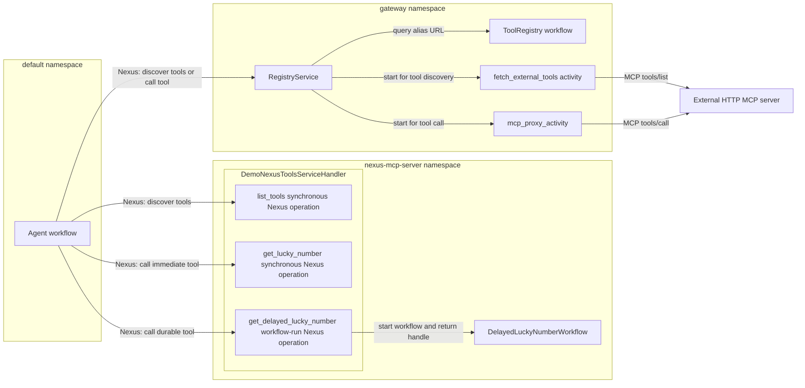

# Nexus hello agent

This example gives one agent access to three tools through Temporal Nexus. The
preferred path uses Nexus as the transport for an `MCPServer`-shaped AI SDK
adapter. The example also shows a compatibility path for an existing external
HTTP MCP server.

The agent uses two access paths:

- `nexus_native_mcp_server(name, endpoint)` connects the agent directly to a
  native Nexus tool service.
- `nexus_tools_gateway().mcp_servers(...)` connects the agent to selected
  external MCP servers through the Durable Tools Gateway.

The complete agent workflow is in [`workflow.py`](workflow.py). It configures
both paths in one `Agent`:

```python
nexus_gateway = nexus_tools_gateway()
mcp_servers = [
    nexus_native_mcp_server("demo-nexus", "nexus-hello-demo-endpoint"),
    nexus_gateway.mcp_servers("demo"),
]
```

The example provides these tools:

| Tool | Implementation | Access path |
| --- | --- | --- |
| `demo-nexus_get_lucky_number` | Synchronous Nexus operation | Direct Nexus call |
| `demo-nexus_get_delayed_lucky_number` | Workflow-backed Nexus operation | Direct Nexus call |
| `demo_get_fun_fact` | External HTTP MCP server | Durable Tools Gateway compatibility path |

## Data flow of the example

The following diagram shows tool discovery and tool calls. It also shows the
workflow that supports the delayed tool.



### Native Nexus tools

The agent has the service name and Nexus endpoint in its configuration. It
calls the service through `nexus-hello-demo-endpoint`. The gateway does not
process these calls.

The service exposes three Nexus operations. The generated `list_tools`
operation returns the current tool manifest and the exact route for each tool.

`get_lucky_number` is a synchronous Nexus handler operation. The handler
creates the result and returns it directly. This operation does not start a
workflow.

`get_delayed_lucky_number` is a workflow-run Nexus operation. Its handler
starts `DelayedLuckyNumberWorkflow` and returns a workflow handle. The backing
workflow uses `workflow.sleep()` for its durable timer.

The complete implementation is in
[`nexus_tool_service.py`](nexus_tool_service.py). This reduced excerpt shows
the two tool implementations and the worker registration:

```python
@nexusrpc.handler.service_handler(name=SERVICE_NAME)
class DemoNexusToolsServiceHandler(MCPOverNexusServiceHandler):
    @nexus_mcp_tool
    async def get_lucky_number(self, topic: str) -> str:
        return f"{topic}'s lucky number today is {random.randint(1, 100)}."

    @nexus_mcp_operation(title="Get a delayed lucky number")
    @temporalio.nexus.workflow_run_operation
    async def get_delayed_lucky_number(
        self,
        ctx: temporalio.nexus.WorkflowRunOperationContext,
        input: DelayedLuckyNumberInput,
    ) -> temporalio.nexus.WorkflowHandle[DelayedLuckyNumberOutput]:
        return await ctx.start_workflow(
            DelayedLuckyNumberWorkflow.run,
            input,
            id=f"delayed-lucky-number-{ctx.request_id}",
            task_queue=NEXUS_TASK_QUEUE,
        )

worker = Worker(
    client,
    task_queue=NEXUS_TASK_QUEUE,
    workflows=[DelayedLuckyNumberWorkflow],
    nexus_service_handlers=[DemoNexusToolsServiceHandler()],
)
```

The excerpt omits the Pydantic model definitions and the MCP tool annotations.

### External MCP tool

The gateway registry maps the alias `demo` to
`http://127.0.0.1:8765/mcp`. The registry stores the URL. It does not store a
tool list. The registration signal stores the URL and then tests the
connection. The registry keeps the URL if this test fails.

The external server is a standard MCP server. Its complete implementation is
in [`tool_server.py`](tool_server.py):

```python
mcp = MCPServer("demo-tools")

@mcp.tool()
def get_fun_fact(topic: str) -> str:
    facts = [
        f"{topic} was mentioned in a movie script exactly once, allegedly.",
        # Additional demo facts are in tool_server.py.
    ]
    return random.choice(facts)
```

The gateway uses `fetch_external_tools` for discovery and `mcp_proxy_activity`
for tool calls. See the
[gateway architecture](../../nexus/mcp/ARCHITECTURE.md#durable-tools-gateway),
[`registry.py`](../../nexus/mcp/nexus_mcp/durable_tools_gateway/registry.py)
and
[`registry_service_handler.py`](../../nexus/mcp/nexus_mcp/durable_tools_gateway/registry_service_handler.py).

The gateway requires these Temporal dynamic configuration values:

```text
nexusoperation.enableStandalone=true
activity.enableStandalone=true
```

The `just temporal` recipe sets both values.

### Agent identifiers

This example uses two agent identifiers:

| Identifier | Value | Purpose |
| --- | --- | --- |
| `agents.toml` key | `nexus-hello` | Routes UI requests to the agent. |
| Gateway `agent_id` | `NexusHelloAgent` | Selects gateway registrations for this workflow type. |

`nexus_tools_gateway()` gets `agent_id` from the current workflow type. The two
identifiers do not have to match.

## Files

| File | Purpose |
| --- | --- |
| [`workflow.py`](workflow.py) | Defines the agent workflow and configures both tool paths. |
| [`worker.py`](worker.py) | Runs the agent worker in the `default` namespace. |
| [`tool_server.py`](tool_server.py) | Runs the external MCP server for `demo_get_fun_fact`. |
| [`nexus_tool_service.py`](nexus_tool_service.py) | Runs the native Nexus service and the delayed workflow. |
| [`agents.toml`](agents.toml) | Adds the agent to the example UI. |
| [`justfile`](justfile) | Starts the local services and creates the Nexus resources. |

## Run the example

### Requirements

- Use Python 3.13 or later for the `nexus-mcp` extra.
- Install the Temporal CLI and add it to `PATH`.
- From the repository root, copy `.env.example` to `.env.local`.
- Set `OPENAI_API_KEY` in `.env.local`.
- From the repository root, run `uv sync --extra nexus-mcp`.

The extra installs the local `temporal-nexus-mcp` distribution. Do not run
`pip install nexus-mcp`. That command installs an unrelated project from PyPI.

### Start the services

Change to the example directory:

```sh
cd examples/nexus_hello
```

Run each command in a separate terminal. Run the commands in the listed order.

```sh
just temporal
just setup-nexus
just tool-server
just registry
just nexus-tool-service
just register-third-party
just session-manager
just server
just worker
```

`just setup-nexus` creates the three namespaces and two Nexus endpoints. Run it
once for each new Temporal development server. `just register-third-party`
registers the `demo` URL under agent ID `NexusHelloAgent`. You can run both
commands again if necessary.

Open <http://localhost:8000>. Select **Nexus Hello**, and start a chat.

The agent waits on its Nexus operation handle when it calls the delayed tool.
The harness adapter does not use the MCP Tasks extension. The
[`test_caller_matrix_integration.py`](../../tests/nexus_mcp/test_caller_matrix_integration.py)
test covers that protocol path. It uses `NexusMCPBridge` and a task-capable MCP
client.

## Refresh the agent list

`SessionManagerWorkflow` stores the agent list when it starts. Restarting the
web server does not update an existing workflow. If the UI does not show
**Nexus Hello**, terminate the workflow:

```sh
temporal workflow terminate --workflow-id session-manager
```

The session-manager worker starts a new workflow when the application requests
it.
