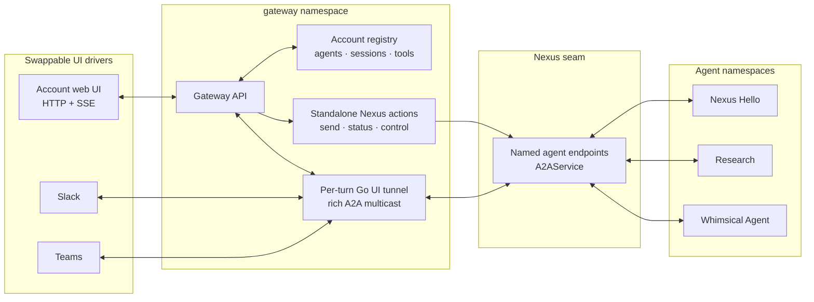
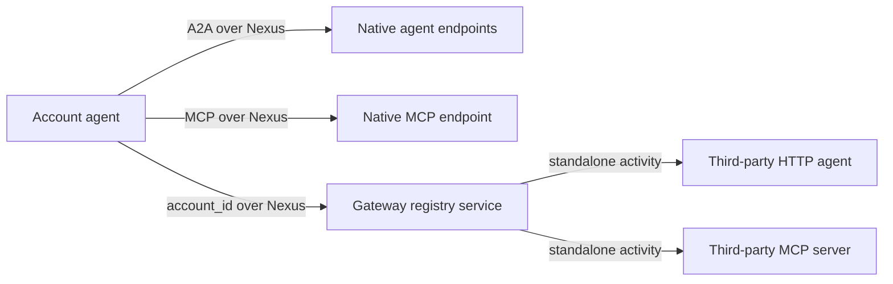
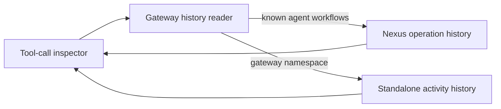
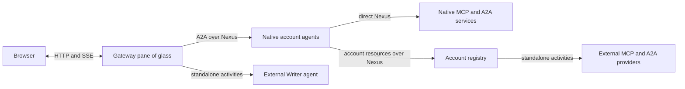

# Nexus Hello: account gateway and agent UI

This prototype gives `NexusHelloAccount` one pane of glass for its agents, sessions,
and MCP tools. An account owner can mount a Temporal Agent Harness agent through a
Nexus endpoint even when the UI and agent run in different Temporal namespaces. The
same UI also demonstrates a minimal third-party HTTP agent.

The account registry owns registrations and session routing. It does not copy native
agent transcripts, inspect an agent namespace through Temporal Visibility, or depend on
`SessionManagerWorkflow`. Authentication is intentionally out of scope; matching
`account_id` values are the demo trust boundary.

## What the demo registers

| Resource | Kind | Route |
|---|---|---|
| Nexus Hello | harness agent | `nexus-hello-agent-endpoint` |
| Research | harness agent/subagent | `nexus-hello-subagent-endpoint` |
| Whimsical Agent | OpenAI Agents SDK harness agent/subagent | `nexus-hello-whimsical-agent-endpoint` |
| Writer HTTP | third-party agent | `http://127.0.0.1:8766` |
| demo-nexus | native Nexus MCP service | `nexus-hello-demo-endpoint` |
| demo | third-party MCP server | `http://127.0.0.1:8765/mcp` |

The registered agent IDs deliberately match the subagent keys Nexus Hello uses. A
Research, Whimsical, or Writer child can therefore appear under the same account card
after its lifecycle event is observed. Only account-registered agent types are exposed.

Whimsical Agent is both a child and a top-level agent. It uses the OpenAI Agents SDK
inside the Temporal Agent Harness and the same account tools as Nexus Hello, but has a
playful system prompt so its output is easy to distinguish.

## Architecture

The Go UI connector is the shared tunnel. For every mounted A2A task turn it calls
`SubscribeToTask` once per page and multicasts the complete serialized A2A
`StreamResponse` to independent subscribers. Browser, Slack, and Teams drivers decide
how to render that rich stream at the edge; the tunnel does not reduce it to a
platform-specific message model. A slow subscriber advances from its own cursor without
blocking another subscriber.

The harness-independent A2A-over-Nexus binding lives in `nexus/a2a`. The
`temporal_agent_harness.a2a` package is the thin harness adapter: it maps agent
workflows and their rich events onto that reusable transport.



The browser never needs an agent workflow-ID convention, task queue, or namespace. The
registry resolves an account session to a registered endpoint and A2A task ID. One-shot
operations such as send, status, close, approval, and command are standalone Nexus
operations. The shared tunnel remains a workflow because it repeatedly long-polls A2A
and multicasts pages until that turn reaches its terminal event and subscribers drain.

Nexus is also the seam for account resources. Native resources stay direct; registered
third-party resources are durably invoked by the gateway.



A direct Writer session stays on the gateway HTTP path. For a Writer spawned by Nexus
Hello, dispatch activities use deterministic IDs, so the UI can reconstruct retained
turns from Temporal activity input and outcome without persisting a third transcript.
The provider and the account's Temporal retention policies define how far back that
history remains available.

### Completed sessions and child discovery

`A2AService.SubscribeToTask` has one cursor contract for both live and completed tasks.
It long-polls a running harness stream and serves a bounded replay from final workflow
state after completion. This lets the same driver mount a stopped native child and show
its retained history.

The tunnel observes rich subagent lifecycle events and reports registered child sessions
to the account registry. The explicit UI refresh also reconciles children of known live
account sessions. Neither path scans all workflows in an agent namespace.

### Historical MCP calls

The sidebar's **Tool calls** view is read-only and does not change execution routing.



For native MCP, the reader inspects only account-known caller workflows and matches
retained Nexus operation events to the registered endpoint and service. For third-party
MCP, it lists recent gateway proxy activities and point-reads their input and outcome,
with bounded concurrency. It stores no duplicate tool result. The UI shows the Nexus
operation ID or activity execution ID plus the caller agent workflow when available.

## Run the complete demo

Prerequisites:

- Python 3.13 or newer, `temporal`, `just`, `curl`, `pnpm`, and `uv`.
- Copy `.env.example` to the repository-root `.env.local` and set
  `OPENAI_API_KEY`.
- Install once with `uv sync --extra nexus-mcp` and `just app-install` from this
  directory.

Run all commands below from the example directory:

```sh
cd examples/nexus_hello
```

Start Temporal, then create the four namespaces and five Nexus endpoints:

```sh
just temporal
just setup-nexus
```

Keep each service below running in its own terminal:

```sh
just third-party-mcp-server  # HTTP MCP server on :8765
just third-party-subagent    # HTTP agent provider on :8766
just nexus-tool-service      # native Nexus MCP service
just nexus-subagent          # native Research agent
just whimsical-agent         # child/top-level OpenAI Agents SDK agent
just worker                  # Nexus Hello agent
just gateway-ui              # UI tunnel + registry + API/UI on :8000
```

`just gateway-ui` builds the Svelte UI, starts the Go UI tunnel in the `gateway`
namespace, and starts the gateway worker/API. If JavaScript dependencies are missing,
run `just app-install` once.

Populate `NexusHelloAccount` with these idempotent one-shot recipes:

```sh
just register-agents
just register-native-mcp-server
just register-third-party-mcp-server
just register-third-party-subagent
```

Open <http://localhost:8000>. The account sidebar should show four agent cards and two
MCP servers.

### Exercise the routes

Click **New** on **Nexus Hello**. Creating the registry session does not start an agent;
the first message starts it lazily through `nexus-hello-agent-endpoint`. A useful prompt
is:

```text
Get a fun fact and a lucky number, ask the research, whimsical-agent, and writer
subagents about Temporal, then summarize the results and stop all three subagents.
```

The model chooses its own calls, so the exact sequence varies. As registered children
appear, open the corresponding session drawer and mount one to inspect its own stream.
Closed native children remain mountable through A2A replay.

Click **New** on **Whimsical Agent** to run the same workflow directly as a top-level
account session. Click **New** on **Writer HTTP** to exercise the third-party feasibility
path. Mounting again creates a separate account session.

The important routes are:



The one-shot send, status, interface, approval, callback, command, and close requests do
not need proxy workflows: the gateway starts them as standalone Nexus operations. The
third-party HTTP equivalents are standalone activities. Only operations that actually
orchestrate repeated calls remain workflows: a bounded `UIAgentTunnelWorkflow` polls one
agent turn, and `BrokeredAgentDiscovery` drains lifecycle pages before reconciling child
sessions.

The Nexus Hello workflow opts into its account toolbox explicitly:

```python
account_gateway = nexus_gateway("NexusHelloAccount")
mcp_server = account_gateway.mcp_servers("demo")

subagent_gateway = agent.nexus_subagent_gateway("NexusHelloAccount")
writer = subagent_gateway.subagent([...], "writer", key="writer")

whimsical = agent.nexus_native_subagent(
    WhimsicalAgentWorkflow,
    "nexus-hello-whimsical-agent-endpoint",
    key="whimsical-agent",
)
```

An agent using another `account_id` resolves another registry workflow and cannot see
these registrations.

### Subagent lifecycle controls

The parent owns and tracks the children it starts. Two slash commands let the operator
change their lifecycle without adopting sessions from another parent or from an
account-wide registry:

- `/subagent-reuse use-existing|always-new` controls whether `start_<key>` reuses the
  most recently used matching child that is still active under this parent. The default
  is `use-existing`.
- `/subagent-close-policy keep-open|close|ask-user` controls model-requested stops and
  graceful parent shutdown. The default is `ask-user`: model-requested stops use the
  same approval UI as gated tools, while parent shutdown leaves children open.

`keep-open` never closes tracked children, while `close` allows model-requested stops
and closes tracked children during graceful parent shutdown. An abrupt parent
termination cannot run cleanup, so local children use Temporal's `ABANDON` parent-close
policy.

## Run without `just`

The justfile is the canonical runbook. The combined gateway command is equivalent to
running these processes together:

```sh
CONNECTOR_NAMESPACE=gateway just ui-tunnel

TEMPORAL_NAMESPACE=gateway \
GATEWAY_SEED_ACCOUNT_ID=NexusHelloAccount \
GATEWAY_UI_ACCOUNT_ID=NexusHelloAccount \
uv run --extra nexus-mcp --group examples python -m nexus_mcp.durable_tools_gateway.worker
```

## Troubleshooting and reset

- If the pane has no cards, run `just register-agents` and reload.
- If a native send fails, confirm the corresponding worker is running and the Nexus
  endpoint targets its namespace and task queue.
- If the toolbox is empty, run the MCP registration recipes after the servers and
  gateway are ready.
- If streams do not advance, confirm the `ui-tunnel` process started by
  `just gateway-ui` is still running on task queue `nexus-ui-tunnel` in namespace
  `gateway`.
- To reset durable account state, stop `gateway-ui`, terminate the registry below, then
  restart and register resources again.

```sh
temporal workflow terminate \
  --namespace gateway \
  --workflow-id account-registry-cf700a56bafc7c6f1417b0fda1135aedd0298c6266fb173b325d69db81b09a8f
```

The HTTP provider stores sessions and idempotency keys in memory. Authentication,
authorization, and production registry storage are intentionally left for a production
implementation.
