# Nexus Hello: account gateway and brokered agent UI

This is the end-to-end demo for the account-scoped Nexus gateway. It shows an account
owner opening one UI, seeing the agents and toolbox registered to that account, and
mounting either:

- a Temporal Agent Harness agent reached through a Nexus endpoint, even though the
  gateway UI and agent live in different Temporal namespaces; or
- a third-party agent implementing standard A2A over HTTP+JSON.

The registry owns the account's agent registrations, tool registrations, and UI session
records. There is no `SessionManagerWorkflow`, no `agents.toml`, and no Temporal
visibility query into the agent's namespace.

The account used by the demo is `NexusHelloAccount`. Authentication is deliberately out
of scope for now, so matching `account_id` values are the trust boundary.

## What the account owns

After the registration steps, the account pane at <http://localhost:8000> contains:

| Registration | Kind | Route |
|---|---|---|
| `Nexus Hello` | mountable harness agent | `nexus-hello-agent-endpoint` |
| `Research` | mountable harness agent/subagent | `nexus-hello-subagent-endpoint` |
| `Whimsical Agent` | mountable OpenAI Agents SDK agent/subagent | `nexus-hello-whimsical-agent-endpoint` |
| `Writer HTTP` | mountable third-party agent | `http://127.0.0.1:8766` |
| `demo` | MCP server in the toolbox | `http://127.0.0.1:8765/mcp` |
| `writer` | subagent provider in the toolbox | `http://127.0.0.1:8766` |

The `Research`, `Whimsical Agent`, and `Writer HTTP` agent IDs deliberately match the
`research`, `whimsical-agent`, and `writer` keys Nexus Hello uses when it spawns them. That
lets the registry project a spawned child into the account's session list and route it
through the already registered endpoint. The Writer card and `writer` subagent registration
intentionally point at the same canned HTTP server, demonstrating that one provider can be
mounted directly or used through the gateway.

The Nexus Hello agent itself can use six resources:

- `demo_get_fun_fact`: the registered HTTP MCP server, proxied through the account
  gateway.
- `demo-nexus_get_lucky_number`: a Nexus-native tool reached directly.
- `demo-nexus_get_delayed_lucky_number`: a workflow-backed Nexus operation reached
  through the same direct service route.
- `research`: a Nexus-native harness subagent reached directly.
- `whimsical-agent`: an OpenAI Agents SDK harness subagent reached directly over Nexus.
- `writer`: the registered HTTP subagent, proxied through the account gateway.

Only registered agents become independently mountable sessions. The native tool and native
research routes remain direct dependencies of Nexus Hello, so they do not appear in the
toolbox strip; Research and Whimsical Agent appear as agent cards because their endpoints
are separately registered.

Whimsical Agent is intentionally both a child and a top-level agent. Nexus Hello can create
it through the native subagent toolset, while an account owner can click **New** on its card
to start the same workflow independently. In either role its inner harness uses the OpenAI
Agents SDK and the same `demo` and `demo-nexus` MCP tools, but a playful system instruction
makes its replies easy to distinguish from Nexus Hello.

## Architecture

The gateway is the account owner's pane of glass. The browser talks only HTTP and SSE;
the gateway owns the durable account mapping and chooses the registered transport for each
agent or session.

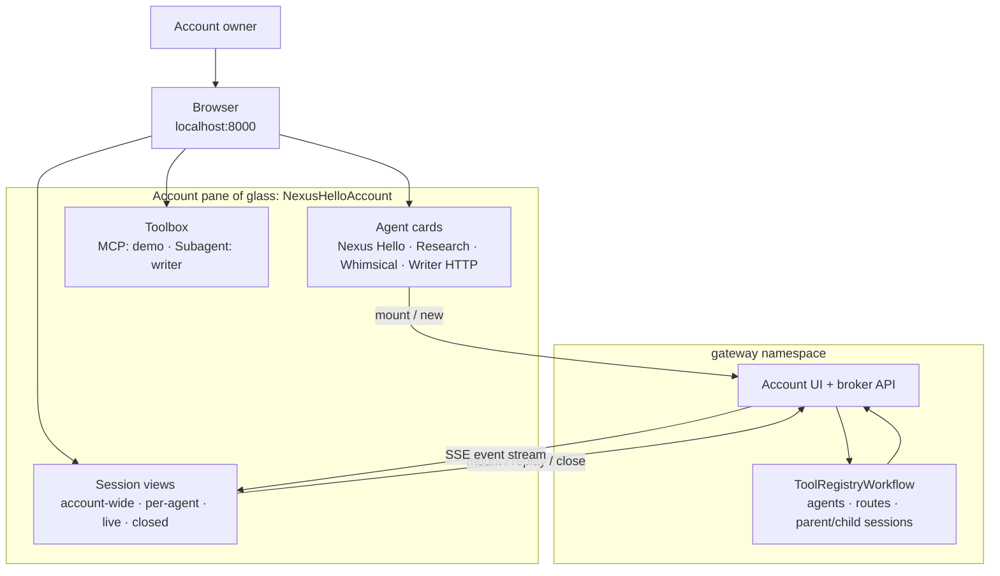

A direct Writer HTTP session is the deliberate exception: its action workflow invokes the
registered provider with standalone HTTP activities, and attach replays UI events retained
in the registry. That path stays on the gateway side and never crosses the Nexus seam. A
Writer spawned by Nexus Hello does cross Nexus into the registry service; its transcript is
not copied into the registry. Mount reconstructs those turns from the retained standalone
activity input and outcome described below.

For harness-native agents, Nexus is the transport seam. A named endpoint hides the target
namespace, task queue, and workflow-ID convention from the gateway. `A2AService` binds
standard A2A task semantics to Nexus; the provider session ID is the durable task ID.
The harness-independent binding lives in `nexus/a2a`; the thin
`temporal_agent_harness.a2a` adapter projects harness workflows and rich stream events onto
that binding.

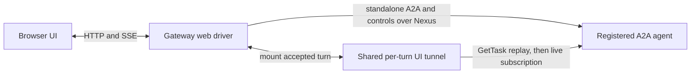

`GetTask` returns the complete retained replay and its continuation cursor. A live task
then uses `SubscribeToTask` from that cursor.

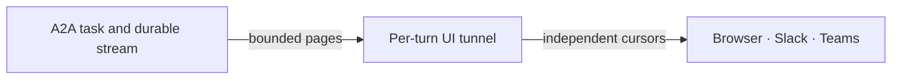

The agent's own account resources use Nexus in the opposite direction: the agent crosses
the seam back into the gateway for account-owned HTTP resources, or crosses directly to a
native Nexus service.

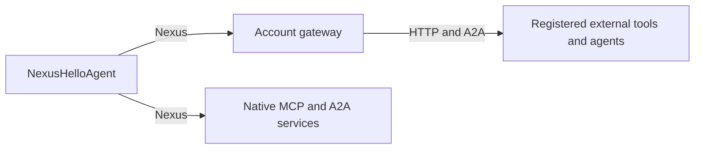

Spawned children become independently mountable without scanning Temporal visibility:

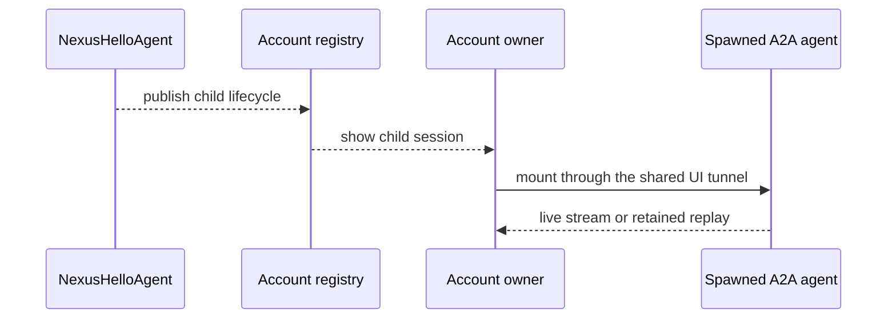

For a spawned third-party child, the registry keeps only its account/session routing record
and completed turn count. Each dispatch uses
`subagent-dispatch-{gateway_instance_id}-{turn_number}` as its standalone activity ID.
Mount can therefore point-read the retained input and outcome for every turn—bounded to eight
concurrent reads—and project them into the same SSE cursor space as later UI-originated turns.
There is no Visibility scan and no third copy of the transcript. Once the account's Temporal
activity retention expires, that historical turn is intentionally reported as unavailable.

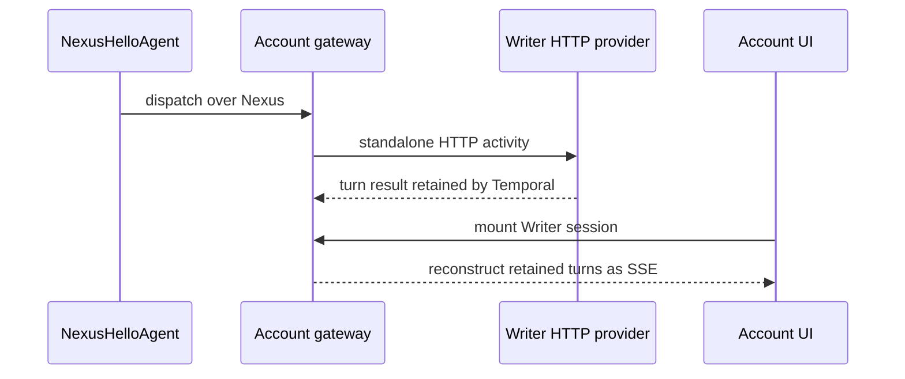

The browser and gateway never need the Nexus Hello workflow ID format, task queue, or
namespace. The account registry stores the agent ID and endpoint. The agent's
`A2AServiceHandler` maps each gateway-owned A2A Task ID onto a lazily started
`NexusHelloAgent` workflow.

### Why the gateway UI is colocated

The gateway UI is the browser driver for the shared UI connector. Each message or control
is a standalone Nexus operation. Mounting starts (or joins) one deterministic, bounded
`UIAgentTunnelWorkflow` for the selected agent task and turn. That workflow gets the
complete `GetTask` snapshot, subscribes from its cursor only while the task is live, and
multicasts the rich A2A event pages to every attached driver without making one slow
subscriber block the others.

`GetTask` reconstructs both live and completed tasks from the harness's retained
`WorkflowStream` state. A stopped child therefore replays without attempting an invalid
subscription against its completed workflow. While an agent is running,
`SubscribeToTask` uses a long-polling workflow update for records after the snapshot cursor.

This design avoids starting one Temporal workflow per poll while also avoiding a second
long-lived store for the agent stream. The tunnel closes after the selected turn reaches a
terminal event and its subscribers drain; the agent's A2A task and Temporal history remain
the durable source of truth. A later mount can replay the same retained turn through the
same cursor contract.

### Non-workflow A2A caller

The harness-independent `nexus-a2a` package also implements the official Python A2A
client-transport interface using standalone Nexus operations. The calling agent does not
have to be a Temporal workflow or use this harness; its host supplies a Temporal client
that can reach the endpoint. Cursor paging remains private to the transport, so the caller
consumes a normal A2A async event stream.

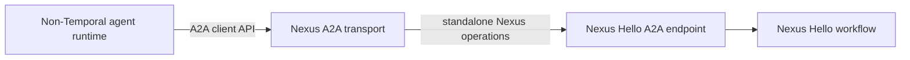

With `just temporal`, `just setup-nexus`, and `just worker` running, the optional OpenAI
Agents SDK proof can call Nexus Hello directly:

```sh
just standalone-a2a-caller "Ask Nexus Hello what it can do"
```

## Run the complete demo

Prerequisites:

- Python 3.13 or newer for the `nexus-mcp` extra.
- `temporal`, `just`, `curl`, `pnpm`, and `uv` on `PATH`.
- From the repository root, copy `.env.example` to `.env.local` and set
  `OPENAI_API_KEY`.
- Install dependencies once with `uv sync --extra nexus-mcp` and, from this example
  directory, `just app-install`.

Run all `just` commands from the example directory:

```sh
cd examples/nexus_hello
```

Start Temporal in one terminal:

```sh
just temporal
```

In another terminal, create the four namespaces and five Nexus endpoints. This is a
one-shot command and is safe to rerun:

```sh
just setup-nexus
```

Start these long-running services, one per terminal:

```sh
just third-party-mcp-server  # HTTP MCP server on :8765
just third-party-subagent    # HTTP agent/subagent provider on :8766
just nexus-tool-service      # native Nexus tool service
just nexus-subagent          # native research agent + its Nexus front door
just whimsical-agent         # OpenAI child/standalone agent + its Nexus front door
just worker                  # Nexus Hello agent + its Nexus front door
just gateway-ui              # registry, gateway, broker, API, and UI on :8000
```

`just gateway-ui` builds the shared Svelte UI before starting the colocated gateway
process. If the build reports missing JavaScript dependencies, run `just app-install`
once.

With the services running, populate `NexusHelloAccount` using these one-shot recipes:

```sh
just register-agents                 # Nexus Hello + Research + Whimsical + Writer cards
just register-third-party-mcp-server # demo MCP toolbox entry
just register-third-party-subagent   # writer subagent toolbox entry
```

All three registration recipes are safe to repeat. Now open <http://localhost:8000>. The
account pane should show four agent cards and both toolbox registrations.

### Mount Nexus Hello

Click **Mount** on **Nexus Hello**. This creates an account-owned session record but does
not start the underlying agent workflow yet. Send the first message to start it lazily
through `nexus-hello-agent-endpoint`.

A prompt that makes the child and tool routes easy to observe is:

```text
Get a fun fact and a lucky number, ask the research, whimsical-agent, and writer
subagents about Temporal, then summarize the results and stop all three subagents.
```

The model still decides which tools are relevant, so its exact call sequence can vary.
The browser stream travels back through A2A `GetTask` and, while live, bounded Nexus
`SubscribeToTask` calls rather than directly attaching to the workflow.

As soon as the attached stream observes a registered child, that child is added to the
account session drawer with a **spawned** marker. Click it to mount the child's own stream.
The refresh button explicitly reconciles active children from each live registered harness
session; it does not scan Temporal visibility or create sessions. Stopped children remain as
closed registry records and remain mountable: `GetTask` returns their retained stream
history without opening a subscription. Children whose `agent_key` is not registered to
the account are intentionally ignored.

### Mount Whimsical Agent directly

Click **New** on **Whimsical Agent** and send it a message to run the exact same workflow
as a top-level account session. It uses the OpenAI Agents SDK inside the Temporal Agent
Harness and can call both account MCP services. Its storybook tone distinguishes its stream
from Nexus Hello's. If Nexus Hello spawns `whimsical-agent` instead, the resulting child
appears under the same card and remains independently mountable through the same Nexus
endpoint.

### Mount the third-party agent

Click **Mount** on **Writer HTTP** and send it any message. The gateway creates an HTTP
provider session, dispatches the turn through a standalone Temporal activity, stores the
UI-compatible replay events in the account registry, and renders the canned reply. This
is the minimal third-party feasibility path; harness-native Nexus agents are the primary
integration.

If Nexus Hello spawns `writer`, refresh the account once discovery completes and mount the
spawned Writer session from its session drawer. Its parent-originated turns are replayed from
the deterministic standalone activity history instead of registry event storage. Sending a
new message from that mounted view continues the provider session; those UI-originated events
then occupy the next deterministic four-offset turn window.

Mounting any card again creates another independent account session. The account pane
and session drawer show live and historical session counts from the registry.

## Routes exercised

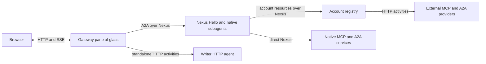

The one-shot send, status, interface, approval, callback, command, and close requests do
not need proxy workflows: the gateway starts them as standalone Nexus operations. The
third-party HTTP equivalents are standalone activities. Only operations that actually
orchestrate repeated calls remain workflows: a bounded `UIAgentTunnelWorkflow` follows one
live agent turn, and `BrokeredAgentDiscovery` reads a task snapshot before reconciling child
sessions.

The Nexus Hello workflow opts into its account toolbox explicitly:

```python
account_gateway = nexus_gateway("NexusHelloAccount")
mcp_server = account_gateway.mcp_servers("demo")

subagent_gateway = agent.nexus_subagent_gateway("NexusHelloAccount")
writer = subagent_gateway.subagent([...], "writer", key="writer")

whimsical = agent.nexus_native_subagent(
    WhimsicalAgentWorkflow,
    "nexus-hello-whimsical-agent-endpoint",
    key="whimsical-agent",
)
```

An agent using a different `account_id` resolves a different registry workflow and cannot
see these registrations.

### Subagent lifecycle controls

The parent owns and tracks the children it starts. Two slash commands let the operator
change their lifecycle without adopting sessions from another parent or from an
account-wide registry:

- `/subagent-reuse use-existing|always-new` controls whether `start_<key>` reuses the
  most recently used matching child that is still active under this parent. The default
  is `use-existing`.
- `/subagent-close-policy keep-open|close|ask-user` controls model-requested stops and
  graceful parent shutdown. The default is `ask-user`: model-requested stops use the
  same approval UI as gated tools, while parent shutdown leaves children open.

`keep-open` never closes tracked children, while `close` allows model-requested stops
and closes tracked children during graceful parent shutdown. An abrupt parent
termination cannot run cleanup, so local children use Temporal's `ABANDON` parent-close
policy.

There are two paths to a resource over Nexus: **native** and **gateway-brokered**. This
example uses both paths for MCP tools and subagents.

### MCP tools

**1. Nexus-native tools** (`demo-nexus_get_lucky_number` and
`demo-nexus_get_delayed_lucky_number`). The tool service is a Nexus operation
handler. There is no gateway or registry. The agent knows the service name and
endpoint from `nexus_native_mcp_server(...)`. Tool listing and tool calls each
use a direct Nexus hop. The delayed tool starts a backing workflow and uses
`workflow.sleep()`.

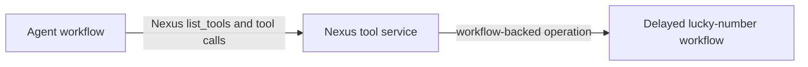

**2. Gateway tool** (`demo_get_fun_fact`). The real MCP server only speaks HTTP. The
gateway holds its URL. The gateway calls it on the agent's behalf. `.mcp_servers("demo")`
asks the gateway for that alias's tools, once per turn, in one Nexus call. An alias that
isn't registered is skipped silently for now (this is a prototype). `just
register-third-party-mcp-server` registers the URL and then checks it. The gateway fetches
the real tool list on every discovery call. Discovery retries up to three times and then
skips an unavailable server. This needs the dynamic config `just temporal` sets:
`nexusoperation.enableStandalone` and `activity.enableStandalone`.

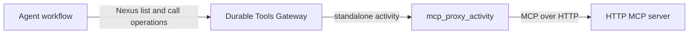

**3. Traditional MCP** (not used by this demo -- shown for contrast). Plain HTTP,
wrapped in an activity. This is what `stateless_mcp_server`/`MCPServerStreamableHttp`
give you.

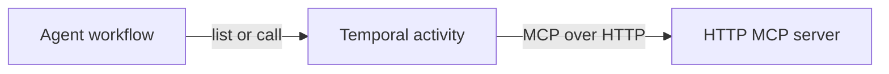

### Subagents

Subagents use A2A for discovery, messaging, task lifecycle, and streaming. Nexus is the
durable transport binding for both the direct and gateway paths.

The reusable `nexus-a2a` package under `nexus/a2a` defines that transport without
depending on this harness. `temporal_agent_harness.a2a` is the thin adapter that maps
the harness workflow and rich event stream onto the generic binding.

The same package implements the official Python A2A client-transport interface with
standalone Nexus operations. A caller therefore does not have to be a workflow or use
this harness: an ordinary AI SDK process can supply a Temporal client, select the Nexus
interface from the Agent Card, and consume a normal A2A event stream. The transport
reconstructs retained history from `GetTask`, then hides the bounded
`SubscribeToTask` pages and cursor advancement for the live tail.

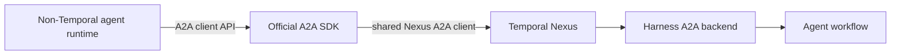

With the stack running, this optional command demonstrates that path using a plain
OpenAI Agents SDK agent process:

```bash
just standalone-a2a-caller "Ask Nexus Hello what it can do"
```

**1. Native subagent** (`research`). Same shape as the native tool above, but the
resource is a whole harness agent (`native_subagent.py`), not a tool. `SendMessage`
starts or advances its A2A Task. `GetTask` returns its message/artifact history plus the
lossless Harness event replay and continuation cursor. If the task is active, the parent
then repeats bounded `SubscribeToTask` pages until the turn ends. `CancelTask` closes the
child. A closed child still replays from `GetTask`; it is never subscribed to again.
There is no gateway and no standalone activity. The A2A adapter runs beside the agent
workflow in the same worker for this demo, though it may be scaled independently.

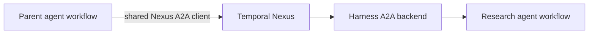

**2. Gateway subagent** (`writer`). The registered alias identifies an HTTP A2A agent.
The parent allocates an A2A Task ID locally; the first `SendMessage` lazily creates the
provider task. Follow-up turns and `CancelTask` reuse that durable route, so changing a
registration cannot redirect an existing task. Two tasks remain independently addressable.
Messages carry stable IDs, so the gateway activity may retry safely. The MCP tool-call
activity does not retry because an MCP tool may have side effects.

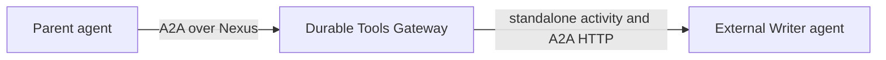

### One gateway, two resource kinds

The Durable Tools Gateway is one Nexus service in one namespace. One registry workflow
stores MCP server URLs and A2A agent URLs. The HTTP operations use separate
activities and retry rules.

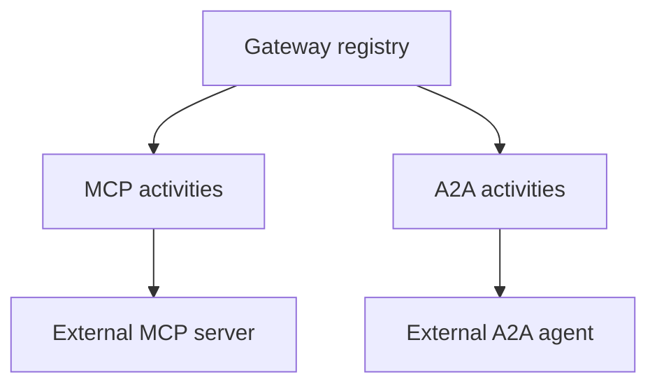

### Browser UI tunnel

This example deliberately opts the packaged browser UI into the same Nexus/A2A
foundation. The scoped `session-manager` and `server` recipes set the endpoint for
you. Each send/control is a standalone Nexus operation; the UI still receives SSE
while one bounded per-turn connector workflow gets the complete A2A task snapshot
and owns the bounded A2A subscription only when the task is live.
The Nexus binding carries requests and responses as standard A2A JSON so its Go
connector and Python agent backends share one package-independent wire contract.

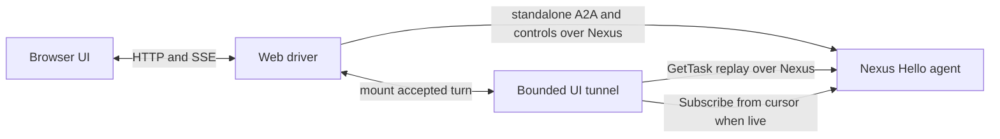

Four Temporal namespaces show cross-namespace Nexus calls:

| Namespace | Hosts |
|---|---|
| `default` | The agent (`worker.py`) and session-manager Nexus front door. |
| `gateway` | The Durable Tools Gateway and shared UI tunnel. Brokers both `demo` (tool) and `writer` (subagent). |
| `nexus-mcp-server` | The demo native Nexus tool service. |
| `nexus-subagent-server` | The demo native subagent's own agent workflow. |

## Demo limits

- The demo HTTP A2A agent stores task state in memory. A production provider must use a
  durable task store.
- A graceful parent close stops its active instances. A forced workflow termination cannot
  run cleanup. A production provider should also expire inactive instances.

Three different IDs are in play here. `agents.toml`'s key (`"nexus-hello"`) identifies
the UI entry, `NexusHelloAgent` is the Temporal workflow type, and
`NexusHelloAccount` owns the gateway resources. They are deliberately independent.

## Layout

| File | Role |
|---|---|
| `workflow.py` | `NexusHelloAgentWorkflow` - `ask` handler: model decides whether to use any of `mcp_servers=[...]` or the two bridged subagent tools (`tools=[...]`). |
| `worker.py` | Worker on `default`. No Nexus-related plugin config. |
| `tool_server.py` | Demo 3rd-party MCP server (`get_fun_fact`). |
| `nexus_tool_service.py` | Native Nexus tool service with a short tool and a workflow-backed delayed tool. |
| `native_subagent.py` | Demo native subagent (`NativeResearchSubagentWorkflow`) with a generic `NexusA2AServiceHandler` and harness-specific A2A backend in the same worker. |
| `subagent_server.py` | Demo third-party A2A HTTP+JSON agent, proxied through the same gateway as `tool_server.py`. |

## Run without `just`

Prereqs:
- From the repo root, `cp .env.example .env.local` and set `OPENAI_API_KEY`.
- The root project's `nexus-mcp` extra needs Python >=3.13
  (`uv sync --extra nexus-mcp`, or `uv sync` on Python 3.13 or later). Here,
  `nexus-mcp` is an extra name. It is not the package name on PyPI. Do not run
  `pip install nexus-mcp`; that installs an unrelated project. This repository
  installs the local `temporal-nexus-mcp` distribution.
- `temporal` CLI on PATH (the stable public release; no custom build needed).

The justfile is the canonical executable runbook and contains the raw namespace and
endpoint creation commands. The two processes introduced for the brokered UI are
equivalent to:
```sh
TEMPORAL_NAMESPACE=default \
uv run --extra nexus-mcp --group examples python -m examples.nexus_hello.worker

TEMPORAL_NAMESPACE=gateway \
GATEWAY_SEED_ACCOUNT_ID=NexusHelloAccount \
GATEWAY_UI_ACCOUNT_ID=NexusHelloAccount \
uv run --extra nexus-mcp --group examples python -m nexus_mcp.durable_tools_gateway.worker
```

Register a harness-native agent dynamically through the account API:

```sh
curl --fail --request POST http://127.0.0.1:8000/api/account/agents \
  --header 'content-type: application/json' \
  --data-binary '{"agent_id":"nexus-hello","kind":"harness_nexus","label":"Nexus Hello","description":"Nexus Hello demo","nexus_endpoint":"nexus-hello-agent-endpoint"}'
```

## Troubleshooting and reset

- If the pane has no cards, run `just register-agents` and reload the page.
- If Nexus Hello mounts but the first send fails, confirm `just worker` is running and
  `nexus-hello-agent-endpoint` targets namespace `default`, task queue `nexus-hello`.
- If the toolbox is empty, run both `register-third-party-*` recipes after the HTTP
  servers and gateway are ready.
- Account state is durable. To get a completely fresh demo, stop `gateway-ui`, run the
  command below, and restart `just gateway-ui` before registering resources.

```sh
temporal workflow terminate \
  --namespace gateway \
  --workflow-id account-registry-cf700a56bafc7c6f1417b0fda1135aedd0298c6266fb173b325d69db81b09a8f
```

The HTTP provider stores its sessions and idempotency keys in memory. A production
provider must persist and expire them. Authentication, account authorization, and a
shared event transport for multiple gateway replicas are also intentionally left for a
production implementation.
