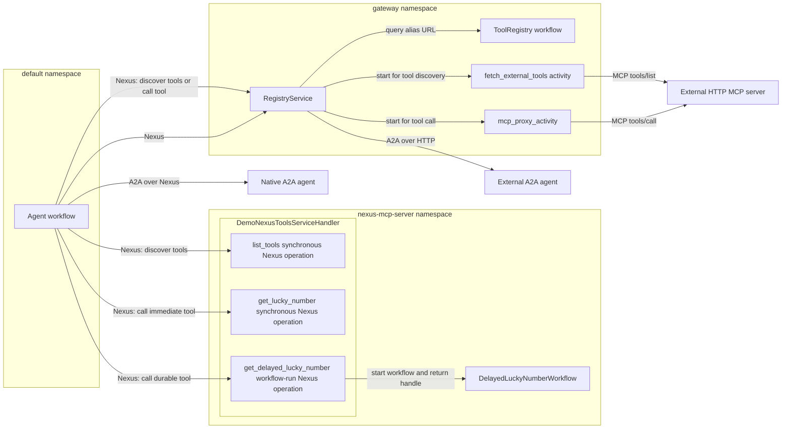
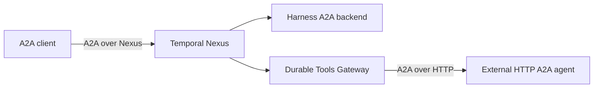
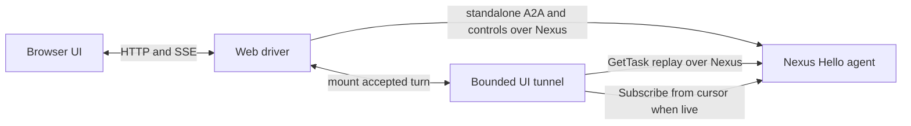

# Nexus hello agent

This example gives one agent access to three tools and two subagents through
Temporal Nexus. Nexus is the transport for both MCP tool calls and A2A agent
calls. The example also shows compatibility paths for existing HTTP MCP and
A2A servers.

The agent uses two access paths:

- `nexus_native_mcp_server(name, endpoint)` connects the agent directly to a
  native Nexus tool service.
- `nexus_gateway(account_id).mcp_servers(...)` connects the agent to selected
  account-owned external MCP servers through the Durable Tools Gateway.
- `agent.nexus_native_subagent(...)` connects the agent directly to a
  harness-native A2A agent.
- `agent.nexus_subagent_gateway(account_id).subagent(...)` connects the agent
  to an account-owned external HTTP A2A agent through the gateway.

The complete agent workflow is in [`workflow.py`](workflow.py). It configures
both paths in one `Agent`:

```python
account_gateway = nexus_gateway("NexusHelloAccount")
mcp_servers = [
    nexus_native_mcp_server("demo-nexus", "nexus-hello-demo-endpoint"),
    account_gateway.mcp_servers("demo"),
]

research = agent.nexus_native_subagent(
    NativeResearchSubagentWorkflow,
    "nexus-hello-subagent-endpoint",
    key="research",
)
writer = agent.nexus_subagent_gateway("NexusHelloAccount").subagent(
    [agent.declared_handler("ask", "...", TextMessage, TextReply)],
    "writer",
    key="writer",
)
```

The example provides these tools:

| Tool | Implementation | Access path |
| --- | --- | --- |
| `demo-nexus_get_lucky_number` | Synchronous Nexus operation | Direct Nexus call |
| `demo-nexus_get_delayed_lucky_number` | Workflow-backed Nexus operation | Direct Nexus call |
| `demo_get_fun_fact` | External HTTP MCP server | Durable Tools Gateway compatibility path |

The agent can also use these subagents:

| Subagent | Implementation | Access path |
| --- | --- | --- |
| `research` | Harness agent exposed as A2A | Direct Nexus call |
| `writer` | External HTTP A2A agent | Durable Tools Gateway compatibility path |

## Data flow of the example

The following diagram shows tool discovery and tool calls. It also shows the
workflow that supports the delayed tool.



### Native Nexus tools

The agent has the service name and Nexus endpoint in its configuration. It
calls the service through `nexus-hello-demo-endpoint`. The gateway does not
process these calls.

The service exposes three Nexus operations. The generated `list_tools`
operation returns the current tool manifest and the exact route for each tool.

`get_lucky_number` is a synchronous Nexus handler operation. The handler
creates the result and returns it directly. This operation does not start a
workflow.

`get_delayed_lucky_number` is a workflow-run Nexus operation. Its handler
starts `DelayedLuckyNumberWorkflow` and returns a workflow handle. The backing
workflow uses `workflow.sleep()` for its durable timer.

The complete implementation is in
[`nexus_tool_service.py`](nexus_tool_service.py). This reduced excerpt shows
the two tool implementations and the worker registration:

```python
@nexusrpc.handler.service_handler(name=SERVICE_NAME)
class DemoNexusToolsServiceHandler(MCPOverNexusServiceHandler):
    @nexus_mcp_tool
    async def get_lucky_number(self, topic: str) -> str:
        return f"{topic}'s lucky number today is {random.randint(1, 100)}."

    @nexus_mcp_operation(title="Get a delayed lucky number")
    @temporalio.nexus.workflow_run_operation
    async def get_delayed_lucky_number(
        self,
        ctx: temporalio.nexus.WorkflowRunOperationContext,
        input: DelayedLuckyNumberInput,
    ) -> temporalio.nexus.WorkflowHandle[DelayedLuckyNumberOutput]:
        return await ctx.start_workflow(
            DelayedLuckyNumberWorkflow.run,
            input,
            id=f"delayed-lucky-number-{ctx.request_id}",
            task_queue=NEXUS_TASK_QUEUE,
        )

worker = Worker(
    client,
    task_queue=NEXUS_TASK_QUEUE,
    workflows=[DelayedLuckyNumberWorkflow],
    nexus_service_handlers=[DemoNexusToolsServiceHandler()],
)
```

The excerpt omits the Pydantic model definitions and the MCP tool annotations.

### Subagent lifecycle controls

The parent owns and tracks the children it starts. Two slash commands let the operator
change their lifecycle without adopting sessions from another parent or from an
account-wide registry:

- `/subagent-reuse use-existing|always-new` controls whether `start_<key>` reuses the
  most recently used matching child that is still active under this parent. The default
  is `use-existing`.
- `/subagent-close-policy keep-open|close|ask-user` controls model-requested stops and
  graceful parent shutdown. The default is `ask-user`: model-requested stops use the
  same approval UI as gated tools, while parent shutdown leaves children open.

`keep-open` never closes tracked children, while `close` allows model-requested stops
and closes tracked children during graceful parent shutdown. An abrupt parent
termination cannot run cleanup, so local children use Temporal's `ABANDON` parent-close
policy.

There are two paths to a resource over Nexus: **native** and
**gateway-brokered**. This example uses both paths for MCP tools and subagents.

### External MCP tool

The gateway registry maps the alias `demo` to
`http://127.0.0.1:8765/mcp`. The registry stores the URL. It does not store a
tool list. The registration signal stores the URL and then tests the
connection. The registry keeps the URL if this test fails.

The external server is a standard MCP server. Its complete implementation is
in [`tool_server.py`](tool_server.py):

```python
mcp = MCPServer("demo-tools")

@mcp.tool()
def get_fun_fact(topic: str) -> str:
    facts = [
        f"{topic} was mentioned in a movie script exactly once, allegedly.",
        # Additional demo facts are in tool_server.py.
    ]
    return random.choice(facts)
```

The gateway uses `fetch_external_tools` for discovery and `mcp_proxy_activity`
for tool calls. See the
[gateway architecture](../../nexus/mcp/ARCHITECTURE.md#durable-tools-gateway),
[`registry.py`](../../nexus/mcp/nexus_mcp/durable_tools_gateway/registry.py)
and
[`registry_service_handler.py`](../../nexus/mcp/nexus_mcp/durable_tools_gateway/registry_service_handler.py).

The gateway requires these Temporal dynamic configuration values:

```text
nexusoperation.enableStandalone=true
activity.enableStandalone=true
```

The `just temporal` recipe sets both values.

### Subagents over A2A

Subagents use A2A for discovery, messaging, task lifecycle, and streaming.
Nexus is the durable transport binding for both access paths.

The reusable [`nexus-a2a`](../../nexus/a2a/README.md) package defines the Nexus
transport without depending on this harness. `temporal_agent_harness.a2a` is a
thin adapter that maps the harness workflow and its rich event stream to that
binding. An ordinary process can also use the official Python A2A client API
with a Temporal client; the caller does not have to be a workflow or use this
harness.



The native `research` agent is a normal harness agent in the
`nexus-subagent-server` namespace. `SendMessage` starts or advances its A2A
task. `GetTask` returns retained history and a continuation cursor.
`SubscribeToTask` reads bounded pages of live events until the turn ends.
`CancelTask` closes the child. A closed child can still replay its history from
`GetTask`.

The gateway-backed `writer` agent is an HTTP A2A service. The registry stores
its URL under the `writer` alias. The gateway keeps each A2A task bound to the
provider route that created it, so later registration changes cannot redirect
an existing task.

With the services running, this optional command demonstrates the transport
from a standalone OpenAI Agents SDK process:

```sh
just standalone-a2a-caller "Ask Nexus Hello what it can do"
```

### Agent identifiers

This example uses three independent identifiers:

| Identifier | Value | Purpose |
| --- | --- | --- |
| `agents.toml` key | `nexus-hello` | Routes UI requests to the agent. |
| Workflow type | `NexusHelloAgent` | Identifies the Temporal agent workflow. |
| Gateway `account_id` | `NexusHelloAccount` | Selects the account-owned gateway registry. |

The identifiers do not have to match.

## Files

| File | Purpose |
| --- | --- |
| [`workflow.py`](workflow.py) | Defines the agent workflow and configures both tool paths. |
| [`worker.py`](worker.py) | Runs the agent worker in the `default` namespace. |
| [`tool_server.py`](tool_server.py) | Runs the external MCP server for `demo_get_fun_fact`. |
| [`nexus_tool_service.py`](nexus_tool_service.py) | Runs the native Nexus service and the delayed workflow. |
| [`native_subagent.py`](native_subagent.py) | Runs the native research agent and its A2A Nexus service. |
| [`subagent_server.py`](subagent_server.py) | Runs the external HTTP A2A writer agent. |
| [`agents.toml`](agents.toml) | Adds the agent to the example UI. |
| [`justfile`](justfile) | Starts the local services and creates the Nexus resources. |

## Run the example

### Requirements

- Use Python 3.13 or later for the `nexus-mcp` extra.
- Install the Temporal CLI and add it to `PATH`.
- From the repository root, copy `.env.example` to `.env.local`.
- Set `OPENAI_API_KEY` in `.env.local`.
- From the repository root, run `uv sync --extra nexus-mcp`.

The extra installs the local `temporal-nexus-mcp` distribution. Do not run
`pip install nexus-mcp`. That command installs an unrelated project from PyPI.

### Browser UI tunnel

This example deliberately opts the packaged browser UI into the same Nexus/A2A
foundation. The scoped `session-manager` and `server` recipes set the endpoint for
you. Each send/control is a standalone Nexus operation; the UI still receives SSE
while one bounded per-turn connector workflow gets the complete A2A task snapshot
and owns the bounded A2A subscription only when the task is live.
The Nexus binding carries requests and responses as standard A2A JSON so its Go
connector and Python agent backends share one package-independent wire contract.



Four Temporal namespaces show cross-namespace Nexus calls:

| Namespace | Hosts |
|---|---|
| `default` | The agent (`worker.py`) and session-manager Nexus front door. |
| `gateway` | The Durable Tools Gateway and shared UI tunnel. Brokers both `demo` (tool) and `writer` (subagent). |
| `nexus-mcp-server` | The demo native Nexus tool service. |
| `nexus-subagent-server` | The demo native subagent's own agent workflow. |

### Start the services

Change to the example directory:

```sh
cd examples/nexus_hello
```

Run each command in a separate terminal. Run the commands in the listed order.

```sh
just temporal
just setup-nexus
just third-party-mcp-server
just third-party-subagent
just registry
just nexus-tool-service
just nexus-subagent
just register-third-party-mcp-server
just register-third-party-subagent
just session-manager
just ui-tunnel
just server
just worker
```

`just setup-nexus` creates the four namespaces and four Nexus endpoints. Run it
once for each new Temporal development server.
`just register-third-party-mcp-server` registers the `demo` MCP URL under
account ID `NexusHelloAccount`. `just register-third-party-subagent` registers
the `writer` A2A URL under the same account. You can run these setup commands
again if necessary.

Open <http://localhost:8000>. Select **Nexus Hello**, and start a chat. Ask for
research and writing to let the model use both subagents alongside the MCP
tools.

The agent waits on its Nexus operation handle when it calls the delayed tool.
The harness adapter does not use the MCP Tasks extension. The
[`test_caller_matrix_integration.py`](../../tests/nexus_mcp/test_caller_matrix_integration.py)
test covers that protocol path. It uses `NexusMCPBridge` and a task-capable MCP
client.

## Refresh the agent list

`SessionManagerWorkflow` stores the agent list when it starts. Restarting the
web server does not update an existing workflow. If the UI does not show
**Nexus Hello**, terminate the workflow:

```sh
temporal workflow terminate --workflow-id session-manager
```

The session-manager worker starts a new workflow when the application requests
it.
