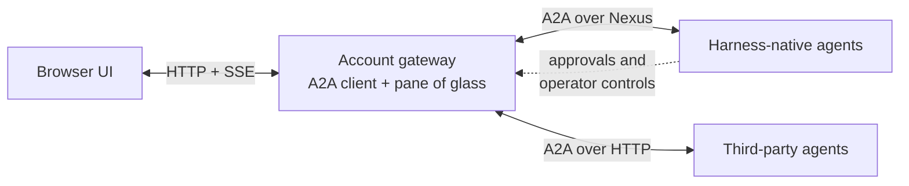
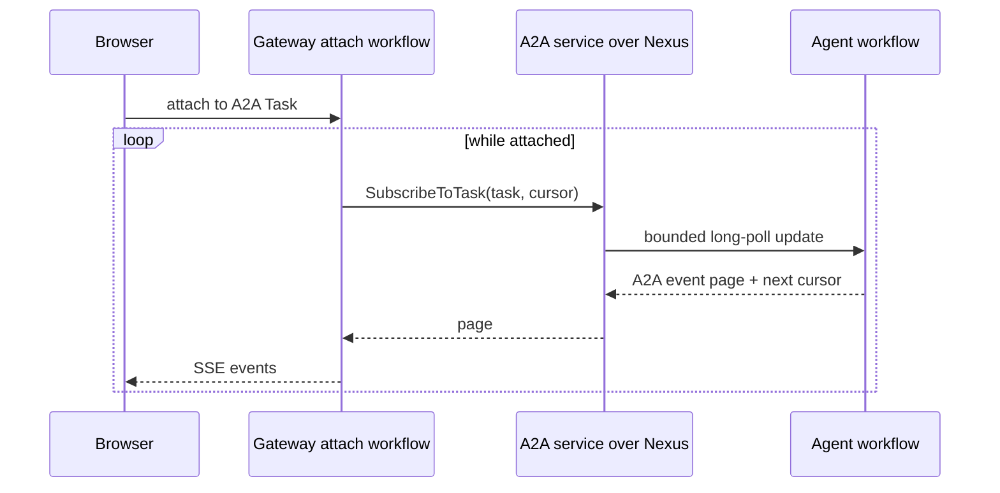
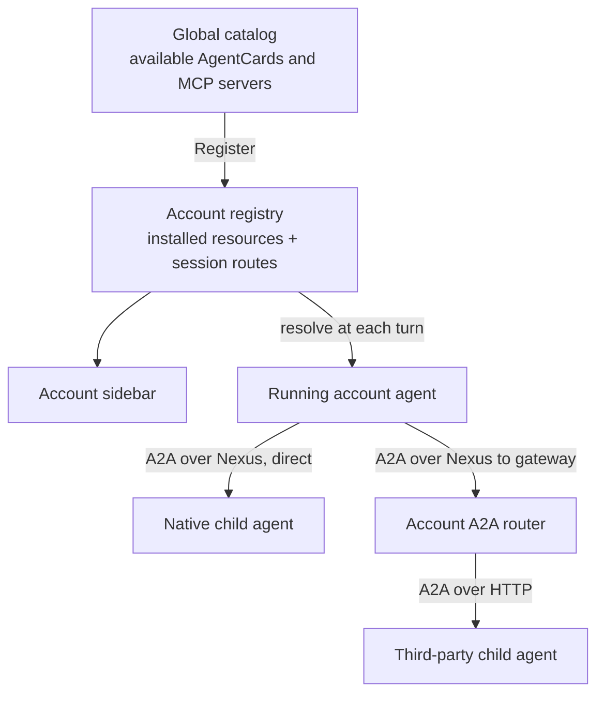

# Nexus Hello: A2A agents behind one account gateway

This demo is a small pane of glass for an account's agents and tools. It demonstrates
three ideas together:

- a global catalog installs agents and MCP servers into an account registry;
- registered agents discover the account toolbox dynamically, so installing another
  agent makes it available as a child on the next turn; and
- standard A2A is the agent protocol for both top-level UI sessions and subagents.

Temporal Nexus is the transport seam for harness-native agents. A third-party A2A
agent uses standard HTTP instead. The UI renders both in the same way.

The demo account is `NexusHelloAccount`. Authentication and OAuth are deliberately
out of scope, so a matching `account_id` is the prototype trust boundary.

## The high-level model

The browser does not hold a Temporal client and it does not speak directly to an agent.
It uses HTTP and SSE with the gateway UI backend. That backend is the A2A client and
selects the transport described by the agent's A2A `AgentCard`.



One long-lived UI or subagent session maps to one A2A Task. After a turn completes,
the Task is `INPUT_REQUIRED`; closing the session cancels it. The harness preserves its
rich event stream in an A2A metadata extension, so existing chat, graph, latency, logs,
approval, and replay views do not lose information.

Nexus operations currently return one result rather than a server stream. The Nexus
binding therefore represents A2A `SubscribeToTask` as a bounded cursor page.
`BrokeredAgentAttach` repeats that operation and multicasts each page to attached UI
drivers. Completed harness workflows serve the same pages from their retained stream.



Approvals, callbacks, slash commands, and harness status are intentionally not part of
the portable agent protocol. Harness-aware UIs reach those through the separate
`HarnessControlService`; ordinary A2A clients can still send, inspect, subscribe to, and
cancel Tasks without knowing that extension.

## Catalog, account, and dynamic toolbox

The global catalog and account registry share one resource descriptor. Agents carry an
official A2A `AgentCard`; the card's interface declares `TEMPORAL_NEXUS` or standard
HTTP+JSON. MCP entries declare their Nexus or HTTP transport in the same resource
envelope.



The registry is the control plane, not a transcript store. It owns installations,
routes, and session identity. Temporal workflow history and the provider remain the
sources of truth for execution history. Delegation lineage prevents an agent from
offering itself or an ancestor as a child, and the demo caps dynamic delegation at five
levels.

## Resources in the demo

Register these from **Catalog** in the sidebar:

| Registration | Protocol | Purpose |
|---|---|---|
| `Nexus Hello` | A2A over Nexus | Main OpenAI Agents SDK harness agent |
| `Research` | A2A over Nexus | Canned native child or standalone agent |
| `Whimsical Agent` | A2A over Nexus | OpenAI Agents SDK child or standalone agent with a playful voice |
| `Writer HTTP` | A2A over HTTP | Minimal third-party child or standalone agent |
| `demo-nexus` | MCP over Nexus | Native lucky-number tool |
| `demo` | MCP over HTTP | Third-party fun-fact tool |

Nexus Hello resolves the installed account toolbox at the start of every turn. With all
six resources installed, it can call both MCP servers and invoke Research, Whimsical,
or Writer as children without those registrations being hard-coded into its worker.
Whimsical does the same resolution and can therefore act as either a child or a parent.

## Run the complete demo

Prerequisites:

- Python 3.13 or newer
- `temporal`, `just`, `pnpm`, and `uv` on `PATH`
- a repo-root `.env.local` with `OPENAI_API_KEY`

Install dependencies once:

```sh
uv sync --extra nexus-mcp
cd examples/nexus_hello
just app-install
```

Run the remaining commands from `examples/nexus_hello`. Start Temporal first:

```sh
just temporal
```

In another terminal, create four namespaces and five Nexus endpoints. This is a
one-shot setup command and is safe to rerun:

```sh
just setup-nexus
```

Start each long-running process in its own terminal:

```sh
just third-party-mcp-server  # HTTP MCP server on :8765
just third-party-subagent    # standard A2A HTTP agent on :8766
just nexus-tool-service      # native Nexus MCP service
just nexus-subagent          # native Research A2A agent
just whimsical-agent         # native Whimsical A2A agent
just worker                  # Nexus Hello A2A agent
just gateway-ui              # catalog, registry, gateway, API, UI on :8000
```

Open <http://localhost:8000>, expand **Catalog**, and register the resources you want.
Register all six for the full demo. Registration updates the account sidebar; no
`just register-*` command or worker restart is required.

Click **New** on an agent card to create an account session. This only records the A2A
Task route; the underlying agent starts lazily on the first message. For Nexus Hello,
try:

```text
Get a fun fact and a lucky number, ask the research, whimsical-agent, and writer
agents about Temporal, then summarize their answers.
```

Spawned children appear under their agent card. Open its **Sessions** list and click
**Mount** to view or continue that exact A2A Task. A top-level refresh reconciles
children from all active harness sessions. Closed native Tasks remain mountable for
retained-history replay.

## What each route does

### Native send and mount

```text
browser -> gateway HTTP API -> A2A SendMessage over Nexus -> agent workflow
browser <- gateway SSE      <- repeated A2A SubscribeToTask pages over Nexus
```

One-shot A2A and harness-control calls use standalone Nexus operations. Only repeated
orchestration remains a workflow: `BrokeredAgentAttach` polls the A2A subscription and
`BrokeredAgentDiscovery` reconciles spawned Tasks.

### Native subagent

```text
parent workflow -> account toolbox -> registered AgentCard
                -> A2A SendMessage over the child's Nexus endpoint
                <- A2A SubscribeToTask pages
```

The native route stays direct; it does not pay an extra gateway activity hop.

### Third-party agent

```text
browser or parent -> account A2A router over Nexus
                  -> standalone activity -> A2A HTTP agent
```

The gateway remembers the route from its deterministic account Task ID to the provider's
A2A Task ID. It does not invent a second agent protocol or copy the provider transcript.

### MCP and retained tool-call inspection

Native MCP calls remain direct Nexus operations. External MCP calls remain standalone
gateway activities. Opening **Tool calls** performs a read-only history lookup across
the known native agent namespaces and the gateway namespace, then matches calls to the
selected registered MCP server. It stores no duplicate input or output data, so the
account's Temporal retention policy defines how far back the UI can inspect.

## Dynamic toolbox in code

Every account agent uses the same resolver:

```python
toolbox = await nexus_gateway(account_id).resolve_toolbox(
    caller_agent_id=registered_agent_id,
    lineage=delegation_lineage,
    delegation_depth=delegation_depth,
    max_delegation_depth=5,
)

sdk_agent = Agent(
    mcp_servers=list(toolbox.mcp_servers),
    tools=[harness_tool_as_openai_tool(tool) for tool in toolbox.subagent_tools],
)
```

The resolver turns installed A2A AgentCard skills into harness tools. It excludes the
caller and its ancestors, then picks the card's native Nexus or external HTTP interface.
A different `account_id` resolves a different registry workflow and toolbox.

## Troubleshooting

- Empty sidebar: open **Catalog** and register at least one agent.
- First native message fails: verify the matching worker is running and rerun
  `just setup-nexus` to check endpoint creation.
- Agent toolbox is empty: install agents and MCP servers from **Catalog**; changes are
  visible on the next turn.
- HTTP agent fails: verify `just third-party-subagent` serves its AgentCard at
  <http://127.0.0.1:8766/.well-known/agent-card.json>.
- UI build fails: run `just app-install`, then `just gateway-ui` again.

The justfile is the canonical command reference. Account state is durable across gateway
restarts; use the Temporal UI or CLI to terminate the demo account-registry workflow if
you want a completely fresh account.

This remains a prototype. Production work would add authentication and authorization,
OAuth-backed catalog installs, persistent external-provider storage, and shared pub/sub
for multiple gateway replicas.
