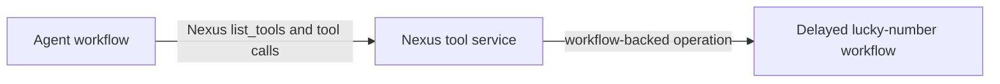
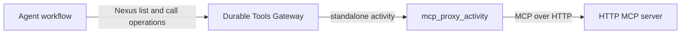
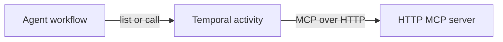
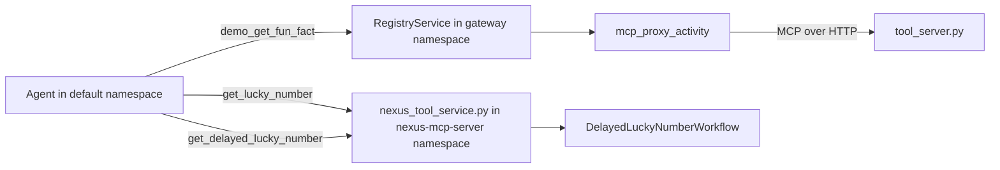

# Nexus-hello agent

Demonstrates two ways to reach a tool over Nexus, side by side in one
`Agent(mcp_servers=[...])`:

- `nexus_native_mcp_server(name, endpoint)` -- one hard-coded native Nexus service,
  called directly. No registry, no registration, ever.
- `nexus_tools_gateway().mcp_servers(...)` -- an explicit set of 3rd-party servers,
  registered ahead of time with the Durable Tools Gateway, proxied through it.
  `agent_id` is inferred from this workflow's own type (`workflow_type`), not chosen
  by hand.

Native and 3rd-party tools never mix inside the gateway -- the gateway only ever
tracks 3rd-party servers. Tool lists are never cached: they're fetched live, from the
real MCP server, on every `list_tools()` call.

Tools available to the agent:

- `demo_get_fun_fact` - a 3rd-party (non-Nexus) MCP server, reached through the
  **Durable Tools Gateway** (`demo` maps to `http://127.0.0.1:8765/mcp`). This
  gateway route is registered under agent ID `NexusHelloAgent`.
- `demo-nexus_get_lucky_number` - a native Nexus tool service, called directly - no
  gateway, no registration.
- `demo-nexus_get_delayed_lucky_number` - a workflow-backed Nexus operation. It
  waits on a durable timer before it returns.

## How it works

```python
nexus_gateway = nexus_tools_gateway()  # agent_id inferred from workflow_type
mcp_servers=[
    nexus_gateway.mcp_servers("demo"),
    nexus_native_mcp_server("demo-nexus", "nexus-hello-demo-endpoint"),
]
```

Three ways for an agent to reach tools. This demo uses the first two.

**1. Nexus-native tools** (`demo-nexus_get_lucky_number` and
`demo-nexus_get_delayed_lucky_number`). The tool service is a Nexus operation
handler. There is no gateway or registry. The agent knows the service name and
endpoint from `nexus_native_mcp_server(...)`. Tool listing and tool calls each
use a direct Nexus hop. The delayed tool starts a backing workflow and uses
`workflow.sleep()`.



**2. Gateway-proxied tool** (`demo_get_fun_fact`). The real MCP server only speaks
HTTP. The gateway holds the URL and dispatches for it, so the agent never has to.
`.mcp_servers("demo")` asks the gateway for exactly those aliases' tools, once per
turn, in a single Nexus call -- an alias that isn't actually registered is silently
skipped (no error yet; this is a prototype). `just register-third-party` (`temporal
workflow signal`) only validates the URL — the actual tool list is fetched live at
discovery time, every turn, as a standalone activity (Nexus + SAA). Needs the dynamic
config `just temporal` sets: `nexusoperation.enableStandalone`/`activity.enableStandalone`.



**3. Traditional MCP with Temporal plugin** (not used by this demo — shown for contrast). HTTP wrapped in activities.
This is what `stateless_mcp_server`/`MCPServerStreamableHttp` give you.



Three Temporal namespaces to demonstrate cross-namespace Nexus calls:

| Namespace | Hosts |
|---|---|
| `default` | The agent (`worker.py`), session-manager, FastAPI/UI. |
| `gateway` | The Durable Tools Gateway. |
| `nexus-mcp-server` | The demo native Nexus tool service. |

Note two different identifiers are in play: `agents.toml`'s `key` (`"nexus-hello"`) is
just how the web UI routes to this agent; the gateway's `agent_id` (`"NexusHelloAgent"`)
is this workflow's `workflow_type`, used only for gateway registration/lookup. They
don't have to match, and here they don't.

## Layout

| File | Role |
|---|---|
| `workflow.py` | `NexusHelloAgentWorkflow` - one `ask` handler, `mcp_servers=[nexus_gateway.mcp_servers(...), nexus_native_mcp_server(...)]`. |
| `worker.py` | Worker on `default`. No Nexus-related plugin config. |
| `tool_server.py` | Demo 3rd-party MCP server (`get_fun_fact`). |
| `nexus_tool_service.py` | Native Nexus tool service with a short tool and a workflow-backed delayed tool. |

## Run it

Prereqs:
- From the repo root, `cp .env.example .env.local` and set `OPENAI_API_KEY`.
- The root project's `nexus-mcp` extra needs Python >=3.13
  (`uv sync --extra nexus-mcp`, or `uv sync` on Python 3.13 or later). Here,
  `nexus-mcp` is an extra name. It is not the package name on PyPI. Do not run
  `pip install nexus-mcp`; that installs an unrelated project. This repository
  installs the local `temporal-nexus-mcp` distribution.
- `temporal` CLI on PATH (the stable public release; no custom build needed).

Each in its own terminal, in order:

```sh
just temporal             # 1. local Temporal dev server
just setup-nexus          # 2. ONE-SHOT: 3 namespaces + 2 Nexus endpoints
just tool-server          # 3. demo 3rd-party MCP tool server
just registry             # 4. durable tools gateway (no seed config -- starts empty)
just nexus-tool-service   # 5. demo native Nexus tool service
just register-third-party # 6. ONE-SHOT: registers "demo" under agent_id "NexusHelloAgent"
just session-manager      # 7. session-manager worker
just server               # 8. builds UI, serves API + UI on :8000
just worker               # 9. this agent's worker
```

Open http://localhost:8000, pick **Nexus Hello**, and start a chat. All three
tools are available.



The agent workflow waits for the delayed tool result through its Nexus handle.
This harness adapter is not an MCP task-capable caller. The MCP task wire flow
is covered by
[`test_caller_matrix_integration.py`](../../tests/nexus_mcp/test_caller_matrix_integration.py).
That test calls the same type of workflow-backed Nexus operation through
`NexusMCPBridge`. Its modern MCP client uses the Tasks extension to receive a
task ID and poll `tasks/get`.

Without `just` (from the repo root):

```sh
uv run --extra nexus-mcp python -m examples.nexus_hello.tool_server
TEMPORAL_NAMESPACE=gateway uv run --extra nexus-mcp --group examples python -m nexus_mcp.durable_tools_gateway.worker
TEMPORAL_NAMESPACE=nexus-mcp-server uv run --extra nexus-mcp python -m examples.nexus_hello.nexus_tool_service
temporal workflow signal --namespace gateway --workflow-id mcp-tool-registry --name register_external \
    --input '"NexusHelloAgent"' --input '"demo"' --input '"http://127.0.0.1:8765/mcp"'
uv run --group examples python -m examples.session_manager_worker
uv run --group examples python -m examples.app examples/nexus_hello/agents.toml --host 0.0.0.0 --port 8000
uv run --extra nexus-mcp --group examples python -m examples.nexus_hello.worker
```

(`just setup-nexus`'s namespace/endpoint creation is one-shot infra setup - see the justfile
for the raw `temporal operator ...` commands if running without `just`.)

## If the UI doesn't show "Nexus Hello"

The web UI's `SessionManagerWorkflow` is a singleton set once from whichever `agents.toml`
first started it - restarting `just server` doesn't refresh it. Terminate and let a fresh one
start:

```sh
temporal workflow terminate --workflow-id session-manager
```
