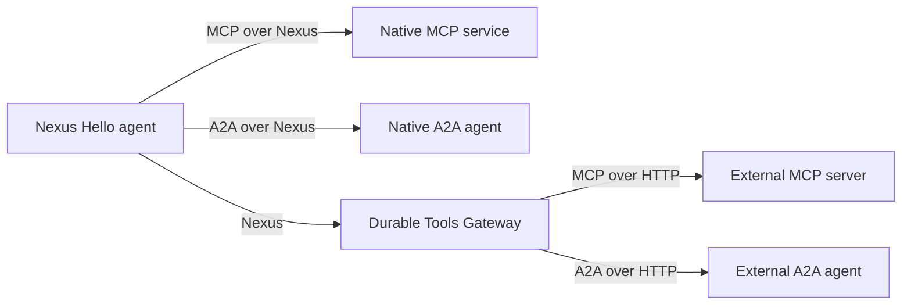
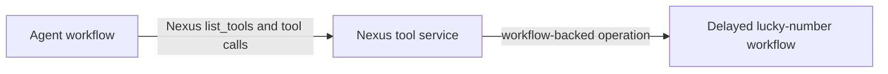
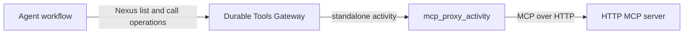
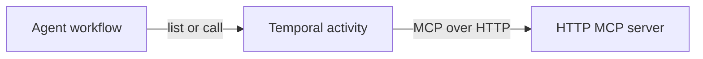
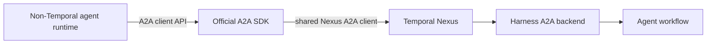
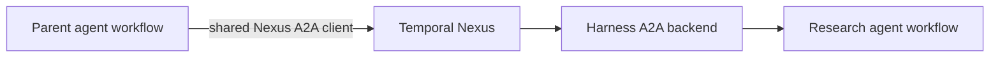
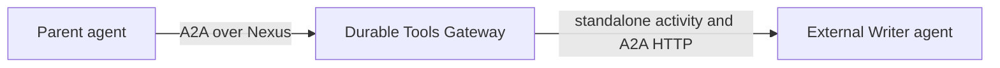
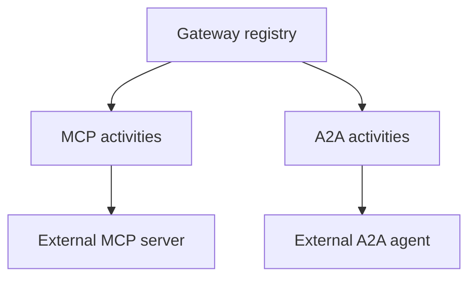
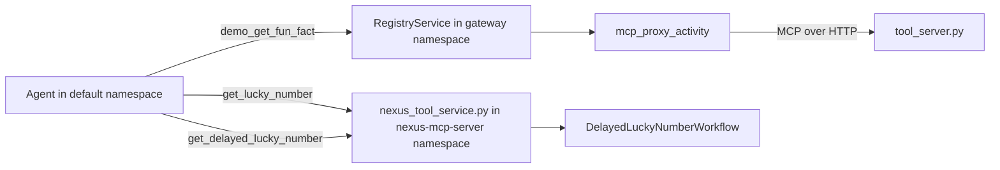
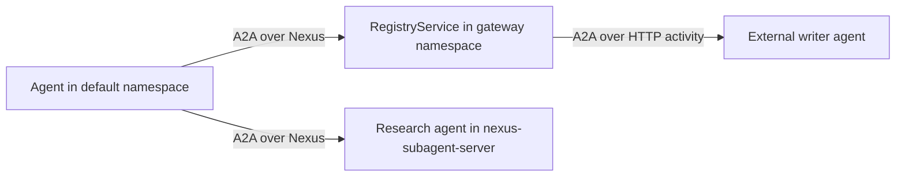

# Nexus-hello agent

This example shows two things reached over Nexus: a tool, and a subagent. Both use the
same two paths. A **native** path calls the resource directly. A **gateway** path calls a
3rd-party resource through the Durable Tools Gateway. The same gateway brokers both kinds.

The model decides when to use each resource. It never gets called directly by the
workflow. The two MCP tools are plain `Agent(mcp_servers=[...])` entries. The two
subagents are bridged into plain `Agent(tools=[...])` function tools, via
`harness_tool_as_openai_tool`.

- `nexus_native_mcp_server(name, endpoint)` / `agent.nexus_native_subagent(cls, endpoint, key=...)`
  -- one hard-coded native Nexus service, called directly. No registry. No registration.
- `nexus_tools_gateway().mcp_servers(...)` / `agent.nexus_subagent_gateway().subagent([...], alias, key=...)`
  -- a resource registered ahead of time with the Durable Tools Gateway, called through it.
  `agent_id` comes from this workflow's own type (`workflow_type`). You never set it by hand.

Tools available to the agent:

- `demo_get_fun_fact` - a 3rd-party (non-Nexus) MCP server, reached through the
  **Durable Tools Gateway** (`demo` maps to `http://127.0.0.1:8765/mcp`). This
  gateway route is registered under agent ID `NexusHelloAgent`.
- `demo-nexus_get_lucky_number` - a native Nexus tool service, called directly - no
  gateway, no registration.
- `demo-nexus_get_delayed_lucky_number` - a workflow-backed Nexus operation. It
  waits on a durable timer before it returns.

Subagents available to the agent:

- `research` - a **native** SUBAGENT (a real harness agent), called directly. No
  gateway. No registration.
- `writer` - a **3rd-party** A2A agent (HTTP+JSON, no Nexus and no Temporal client),
  reached through the same **Durable Tools Gateway** as `demo_get_fun_fact`.

Native and 3rd-party resources never mix inside the gateway's routing. MCP tools and
subagents share one gateway and one registry workflow. Each HTTP operation uses a
standalone activity. Tool lists are fetched live from the real MCP server. The demo
subagents return canned replies: they prove the transport, while the parent model still
decides whether to invoke them.

## Architecture



## How it works

```python
nexus_gateway = nexus_tools_gateway()  # agent_id inferred from workflow_type
mcp_servers=[
    nexus_gateway.mcp_servers("demo"),
    nexus_native_mcp_server("demo-nexus", "nexus-hello-demo-endpoint"),
]

research = agent.nexus_native_subagent(
    NativeResearchSubagentWorkflow, "nexus-hello-subagent-endpoint", key="research"
)
subagent_gateway = agent.nexus_subagent_gateway()  # agent_id inferred from workflow_type
writer = subagent_gateway.subagent(
    [agent.declared_handler("ask", "...", TextMessage, TextReply, param_name="message")],
    "writer",
    key="writer",
)

sdk_agent = OpenAIAgent(
    ...,
    mcp_servers=[nexus_gateway.mcp_servers("demo"), nexus_native_mcp_server(...)],
    tools=[harness_tool_as_openai_tool(fn) for fn in [*research, *writer]],
)
Runner.run_streamed(sdk_agent, input=..., context=self._runner)  # required: run_tool lives on it
```

`harness_tool_as_openai_tool` turns each subagent function into a plain OpenAI-agents
tool. It dispatches through `AgentWorkflowRunner.run_tool`. Approval gating and
tool-lifecycle events fire the same way they do for any other harness tool. The model
decides when to start, ask, and stop a subagent; the workflow never calls one directly.

There are two paths to a resource over Nexus: **native** and **gateway-brokered**. This
example uses both paths for MCP tools and subagents.

### MCP tools

**1. Nexus-native tools** (`demo-nexus_get_lucky_number` and
`demo-nexus_get_delayed_lucky_number`). The tool service is a Nexus operation
handler. There is no gateway or registry. The agent knows the service name and
endpoint from `nexus_native_mcp_server(...)`. Tool listing and tool calls each
use a direct Nexus hop. The delayed tool starts a backing workflow and uses
`workflow.sleep()`.



**2. Gateway tool** (`demo_get_fun_fact`). The real MCP server only speaks HTTP. The
gateway holds its URL. The gateway calls it on the agent's behalf. `.mcp_servers("demo")`
asks the gateway for that alias's tools, once per turn, in one Nexus call. An alias that
isn't registered is skipped silently for now (this is a prototype). `just
register-third-party-mcp-server` registers the URL and then checks it. The gateway fetches
the real tool list on every discovery call. Discovery retries up to three times and then
skips an unavailable server. This needs the dynamic config `just temporal` sets:
`nexusoperation.enableStandalone` and `activity.enableStandalone`.



**3. Traditional MCP** (not used by this demo -- shown for contrast). Plain HTTP,
wrapped in an activity. This is what `stateless_mcp_server`/`MCPServerStreamableHttp`
give you.



### Subagents

Subagents use A2A for discovery, messaging, task lifecycle, and streaming. Nexus is the
durable transport binding for both the direct and gateway paths.

The reusable `nexus-a2a` package under `nexus/a2a` defines that transport without
depending on this harness. `temporal_agent_harness.a2a` is the thin adapter that maps
the harness workflow and rich event stream onto the generic binding.

The same package implements the official Python A2A client-transport interface with
standalone Nexus operations. A caller therefore does not have to be a workflow or use
this harness: an ordinary AI SDK process can supply a Temporal client, select the Nexus
interface from the Agent Card, and consume a normal A2A event stream. The transport
hides the bounded `SubscribeToTask` pages and cursor advancement.



With the stack running, this optional command demonstrates that path using a plain
OpenAI Agents SDK agent process:

```bash
just standalone-a2a-caller "Ask Nexus Hello what it can do"
```

**1. Native subagent** (`research`). Same shape as the native tool above, but the
resource is a whole harness agent (`native_subagent.py`), not a tool. `SendMessage`
starts or advances its A2A Task. `SubscribeToTask` returns bounded cursor pages because
Nexus operations currently have one result rather than a server stream; the parent
repeats the operation until the turn ends. `CancelTask` closes the child. There is no
gateway and no standalone activity. The A2A adapter runs beside the agent workflow in
the same worker for this demo, though it may be scaled independently.



**2. Gateway subagent** (`writer`). The registered alias identifies an HTTP A2A agent.
The parent allocates an A2A Task ID locally; the first `SendMessage` lazily creates the
provider task. Follow-up turns and `CancelTask` reuse that durable route, so changing a
registration cannot redirect an existing task. Two tasks remain independently addressable.
Messages carry stable IDs, so the gateway activity may retry safely. The MCP tool-call
activity does not retry because an MCP tool may have side effects.



### One gateway, two resource kinds

The Durable Tools Gateway is one Nexus service in one namespace. One registry workflow
stores MCP server URLs and A2A agent URLs. The HTTP operations use separate
activities and retry rules.



Four Temporal namespaces show cross-namespace Nexus calls:

| Namespace | Hosts |
|---|---|
| `default` | The agent (`worker.py`), session-manager, FastAPI/UI. |
| `gateway` | The Durable Tools Gateway. Brokers both `demo` (tool) and `writer` (subagent). |
| `nexus-mcp-server` | The demo native Nexus tool service. |
| `nexus-subagent-server` | The demo native subagent's own agent workflow. |

## Demo limits

- The demo HTTP A2A agent stores task state in memory. A production provider must use a
  durable task store.
- A graceful parent close stops its active instances. A forced workflow termination cannot
  run cleanup. A production provider should also expire inactive instances.

Two different IDs are in play here. `agents.toml`'s `key` (`"nexus-hello"`) is how the
web UI finds this agent. The gateway's `agent_id` (`"NexusHelloAgent"`) is this
workflow's `workflow_type`. The gateway uses it only to register and look up resources.
The two IDs don't have to match. Here, they don't.

## Layout

| File | Role |
|---|---|
| `workflow.py` | `NexusHelloAgentWorkflow` - `ask` handler: model decides whether to use any of `mcp_servers=[...]` or the two bridged subagent tools (`tools=[...]`). |
| `worker.py` | Worker on `default`. No Nexus-related plugin config. |
| `tool_server.py` | Demo 3rd-party MCP server (`get_fun_fact`). |
| `nexus_tool_service.py` | Native Nexus tool service with a short tool and a workflow-backed delayed tool. |
| `native_subagent.py` | Demo native subagent (`NativeResearchSubagentWorkflow`) with a generic `NexusA2AServiceHandler` and harness-specific A2A backend in the same worker. |
| `subagent_server.py` | Demo third-party A2A HTTP+JSON agent, proxied through the same gateway as `tool_server.py`. |

## Run it

Prereqs:
- From the repo root, `cp .env.example .env.local` and set `OPENAI_API_KEY`.
- The root project's `nexus-mcp` extra needs Python >=3.13
  (`uv sync --extra nexus-mcp`, or `uv sync` on Python 3.13 or later). Here,
  `nexus-mcp` is an extra name. It is not the package name on PyPI. Do not run
  `pip install nexus-mcp`; that installs an unrelated project. This repository
  installs the local `temporal-nexus-mcp` distribution.
- `temporal` CLI on PATH (the stable public release; no custom build needed).

Each in its own terminal, in order:

```sh
just temporal                        # 1. local Temporal dev server
just setup-nexus                     # 2. ONE-SHOT: 4 namespaces + 4 Nexus endpoints
just third-party-mcp-server          # 3. demo 3rd-party MCP tool server
just third-party-subagent            # 4. demo 3rd-party subagent
just registry                        # 5. durable tools gateway (no seed config -- starts empty)
just nexus-tool-service              # 6. demo native tool service
just nexus-subagent                  # 7. demo native subagent -- agent workflow AND
                                      #    its Nexus front door, one worker
just register-third-party-mcp-server # 8. ONE-SHOT: registers "demo" under agent_id
                                      #    "NexusHelloAgent"
just register-third-party-subagent   # 9. ONE-SHOT: registers "writer" under the same agent_id
just session-manager                 # 10. session-manager worker
just server                          # 11. builds UI, serves API + UI on :8000
just worker                          # 12. this example's agent worker
```

Open http://localhost:8000, pick **Nexus Hello**, start a chat. Ask something that calls
for research and writing (e.g. "research X and write a short summary") and the model
can use both subagents alongside all three MCP tools. The model decides whether each
resource is relevant to what you asked.





The agent workflow waits for the delayed tool result through its Nexus handle.
This harness adapter is not an MCP task-capable caller. The MCP task wire flow
is covered by
[`test_caller_matrix_integration.py`](../../tests/nexus_mcp/test_caller_matrix_integration.py).
That test calls the same type of workflow-backed Nexus operation through
`NexusMCPBridge`. Its modern MCP client uses the Tasks extension to receive a
task ID and poll `tasks/get`.

Without `just` (from the repo root):

```sh
uv run --extra nexus-mcp python -m examples.nexus_hello.tool_server
uv run --extra nexus-mcp --group examples python -m examples.nexus_hello.subagent_server
TEMPORAL_NAMESPACE=gateway uv run --extra nexus-mcp --group examples python -m nexus_mcp.durable_tools_gateway.worker
TEMPORAL_NAMESPACE=nexus-mcp-server uv run --extra nexus-mcp python -m examples.nexus_hello.nexus_tool_service
TEMPORAL_NAMESPACE=nexus-subagent-server uv run --group examples python -m examples.nexus_hello.native_subagent worker
temporal workflow signal --namespace gateway --workflow-id mcp-tool-registry --name register_external \
    --input '"NexusHelloAgent"' --input '"demo"' --input '"http://127.0.0.1:8765/mcp"'
temporal workflow signal --namespace gateway --workflow-id mcp-tool-registry --name register_subagent \
    --input '"NexusHelloAgent"' --input '"writer"' --input '"http://127.0.0.1:8766"'
uv run --group examples python -m examples.session_manager_worker
uv run --group examples python -m examples.app examples/nexus_hello/agents.toml --host 0.0.0.0 --port 8000
uv run --extra nexus-mcp --group examples python -m examples.nexus_hello.worker
```

(`just setup-nexus`'s namespace/endpoint creation is one-shot infra setup - see the justfile
for the raw `temporal operator ...` commands if running without `just`.)

## If the UI doesn't show "Nexus Hello"

The web UI's `SessionManagerWorkflow` is a singleton. It is set once, from whichever
`agents.toml` first started it. Restarting `just server` does not refresh it. Terminate it
and let a fresh one start:

```sh
temporal workflow terminate --workflow-id session-manager
```
