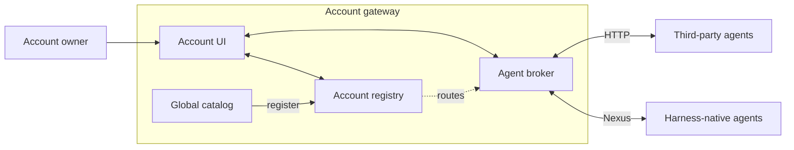
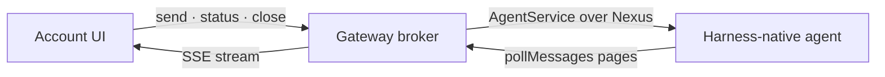
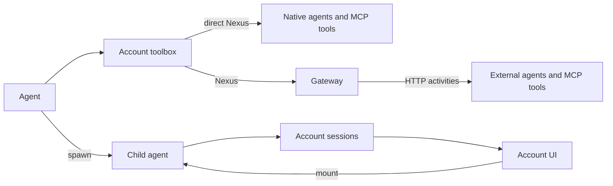
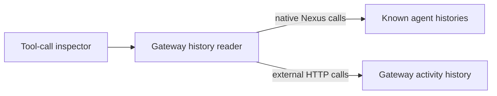

# Nexus Hello: account gateway and brokered agent UI

This is the end-to-end demo for the account-scoped Nexus gateway. It shows an account
owner opening one UI, seeing the agents and toolbox registered to that account, and
mounting either:

- a Temporal Agent Harness agent reached through a Nexus endpoint, even though the
  gateway UI and agent live in different Temporal namespaces; or
- a minimal third-party HTTP agent implementing the gateway's small session protocol.

The global catalog advertises resources that can be installed. The account registry owns
the account's pinned resource registrations and UI session records. There is no
`SessionManagerWorkflow` or `agents.toml`.

The account used by the demo is `NexusHelloAccount`. Authentication is deliberately out
of scope for now, so matching `account_id` values are the trust boundary.

## What the account owns

The gateway publishes these resources to the global catalog. After selecting them from
**Catalog** in the account sidebar at <http://localhost:8000>, the account contains:

| Registration | Kind | Route |
|---|---|---|
| `Nexus Hello` | mountable harness agent | `nexus-hello-agent-endpoint` |
| `Research` | mountable harness agent/subagent | `nexus-hello-subagent-endpoint` |
| `Whimsical Agent` | mountable OpenAI Agents SDK agent/subagent | `nexus-hello-whimsical-agent-endpoint` |
| `Writer HTTP` | mountable third-party agent | `http://127.0.0.1:8766` |
| `demo-nexus` | directly invoked Nexus MCP service | `nexus-hello-demo-endpoint` |
| `demo` | MCP server in the toolbox | `http://127.0.0.1:8765/mcp` |

The `Research`, `Whimsical Agent`, and `Writer HTTP` resource IDs become their dynamic
subagent tool keys. That lets the registry project a spawned child into the account's
session list and route it through the same installed descriptor used for top-level mounts.

The Nexus Hello agent itself can use five resources:

- `demo_get_fun_fact`: the registered HTTP MCP server, proxied through the account
  gateway.
- `demo-nexus_get_lucky_number`: a Nexus-native tool reached directly.
- `research`: a Nexus-native harness subagent reached directly.
- `whimsical-agent`: an OpenAI Agents SDK harness subagent reached directly over Nexus.
- `writer`: the registered HTTP subagent, proxied through the account gateway.

Only installed agents become independently mountable sessions. Installed resources are
resolved once at the start of every agent turn. A newly registered agent or MCP server is
therefore available on the next turn without changing or restarting the agent worker.

Whimsical Agent is intentionally both a child and a top-level agent. Nexus Hello can create
it through the native subagent toolset, while an account owner can click **New** on its card
to start the same workflow independently. In either role its inner harness uses the OpenAI
Agents SDK and the same `demo` and `demo-nexus` MCP tools, but a playful system instruction
makes its replies easy to distinguish from Nexus Hello.

## Architecture

The gateway is the account owner's pane of glass. The account registry says which agents
and tools belong to the account; the broker uses those registrations to reach each agent.
The browser only talks HTTP and SSE to the gateway.



Nexus is the seam between the gateway and every harness-native agent. A registered endpoint
hides the agent's Temporal namespace, task queue, and workflow-ID convention. Third-party
agents use the same UI and registry model, but the gateway reaches them through standalone
HTTP activities instead.



`pollMessages` works for both live and completed workflows: it long-polls a live stream and
replays the retained `WorkflowStream` after completion. The browser sees the same cursor-based
SSE stream either way.

At the beginning of each turn, an agent resolves the account's installed toolbox. Native
resources remain direct Nexus calls; external resources cross Nexus to the gateway, which
invokes their HTTP provider. This keeps the normal native path direct while making account
registrations dynamic.



The registry stores routing and session metadata, not a duplicate transcript. A spawned
harness child is mounted through its registered Nexus endpoint. A spawned third-party child
is reconstructed from its deterministically named standalone activity inputs and outcomes,
subject to the account's Temporal retention policy. Neither path requires a Temporal
Visibility scan.

### Why the gateway UI is colocated

Nexus has no native `attach()` operation. `BrokeredAgentAttach` therefore owns a bounded
loop around `pollMessages` using 30-second long polls. It publishes each returned batch
through an in-process event broker to the browser's SSE connection.

While an agent is running, `pollMessages` uses a long-polling workflow update. Temporal
rejects updates after workflow completion, so the same operation then falls back to a
bounded replay query over the harness's final `WorkflowStream` state. The cursor and batch
format do not change, which lets the UI replay a stopped child without knowing whether its
workflow is live or closed.

This design avoids starting one Temporal workflow per poll. Status is checked only after
an empty poll or a terminal event, and a long attachment continues as new after 500
polls. Because the event broker is in process, this prototype runs the gateway worker and
UI server together. A multi-replica deployment would replace that broker with shared
pub/sub.

### Historical MCP calls

The left account sidebar lists both MCP transports without changing either execution path.
Opening **Tool calls** performs a read-only retained-history scan:



Native MCP calls stay on the direct `agent → Nexus endpoint` path. The history reader resolves
the namespaces behind registered harness endpoints, fetches only account-known workflow IDs,
and matches scheduled/completed/failed Nexus events by endpoint and service. It does not scan
Workflow Visibility across those namespaces.

Third-party MCP calls already execute as standalone activities in the gateway namespace. New
activity inputs include `account_id`, server alias, and caller agent workflow metadata; the
inspector lists retained `mcp_proxy_activity` executions, point-reads their inputs/outcomes with
at most eight concurrent describes, and filters them to the current account. The initial
implementation considers the most recent 500 retained proxy activities. Neither reader persists
another copy of tool inputs or results. Activity/workflow retention therefore defines how far
back the inspector can see. Calls made by an older gateway worker do not contain the account
metadata and are omitted; older calls without caller metadata remain visible but cannot name the
caller agent workflow. Restart the updated gateway before generating calls for this demo.

## Run the complete demo

Prerequisites:

- Python 3.13 or newer for the `nexus-mcp` extra.
- `temporal`, `just`, `curl`, `pnpm`, and `uv` on `PATH`.
- From the repository root, copy `.env.example` to `.env.local` and set
  `OPENAI_API_KEY`.
- Install dependencies once with `uv sync --extra nexus-mcp` and, from this example
  directory, `just app-install`.

Run all `just` commands from the example directory:

```sh
cd examples/nexus_hello
```

Start Temporal in one terminal:

```sh
just temporal
```

In another terminal, create the four namespaces and five Nexus endpoints. This is a
one-shot command and is safe to rerun:

```sh
just setup-nexus
```

Start these long-running services, one per terminal:

```sh
just third-party-mcp-server  # HTTP MCP server on :8765
just third-party-subagent    # HTTP agent/subagent provider on :8766
just nexus-tool-service      # native Nexus tool service
just nexus-subagent          # native research agent + its Nexus front door
just whimsical-agent         # OpenAI child/standalone agent + its Nexus front door
just worker                  # Nexus Hello agent + its Nexus front door
just gateway-ui              # registry, gateway, broker, API, and UI on :8000
```

`just gateway-ui` builds the shared Svelte UI before starting the colocated gateway
process. If the build reports missing JavaScript dependencies, run `just app-install`
once.

Now open <http://localhost:8000>, click **Catalog**, and register the desired agents and
MCP servers. Register all six entries for the full demo. The account sidebar updates after
each installation; no registration CLI command or worker restart is required.

### Mount Nexus Hello

Click **Mount** on **Nexus Hello**. This creates an account-owned session record but does
not start the underlying agent workflow yet. Send the first message to start it lazily
through `nexus-hello-agent-endpoint`.

A prompt that makes the child and tool routes easy to observe is:

```text
Get a fun fact and a lucky number, ask the research, whimsical-agent, and writer
subagents about Temporal, then summarize the results and stop all three subagents.
```

The model still decides which tools are relevant, so its exact call sequence can vary.
The browser stream travels back through repeated Nexus `pollMessages` calls rather than
directly attaching to the workflow.

As soon as the attached stream observes a registered child, that child is added to the
account session drawer with a **spawned** marker. Click it to mount the child's own stream.
The refresh button explicitly reconciles active children from each live registered harness
session; it does not scan Temporal visibility or create sessions. Stopped children remain as
closed registry records and remain mountable: `pollMessages` serves their retained stream
history through the completed-workflow replay query. Children whose `agent_key` is not registered
to the account are intentionally ignored.

### Mount Whimsical Agent directly

Click **New** on **Whimsical Agent** and send it a message to run the exact same workflow
as a top-level account session. It uses the OpenAI Agents SDK inside the Temporal Agent
Harness and can call both account MCP services. Its storybook tone distinguishes its stream
from Nexus Hello's. If Nexus Hello spawns `whimsical-agent` instead, the resulting child
appears under the same card and remains independently mountable through the same Nexus
endpoint.

### Mount the third-party agent

Click **Mount** on **Writer HTTP** and send it any message. The gateway creates an HTTP
provider session, dispatches the turn through a standalone Temporal activity, stores the
UI-compatible replay events in the account registry, and renders the canned reply. This
is the minimal third-party feasibility path; harness-native Nexus agents are the primary
integration.

If Nexus Hello spawns `writer`, refresh the account once discovery completes and mount the
spawned Writer session from its session drawer. Its parent-originated turns are replayed from
the deterministic standalone activity history instead of registry event storage. Sending a
new message from that mounted view continues the provider session; those UI-originated events
then occupy the next deterministic four-offset turn window.

Mounting any card again creates another independent account session. The account sidebar
and session drawer show live and historical session counts from the registry.

## Routes exercised

```text
Mount/send Nexus Hello:
  browser -> gateway API -> standalone Nexus operation
          -> nexus-hello-agent-endpoint -> AgentServiceHandler -> NexusHelloAgent

Stream Nexus Hello:
  browser <- SSE <- in-process broker <- BrokeredAgentAttach
          <- repeated AgentService.pollMessages over Nexus

Nexus Hello's registered MCP call:
  default -> RegistryService(account_id="NexusHelloAccount")
          -> standalone MCP activity -> tool_server.py

Nexus Hello's registered writer subagent:
  default -> RegistryService(account_id="NexusHelloAccount")
          -> standalone start/turn/stop activities -> subagent_server.py

Nexus Hello's Whimsical Agent child:
  default -> nexus-hello-whimsical-agent-endpoint
          -> AgentServiceHandler -> WhimsicalAgent in nexus-subagent-server

Mount/send Whimsical Agent directly:
  browser -> gateway API -> standalone Nexus operation
          -> nexus-hello-whimsical-agent-endpoint -> AgentServiceHandler -> WhimsicalAgent

Whimsical Agent's MCP calls:
  nexus-subagent-server -> mcp-registry-endpoint -> demo HTTP MCP
  nexus-subagent-server -> nexus-hello-demo-endpoint -> native Nexus MCP

Replay a Writer spawned by Nexus Hello:
  browser <- SSE projection <- DescribeActivityExecution(input + outcome)
          <- subagent-dispatch-{gateway_instance_id}-{turn_number}

Mount/send Writer HTTP:
  browser -> gateway API -> standalone start/turn/stop activity -> subagent_server.py
```

The one-shot send, status, interface, approval, callback, command, and close requests do
not need proxy workflows: the gateway starts them as standalone Nexus operations. The
third-party HTTP equivalents are standalone activities. Only operations that actually
orchestrate repeated calls remain workflows: `BrokeredAgentAttach` long-polls the stream,
and `BrokeredAgentDiscovery` drains lifecycle pages before reconciling child sessions.

Nexus Hello and Whimsical use the same generic per-turn resolver:

```python
toolbox = await nexus_gateway(account_id).resolve_toolbox(
    caller_agent_id=registered_agent_id,
    lineage=delegation_lineage,
    delegation_depth=delegation_depth,
    max_delegation_depth=5,
)

sdk_agent = Agent(
    mcp_servers=list(toolbox.mcp_servers),
    tools=[harness_tool_as_openai_tool(tool) for tool in toolbox.subagent_tools],
)
```

The resolved manifest excludes the caller and its ancestors. The runner propagates lineage
to native child sessions and rejects delegation past depth five, preventing dynamically
wired agents from recursively bouncing between one another. An agent using a different
`account_id` resolves a different registry workflow and cannot see these installations.

## Run without `just`

The justfile is the canonical executable runbook and contains the raw namespace and
endpoint creation commands. The two processes introduced for the brokered UI are
equivalent to:

```sh
TEMPORAL_NAMESPACE=default \
uv run --extra nexus-mcp --group examples python -m examples.nexus_hello.worker

TEMPORAL_NAMESPACE=gateway \
GATEWAY_SEED_ACCOUNT_ID=NexusHelloAccount \
GATEWAY_UI_ACCOUNT_ID=NexusHelloAccount \
GATEWAY_CATALOG_FILE=examples/nexus_hello/catalog.json \
uv run --extra nexus-mcp --group examples python -m durable_tools_gateway.worker
```

The UI's registration action is also available directly through the catalog API:

```sh
curl --fail --request POST \
  http://127.0.0.1:8000/api/catalog/nexus-hello/register
```

## Troubleshooting and reset

- If the pane has no cards, open **Catalog** and register at least one agent.
- If Nexus Hello mounts but the first send fails, confirm `just worker` is running and
  `nexus-hello-agent-endpoint` targets namespace `default`, task queue `nexus-hello`.
- If an agent's toolbox is empty, install MCP servers and other agents from **Catalog**.
- Account state is durable. To get a completely fresh demo, stop `gateway-ui`, run the
  command below, and restart `just gateway-ui` before registering resources.

```sh
temporal workflow terminate \
  --namespace gateway \
  --workflow-id account-registry-cf700a56bafc7c6f1417b0fda1135aedd0298c6266fb173b325d69db81b09a8f
```

The HTTP provider stores its sessions and idempotency keys in memory. A production
provider must persist and expire them. Authentication, account authorization, and a
shared event transport for multiple gateway replicas are also intentionally left for a
production implementation.
