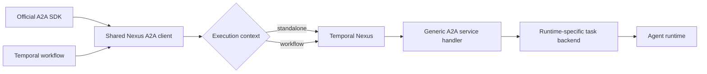

# A2A over Temporal Nexus

`nexus-a2a` is a harness-independent Temporal Nexus transport binding for the
[A2A protocol](https://a2a-protocol.org/). Any A2A-compatible agent runtime can expose
the service, and any Temporal application can call it without depending on Temporal
Agent Harness.



The binding keeps the official A2A protobuf messages as its semantic payloads. Because
Nexus operations currently return one result rather than a server stream,
`SubscribeToTask` returns a bounded cursor page. A durable caller repeats that operation
until the task or requested turn reaches a terminal state.

The shared client owns A2A operation mapping, error translation, and cursor progression.
Small executors supply the calling context: `StandaloneNexusExecutor` uses a normal
Temporal client and `WorkflowNexusExecutor` uses deterministic workflow commands. The
official A2A SDK transport and runtime-specific subagent integrations are frontends over
that same client rather than separate implementations of the Nexus protocol.

On the provider side, `NexusA2AServiceHandler` exposes the wire contract and delegates
task semantics to an `A2ABackend`. An agent framework integrates by implementing that
backend; Temporal Agent Harness is one such adapter, not a dependency of this package.
Runtime-specific task storage, workflow dispatch, authorization, and rich event rendering
therefore remain outside `nexus-a2a`.

Python consumers import the service contract and converter from `nexus_a2a`. The Go
package at this module's root exposes the same service and wire models for Go callers.

## Call an agent outside a Temporal workflow

`NexusA2AClientTransport` implements the official Python A2A `ClientTransport`
interface with standalone Nexus operations. This lets an ordinary Python process—or an
AI SDK that accepts an A2A client factory—drive the agent without itself running as a
Temporal workflow. The host still supplies a Temporal client authorized to reach the
agent's Nexus endpoint.

Connect the Temporal client with `a2a_nexus_data_converter`, then either construct an
official A2A client directly:

```python
from temporalio.client import Client as TemporalClient
from nexus_a2a import a2a_nexus_data_converter, create_nexus_a2a_client

temporal = await TemporalClient.connect(
    "localhost:7233",
    namespace="default",
    data_converter=a2a_nexus_data_converter,
)
a2a_client = create_nexus_a2a_client(temporal, agent_card)

async for event in a2a_client.send_message(request):
    consume(event)
```

or register the binding on a factory supplied to an AI SDK:

```python
from a2a.client import ClientConfig, ClientFactory
from nexus_a2a import A2A_NEXUS_BINDING, register_nexus_a2a_transport

factory = ClientFactory(
    ClientConfig(supported_protocol_bindings=[A2A_NEXUS_BINDING])
)
register_nexus_a2a_transport(factory, temporal)
```

The transport maps one-shot A2A methods to standalone Nexus operations and turns the
bounded, cursor-based `SubscribeToTask` operation into A2A's normal async event stream.
It deliberately does not own or close the shared Temporal client. Push notification
configuration is not supported by this binding; callers should consume the stream or
resubscribe instead.

## Call an agent from a Temporal workflow

Use the same protocol client with the workflow executor. The API and stream paging are
identical; only the mechanism used to issue a Nexus command changes.

```python
from nexus_a2a import NexusA2AClient, WorkflowNexusExecutor

client = NexusA2AClient(WorkflowNexusExecutor(), "agent-endpoint")
task = await client.send_message(request)

async for record in client.stream_task(task_id=task.task.id):
    consume(record.response, offset=record.offset)
```

## Expose an agent runtime through Nexus

Implement `A2ABackend` for the runtime's task store and message lifecycle, then give it
to the generic handler:

```python
from nexus_a2a import NexusA2AServiceHandler

handler = NexusA2AServiceHandler(MyAgentRuntimeBackend(...))
worker = Worker(..., nexus_service_handlers=[handler])
```

The backend receives stable operation request IDs and the Temporal Nexus client required
for update-with-callback subscriptions. It reports protocol failures with
`A2ABackendError`; the generic handler maps them to Nexus handler errors uniformly.
