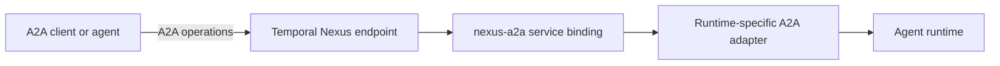

# A2A over Temporal Nexus

`nexus-a2a` is a harness-independent Temporal Nexus transport binding for the
[A2A protocol](https://a2a-protocol.org/). Any A2A-compatible agent runtime can expose
the service, and any Temporal application can call it without depending on Temporal
Agent Harness.

The binding keeps the official A2A protobuf messages as its semantic payloads. Because
Nexus operations currently return one result rather than a server stream,
`SubscribeToTask` returns a bounded cursor page. A durable caller repeats that operation
until the task or requested turn reaches a terminal state.

Python consumers import the service contract and converter from `nexus_a2a`. The Go
package at this module's root exposes the same service and wire models for Go callers.
Runtime-specific task storage, workflow dispatch, authorization, and rendering remain
outside this package.
