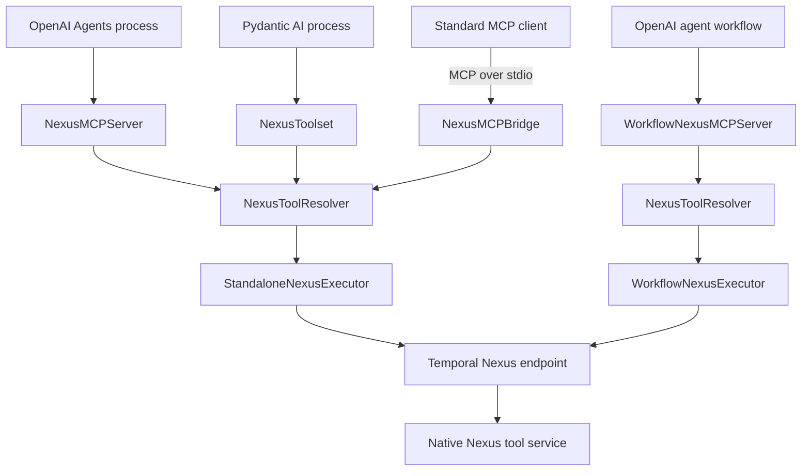
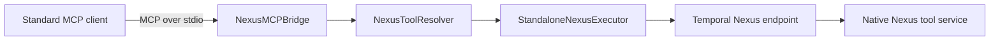
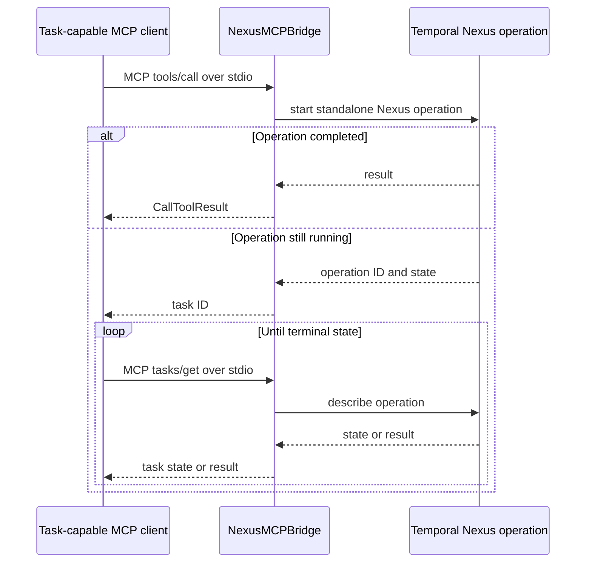
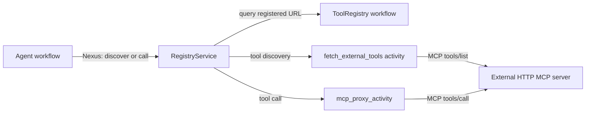

# Temporal Nexus MCP architecture

This document describes the package components, execution paths, and protocol
behavior. For installation and public API examples, see the
[package README](README.md).

## Design

`NexusToolResolver` is the protocol-neutral core. It discovers tools, validates
routes, and sends calls to an executor. The caller selects the executor when it
constructs the resolver. The resolver does not inspect the runtime environment.

- `StandaloneNexusExecutor` uses a connected Temporal `Client`. Use it outside
  a Temporal workflow.
- `WorkflowNexusExecutor` uses the Temporal workflow API. Use it inside a
  Temporal workflow.

The AI SDK integrations and the MCP bridge are frontends for the same resolver.



## Direct AI SDK integrations

The direct integrations adapt `NexusToolResolver` to the tool interface of each
SDK. They do not create an MCP session or start an MCP server.

`NexusMCPServer` implements the OpenAI Agents `MCPServer` interface. It uses
`StandaloneNexusExecutor`. `WorkflowNexusMCPServer` implements the same
interface with `WorkflowNexusExecutor`.

`NexusToolset` implements the Pydantic AI toolset interface. It uses
`StandaloneNexusExecutor`. It maps Nexus tool results to Pydantic AI result
types and maps tool errors to `ModelRetry`.

Each standalone adapter receives a Temporal client from its caller. The
adapter does not own or close that client.

## MCP bridge

`NexusMCPBridge` is the compatibility frontend for standard MCP clients. The
MCP SDK owns protocol initialization, negotiation, sessions, request
validation, and stdio. The bridge converts each MCP request to a resolver call.



The bridge does not replace Nexus as the tool transport. MCP ends at the local
bridge. Discovery and tool calls continue through Nexus.

## Tool discovery and routing

`MCPOverNexusServiceHandler` adds a synchronous `list_tools` Nexus operation to
each native tool service. The operation returns:

- The MCP definition for each marked tool.
- The exact Nexus operation route for each public tool name.

The resolver reads the current manifest before each tool call. The caller does
not have to call `list_tools()` first.

The resolver applies these rules:

- Each public tool name must have an exact operation route.
- Duplicate public names across configured services cause discovery to fail.
- An unknown or constructed tool name does not reach Nexus.
- A discovery error fails the full request. The resolver does not return a
  partial tool list.
- `allowed_servers` limits discovery to selected services.

Exact routing limits accidental access. It does not replace authentication or
authorization.

## Result and failure behavior

The resolver converts operation results as follows:

| Operation result | MCP result |
| --- | --- |
| `CallToolResult` | Preserved without conversion |
| Pydantic model | Returned as text and `structured_content` through a dictionary |
| Dictionary | Returned as text and `structured_content` |
| Other value | Converted to text |

An exception from a listed Nexus operation becomes a tool error result.

The Pydantic AI adapter returns `structured_content` when it is available. It
maps other MCP content types to the nearest Pydantic AI content type. A tool
error becomes `ModelRetry`.

## MCP Tasks

MCP Tasks are a bridge feature. They are available when `NexusMCPBridge` uses
`StandaloneNexusExecutor` and the client negotiates protocol version
`2026-07-28` with the `io.modelcontextprotocol/tasks` extension.

A task-capable tool call starts a standalone Nexus operation. Here,
*standalone* means that a Temporal client starts the operation outside a
Temporal workflow. The operation still runs through Temporal Nexus.



Clients that do not advertise Tasks receive a blocking tool result. A task ID
is the Nexus operation ID. The bridge does not keep an in-memory task table, so
a new bridge process can read an existing task.

`NexusTasksClientExtension` claims task results. The high-level
`Client.call_tool()` method then polls `tasks/get` and returns the final
`CallToolResult`. The original `tools/call` request ends before polling starts.
Use `cancel_task()` to request cancellation. The protocol also provides
`update_task()`, but the Nexus operations in this package do not request more
input.

`task_ttl_ms` defaults to 24 hours. `task_poll_interval_ms` defaults to one
second. Set both values on `NexusMCPBridge`. Apply the same authorization policy
to task methods and tool calls. The package does not bind task IDs to
application users.

The direct OpenAI Agents and Pydantic AI integrations wait for the final Nexus
result. They do not expose MCP Tasks.

## Durable Tools Gateway

The Durable Tools Gateway is a separate path for an existing HTTP MCP server.
It does not process calls to native Nexus tool services.

The registry stores an MCP server URL under an agent ID and alias. It does not
store tool definitions. During discovery, `RegistryService` reads the selected
URLs and starts one `fetch_external_tools` activity for each server. Each
activity sends `tools/list` to the external server.

During a tool call, `RegistryService` reads the URL and starts
`mcp_proxy_activity`. The activity sends `tools/call` to the external server.
The activity does not retry because the tool might not be idempotent.



The gateway requires these Temporal dynamic configuration values:

```text
nexusoperation.enableStandalone=true
activity.enableStandalone=true
```

See the [Nexus hello example](../../examples/nexus_hello/README.md) for a
complete configuration.

## Component responsibilities

| Part | Responsibility | Implementation |
| --- | --- | --- |
| OpenAI Agents integration | Present Nexus tools through the SDK MCP server interface | `NexusMCPServer`, `WorkflowNexusMCPServer` |
| Pydantic AI integration | Present Nexus tools through the SDK toolset interface | `NexusToolset` |
| MCP protocol | Manage MCP connections, requests, responses, and Tasks | `NexusMCPBridge`, MCP SDK |
| Tool resolution | Discover tools, validate routes, and convert results | `NexusToolResolver` |
| Nexus execution | Execute calls and manage operation handles | `WorkflowNexusExecutor`, `StandaloneNexusExecutor` |
| Tool service | Define metadata, routes, and tool behavior | `MCPOverNexusServiceHandler`, authoring decorators |
