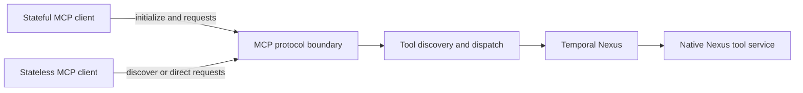
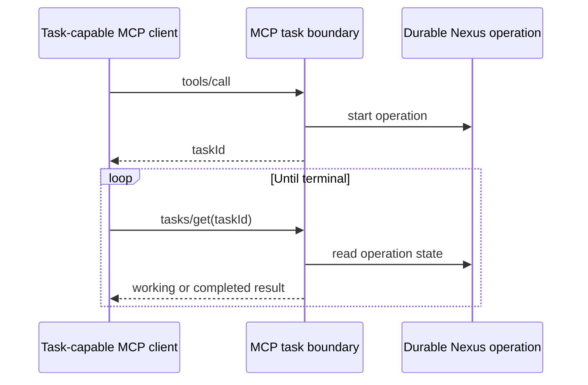
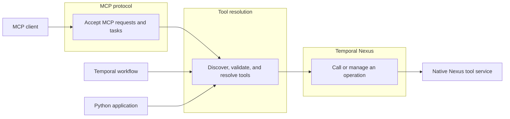
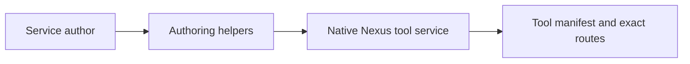
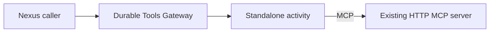

# Temporal Nexus MCP

`nexus_mcp` exposes Nexus service operations as MCP tools. You can author one
Nexus tool service and use it from:

- a Temporal workflow, with direct Nexus calls;
- a stateful MCP client, with the MCP initialization flow;
- a stateless MCP client, with independent MCP requests;
- a task-capable MCP client, with a durable Nexus operation behind each task.

The package uses the MCP Python SDK for the protocol. The SDK owns
initialization, protocol negotiation, sessions, Streamable HTTP, request
validation, and normal MCP errors. This package adds the Nexus execution path
and the MCP Tasks extension.

## Install

The package requires Python 3.13 or later. Its distribution name is
`temporal-nexus-mcp`. Its Python import name is `nexus_mcp`.

An unrelated project owns the `nexus-mcp` name on PyPI. Do not use
`pip install nexus-mcp` or `uv add nexus-mcp`. Those commands install the
unrelated project.

From this repository:

```sh
uv sync --extra nexus-mcp
```

For an editable package-only installation:

```sh
uv pip install -e ./nexus/mcp
```

To install from GitHub before this distribution is published:

```sh
uv add "temporal-nexus-mcp @ git+https://github.com/temporal-community/temporal-agent-harness.git#subdirectory=nexus/mcp"
```

## Choose a use case

| Goal | API | MCP connection |
| --- | --- | --- |
| Call tools inside a Temporal workflow | `NexusToolResolver` and `WorkflowNexusExecutor` | None |
| Call tools from a normal Python process | `NexusToolResolver` | None |
| Serve Nexus tools to MCP clients | `NexusMCPBridge` | MCP SDK managed |
| Run long tool calls as MCP tasks | `NexusMCPBridge` and Tasks helpers | Stateless MCP 2026 |
| Reach an existing HTTP MCP server through Temporal | Durable Tools Gateway | Gateway opens the remote connection |

Use a native Nexus tool service when you own the tool implementation. Use the
Durable Tools Gateway when a tool already exists as an MCP server.

## Author a Nexus tool service

Inherit from `MCPOverNexusServiceHandler`. Use `@nexus_mcp_tool` for a short
operation.

```python
import nexusrpc.handler
from mcp.types import ToolAnnotations
from nexus_mcp.authoring import (
    MCPOverNexusServiceHandler,
    MCPToolConfig,
    nexus_mcp_tool,
)
from pydantic import BaseModel


class Forecast(BaseModel):
    city: str
    summary: str


@nexusrpc.handler.service_handler(name="weather")
class WeatherTools(MCPOverNexusServiceHandler):
    mcp_tool_defaults = MCPToolConfig(
        annotations=ToolAnnotations(read_only_hint=True)
    )

    @nexus_mcp_tool(
        title="Get a weather forecast",
        annotations=ToolAnnotations(idempotent_hint=True),
    )
    async def forecast(self, city: str) -> Forecast:
        """Get the current forecast."""
        return Forecast(city=city, summary="Clear")
```

The method can use `def` or `async def`. The decorator creates a synchronous
Nexus operation in both cases. Use it only for work that can finish within the
Nexus handler deadline.

The package generates:

- the public MCP name `weather_forecast`;
- an input schema from the typed parameters;
- an output schema from the return type;
- the title, description, icons, annotations, and `_meta` values;
- an exact route from `weather_forecast` to its Nexus operation.

`MCPToolConfig` sets defaults for the service. Values on the tool decorator
override those defaults. MCP annotations are hints for clients. They do not
enforce authorization or safe execution.

Only marked operations appear in `tools/list`. Other operations on the same
Nexus service cannot be called by guessing their names.

### Authoring directly against a Nexus operation

Use `@nexus_mcp_operation` above a Nexus operation decorator when you need a
workflow-backed operation or custom Nexus behavior.

```python
import nexusrpc.handler
import temporalio.nexus
from nexus_mcp.authoring import MCPOverNexusServiceHandler, nexus_mcp_operation
from pydantic import BaseModel
from temporalio import workflow


class DelayedForecastInput(BaseModel):
    city: str
    delay_seconds: float = 5.0


class DelayedForecastOutput(BaseModel):
    summary: str


@workflow.defn(sandboxed=False)
class DelayedForecastWorkflow:
    @workflow.run
    async def run(self, input: DelayedForecastInput) -> DelayedForecastOutput:
        await workflow.sleep(input.delay_seconds)
        return DelayedForecastOutput(summary=f"Clear in {input.city}")


@nexusrpc.handler.service_handler(name="weather")
class WeatherTools(MCPOverNexusServiceHandler):
    @nexus_mcp_operation(title="Get a delayed forecast")
    @temporalio.nexus.workflow_run_operation
    async def delayed_forecast(
        self,
        ctx: temporalio.nexus.WorkflowRunOperationContext,
        input: DelayedForecastInput,
    ) -> temporalio.nexus.WorkflowHandle[DelayedForecastOutput]:
        """Get a forecast after a durable delay."""
        return await ctx.start_workflow(
            DelayedForecastWorkflow.run,
            input,
            id=f"delayed-forecast-{ctx.request_id}",
        )
```

The Nexus decorator defines the input model, output model, operation name, and
execution behavior. The MCP decorator adds MCP metadata. The Temporal data
converter constructs the Pydantic input. Your operation returns its declared
output type.

Register the service handler and any backing workflows on a Temporal worker.
Create a Nexus endpoint that targets that worker task queue.

```sh
temporal operator nexus endpoint create \
    --name weather-endpoint \
    --target-namespace default \
    --target-task-queue weather-tools
```

Service names and complete generated tool names must match
`[a-zA-Z0-9_-]{1,64}`.

## Call tools from a Temporal workflow

Compose `NexusToolResolver` with `WorkflowNexusExecutor`. This path uses
`workflow.create_nexus_client`. It does not create an MCP connection or
initialize an MCP session.

```python
from temporalio import workflow

with workflow.unsafe.imports_passed_through():
    from nexus_mcp.execution import WorkflowNexusExecutor
    from nexus_mcp.resolver import NexusToolResolver


@workflow.defn
class WeatherWorkflow:
    @workflow.run
    async def run(self, city: str) -> dict[str, object] | None:
        tools = NexusToolResolver(
            {"weather": "weather-endpoint"},
            WorkflowNexusExecutor(),
        )
        result = await tools.call_tool("weather_forecast", {"city": city})
        return result.structured_content
```

A call first reads the service tool manifest. It then uses the exact route from
that manifest. The caller does not need to call `list_tools()` first. This
discovery step prevents a caller from reaching an unlisted operation by
constructing a name with the correct service prefix.

Use `allowed_servers` to expose only part of a shared service map.

The Temporal Agent Harness provides an OpenAI Agents adapter:

```python
from agents import Agent
from temporal_agent_harness.ai_sdks.openai_agents.workflow import (
    nexus_native_mcp_server,
)

agent = Agent(
    name="weather-agent",
    mcp_servers=[nexus_native_mcp_server("weather", "weather-endpoint")],
)
```

This adapter composes `NexusToolResolver` and `WorkflowNexusExecutor`. The
`nexus_mcp` package does not depend on the OpenAI Agents SDK.

## Call tools from a normal Python process

Use `StandaloneNexusExecutor` with a connected Temporal client.

```python
from nexus_mcp.execution import StandaloneNexusExecutor
from nexus_mcp.resolver import NexusToolResolver
from temporalio.client import Client

client = await Client.connect("localhost:7233")
resolver = NexusToolResolver(
    {"weather": "weather-endpoint"},
    StandaloneNexusExecutor(client),
)

tools = await resolver.list_tools()
result = await resolver.call_tool("weather_forecast", {"city": "New York"})
```

This API returns MCP SDK types, but it does not use MCP on the wire. A local
Temporal server must enable standalone Nexus operations:

```text
nexusoperation.enableStandalone=true
```

## Serve Nexus tools to MCP clients

Build one `NexusMCPBridge`. The MCP SDK supplies both connection models.

```python
from nexus_mcp.execution import StandaloneNexusExecutor
from nexus_mcp.frontends import NexusMCPBridge
from nexus_mcp.resolver import NexusToolResolver
from temporalio.client import Client as TemporalClient

temporal_client = await TemporalClient.connect("localhost:7233")
resolver = NexusToolResolver(
    {"weather": "weather-endpoint"},
    StandaloneNexusExecutor(temporal_client),
)
bridge = NexusMCPBridge(
    resolver,
    name="weather-over-nexus",
    version="1.0.0",
    instructions="Use these tools for weather questions.",
)
```

For a stateful stdio client:

```python
await bridge.run_stdio_async()
```

The client sends `initialize`. The MCP SDK owns initialization, capability
negotiation, and session state.

For Streamable HTTP with sessions:

```python
app = bridge.streamable_http_app(stateless_http=False)
```

For independent stateless requests:

```python
app = bridge.streamable_http_app(
    stateless_http=True,
    json_response=True,
)
```

Serve the returned ASGI app with Uvicorn or another ASGI server. The MCP SDK
owns `server/discover`, version checks, MCP headers, request envelopes, and
result validation. Configure authentication, TLS, rate limits, and deployment
policy in the application host or MCP SDK options.

The bridge supports legacy and modern clients by mapping MCP to Nexus operations:



## Use MCP Tasks

When the resolver uses `StandaloneNexusExecutor`, `NexusMCPBridge` advertises
the `io.modelcontextprotocol/tasks` extension for protocol version
`2026-07-28`. A task-capable tool call starts a standalone Nexus operation. The
first response can return immediately with a durable task ID.

A Python client can ask for the task handle and poll it:

```python
from mcp.client import Client
from nexus_mcp import NexusTasksClientExtension
from nexus_mcp.tasks import CreateTaskResult, get_task

async with Client(
    "http://localhost:8000/mcp",
    mode="2026-07-28",
    extensions=[NexusTasksClientExtension()],
) as client:
    task = await client.session.call_tool(
        "weather_delayed_forecast",
        {"city": "New York", "delay_seconds": 5},
        allow_claimed=True,
    )
    assert isinstance(task, CreateTaskResult)
    current = await get_task(client.session, task.task_id)
```

Use `cancel_task()` to request cancellation. `update_task()` is available for
the protocol method, but Nexus operations in this package do not request more
input while they run.

For a simple blocking client experience, use the same client extension with
the high-level call:

```python
result = await client.call_tool(
    "weather_delayed_forecast",
    {"city": "New York", "delay_seconds": 5},
)
```

The extension polls `tasks/get` and returns the final `CallToolResult`. The
caller waits, but the MCP request that created the task has already ended.

Clients that do not advertise Tasks receive the normal blocking tool result.
Legacy clients also receive the normal result. Task IDs are Nexus operation
IDs, so a new bridge process can read an existing task. The bridge does not
keep an in-memory task table.



`task_ttl_ms` defaults to 24 hours. `task_poll_interval_ms` defaults to one
second. Set both values on `NexusMCPBridge` when needed. Protect task methods
with the same authorization policy as tool calls. This package does not bind a
task ID to an application user.

## Proxy an existing MCP server

The Durable Tools Gateway is for an existing MCP server that cannot become a
native Nexus service. It registers a server URL under an agent ID and alias.
It fetches the remote tool list and runs each remote call in a standalone
Temporal activity.

```python
from agents import Agent
from temporal_agent_harness.ai_sdks.openai_agents.workflow import (
    nexus_tools_gateway,
)

gateway = nexus_tools_gateway(agent_id="weather-agent")
agent = Agent(
    name="weather-agent",
    mcp_servers=[gateway.mcp_servers("weather")],
)
```

The gateway opens an MCP connection to the remote server for each operation.
It is separate from the native Nexus tool path. See the
[Nexus hello example](../../examples/nexus_hello/README.md).

## Result and failure behavior

The resolver preserves an existing `CallToolResult`. It converts a Pydantic
model to a dictionary. It returns a dictionary as text and as
`structured_content`. It converts other values to text. An exception from a
listed Nexus operation becomes a tool error result.

Tool discovery is strict:

- every listed public name must have an exact Nexus operation route;
- duplicate public names across configured services fail discovery;
- an unknown or constructed tool name does not reach Nexus;
- discovery failure is visible instead of producing a partial, ambiguous list.

Use authentication and authorization at the MCP and Nexus boundaries. Exact
routing limits accidental reachability. It is not a replacement for access
control.

## Architecture

The package has four logical domains. The arrows show responsibility boundaries and the table underneath shows modules that are responsible for each domain.



The public types map to these domains:

| Domain | Responsibility | Implementation |
| --- | --- | --- |
| MCP protocol | MCP initialization, requests, responses, and Tasks | `NexusMCPBridge` and the MCP SDK |
| Tool resolution | Live discovery, manifest validation, exact routes, and result conversion | `NexusToolResolver` |
| Nexus invocation | Calls from a workflow or a normal process; durable operation handles | `WorkflowNexusExecutor` or `StandaloneNexusExecutor` |
| Tool service | Tool metadata and business logic | `MCPOverNexusServiceHandler` and authoring decorators |

Workflow callers compose `NexusToolResolver` with `WorkflowNexusExecutor`. An
MCP client enters through `NexusMCPBridge`. Application code can use
`NexusToolResolver` directly.

### Native service authoring



`MCPOverNexusServiceHandler` produces the tool manifest and exact route map.
The decorators turn marked methods or existing Nexus operations into MCP tools.

### Existing third-party MCP servers



The gateway is separate from the native Nexus tool path. It opens an MCP
connection to an existing server for each list or call operation.