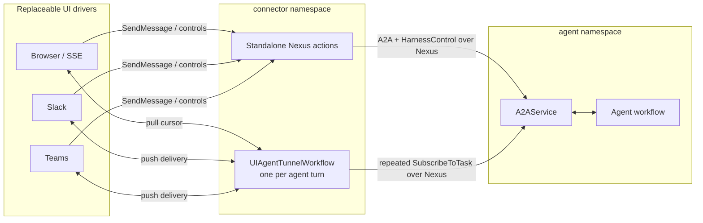

# Nexus UI connector

The connector is a durable, platform-neutral tunnel between user interfaces and an
A2A-compatible agent backend. Its middle layer is a Go Temporal workflow; Slack,
Teams, and the packaged browser UI are replaceable edge drivers. A backend is not a
connector-specific interface: it is the standard A2A service reached over Nexus.



Nexus operation inputs and outputs use standard A2A JSON, which interoperates across
the official Go and Python SDKs without depending on their protobuf package names.
The tunnel stores each streamed event as the untouched base64-encoded protobuf
`a2a.v1.StreamResponse`. It never projects that stream into Slack text, browser SSE,
or Teams cards. A driver may interpret the Temporal Agent Harness metadata extension,
render ordinary A2A messages/artifacts, or forward the complete A2A record to another
consumer. This lossless seam is what makes a new driver possible without changing the
agent or the tunnel.

## Runtime shape

Each message/control is a standalone Nexus operation. Once `SendMessage` returns the
accepted turn number and stream-head offset, the driver mounts a deterministic
`UIAgentTunnelWorkflow` for that one agent turn. The tunnel:

- performs one repeated `A2AService.SubscribeToTask` Nexus operation for the turn;
- multicasts each resulting A2A record to every mounted subscriber;
- keeps an independent durable cursor and opaque driver state per subscriber;
- allows `observer`, `turn-owner`, and `participant` subscriber modes;
- runs push deliveries in separate workflow coroutines, so a slow Slack or Teams
  subscriber does not stop polling or another subscriber;
- replays a lagging subscriber from the agent's durable stream when it falls behind
  the tunnel's bounded in-memory window;
- completes after the turn's terminal record is delivered and subscribers drain.

The connector therefore does not retain a second long-lived copy of an agent's
history. The A2A task/Temporal agent remains the durable source; a later mount starts
a new bounded tunnel and replays from the requested cursor.

Browser/SSE is a pull driver: HTTP requests issue bounded `readEvents` updates and
render records at the FastAPI edge. Slack and Teams are push drivers: the tunnel calls
a platform activity with a page of raw records and opaque state. Teams may return a
private task queue so its in-memory native stream remains pinned to the worker that
opened it.

Messages use standalone A2A `SendMessage`; cancellation uses `CancelTask`. Harness-only
controls such as tool approval and operator commands remain in `HarnessControlService`
because they are not generic A2A concerns.

Drivers may attach arbitrary A2A request metadata to a send. The tunnel forwards it
without defining its schema, so account, delegation, tracing, and future protocol
extensions remain edge concerns rather than another tunnel-specific model.

## Run the packaged browser UI

The packaged browser UI uses its direct `AgentClient` transport by default. To opt
the bundled examples into this Nexus tunnel, add this to the repo-root `.env.local`:

```bash
NEXUS_UI_ENDPOINT=agent-harness-ui-endpoint
```

Then run the local stack from the repository root, with each long-lived command in
its own terminal:

```bash
just temporal
just setup-nexus
just session-manager
just workers      # or run one example's `just worker`
just ui-tunnel
just server
```

The browser still talks HTTP/SSE to its local driver. A send goes directly through a
standalone A2A-over-Nexus operation, then the driver mounts a bounded Go workflow in
the `connector` namespace for the accepted turn. That workflow reaches the selected
agent only through repeated A2A `SubscribeToTask` operations over Nexus.

Unset `NEXUS_UI_ENDPOINT` to run the same UI through its original direct transport;
in that mode, omit both `just setup-nexus` and `just ui-tunnel`.

## Slack and Teams

Both webhooks use the same tunnel task queue (`nexus-ui-tunnel`). Set
`NEXUS_AGENT_ENDPOINT` to an endpoint backed by a `NexusA2AServiceHandler` configured to
start the selected agent workflow: a Slack thread or Teams conversation becomes the
A2A task ID, so these drivers do not rely on a browser-created session.

The packaged `agent-harness-ui-endpoint` is intentionally different: it targets the
session-manager worker and mounts only sessions that the browser API has already
created. Do not point a chat webhook at it.

Before starting either chat driver:

1. Start Temporal and the agent workflow worker.
2. Run `just setup-nexus` once so the local `connector` namespace exists.
3. Start an A2A Nexus worker for that workflow (the packaged
   `temporal_agent_harness.a2a.worker` is one option).
4. Create a Nexus endpoint targeting that A2A worker's namespace and task queue.
5. Export that endpoint name as `NEXUS_AGENT_ENDPOINT`.
6. Start `just ui-tunnel` in the `connector` namespace.

For example, this exposes `OpenAIHelloAgent` through a dedicated A2A task queue
(run the long-lived worker command in its own terminal):

```bash
AGENT_WORKFLOW_NAME=OpenAIHelloAgent \
AGENT_TASK_QUEUE=openai-hello \
NEXUS_AGENT_TASK_QUEUE=my-agent-a2a \
just nexus-agent-worker
```

Provision the matching endpoint and export its name to the webhook processes:

```bash
temporal operator nexus endpoint create \
  --name my-agent-endpoint \
  --target-namespace default \
  --target-task-queue my-agent-a2a
export NEXUS_AGENT_ENDPOINT=my-agent-endpoint
```

The webhook processes fail fast when `NEXUS_AGENT_ENDPOINT` is absent, rather than
silently routing to an endpoint that may not exist.

Slack needs:

```bash
just ui-tunnel
just slack-connector   # Slack delivery activities
just slack-webhook
```

Teams needs:

```bash
just ui-tunnel
just teams-activities-worker
just teams-webhook
```

The platform delivery queues are independently configurable with
`SLACK_DRIVER_TASK_QUEUE` and `TEAMS_DRIVER_TASK_QUEUE`.

## Adding a driver

An inbound driver constructs a `router.Subscriber` and calls `router.Client` to mount,
send, or invoke a harness control. A pull driver calls `readEvents`; a push driver
provides a `DeliveryTarget` activity. The delivery activity receives:

- the driver-specific opaque context;
- its prior opaque state;
- a page of unmodified A2A `StreamItem` records;
- the next cursor and closed state.

Only the driver decides how to decode and display those records. Do not add
platform-specific rendering fields to `TunnelWorkflow` or replace the raw A2A payload
with a lowest-common-denominator delta.
